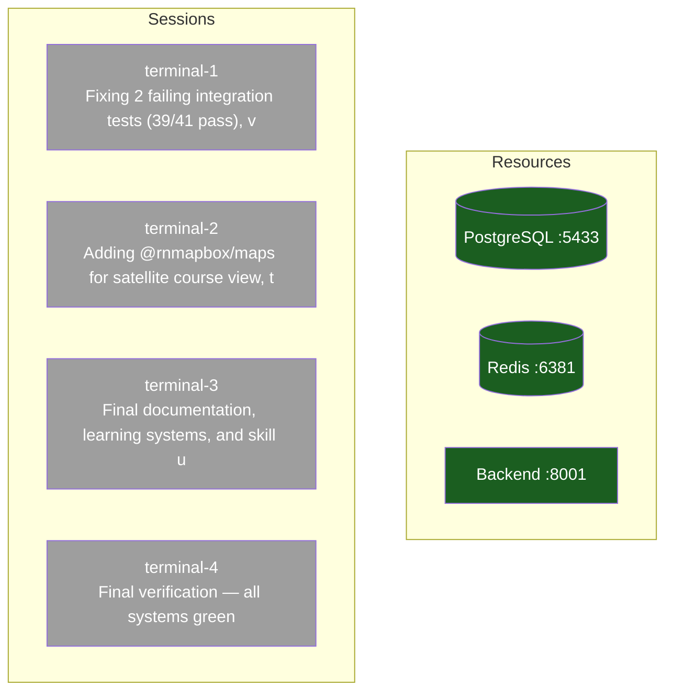

# Team Map — 2026-03-23 11:15:30 CDT

> Auto-generated by scripts/teammap.sh. Run `./scripts/teammap.sh` to refresh.

## Processes

| Resource | Status |
|----------|--------|
| Claude sessions | 40 total |
| Backend API :8001 | PID 17477 |
| PostgreSQL | rgdgc-db Up 15 hours (healthy) |
| Redis | rgdgc-redis Up 15 hours (healthy) |
| pytest running | 16084  |
| Git branch | t3/production-consolidation @ 45d8d61 Merge t6/railway-fix: alembic async URL, healthcheck timeout, visible errors |
| Uncommitted files | 20 |

## Sessions

| Name | Status | Current Task | Blocked By |
|------|--------|-------------|------------|
| terminal-1 | Stale | Fixing 2 failing integration tests (39/41 pass), v | nothing |
| terminal-2 | Stale | Adding @rnmapbox/maps for satellite course view, t | nothing |
| terminal-3 | Stale | Final documentation, learning systems, and skill u | nothing |
| terminal-4 | Stale | Final verification — all systems green | nothing |

## Flowchart

