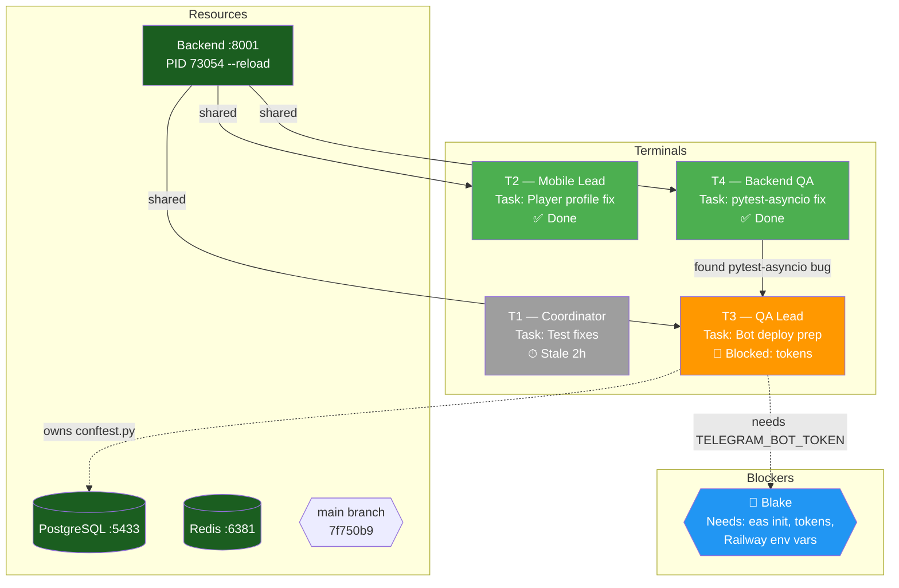

# Team Map — Real-Time Terminal Flowchart

Generate a Mermaid diagram showing all active Claude Code sessions, what they're doing, how they connect, and what's blocked.

## How to Run

1. Read all coordination state:
   - `.claude/coordination/sessions/terminal-*.md` — each terminal's status
   - `.claude/coordination/board.md` — task ownership and status
   - `.claude/coordination/messages/` — latest 3 messages for blockers
   - `ps aux | grep -E "pytest|uvicorn|claude"` — live processes
   - `lsof -i :8001 -i :5433 -i :6381` — shared resource usage
   - `git log --oneline -3` — latest commits
   - `git diff --stat HEAD` — uncommitted work

2. Build the Mermaid diagram from that data using the template below.

3. Write the output to `.claude/coordination/teammap.md`.

4. Print the diagram to the terminal so the user sees it immediately.

## Mermaid Template

```
graph TB
    %% ── Shared Resources ──
    DB[(PostgreSQL :5433)]
    REDIS[(Redis :6381)]
    API[Backend API :8001]
    GIT{{Git Working Tree}}

    %% ── Terminals ──
    %% For each active terminal, create a node:
    %%   T1[Terminal 1<br/>Role: ...<br/>Task: ...<br/>Status: ...]
    %% Color coding:
    %%   style TX fill:#4CAF50 = actively working (green)
    %%   style TX fill:#FF9800 = blocked (orange)
    %%   style TX fill:#9E9E9E = idle/stale (gray)
    %%   style TX fill:#F44336 = conflicting (red)

    %% ── Task Flow ──
    %% Show dependencies: T1 -->|depends on| T3
    %% Show blockers: T3 -.->|blocked: needs token| BLAKE
    %% Show resource usage: T4 -->|running pytest| DB

    %% ── External Blockers ──
    %% BLAKE{{Blake}} for items needing human input
```

## Node Status Rules

| Condition | Color | Meaning |
|-----------|-------|---------|
| Session heartbeat < 30 min ago + process found | `#4CAF50` green | Active |
| Session heartbeat < 30 min ago + no process | `#FFC107` yellow | Idle |
| Session heartbeat > 30 min ago | `#9E9E9E` gray | Stale |
| Blocked-by field is non-empty | `#FF9800` orange | Blocked |
| Two terminals touching same files | `#F44336` red | Conflict risk |

## Process Detection

```bash
# Count active Claude sessions
ps aux | grep -c "[c]laude"

# Check who's running tests
ps aux | grep "[p]ytest" | awk '{print $2, $11, $12}'

# Check who's using the DB
lsof -i :5433 | grep -v COMMAND | awk '{print $1, $2}' | sort -u

# Check dev server owner
lsof -i :8001 | grep LISTEN | awk '{print $1, $2}'
```

## Conflict Detection

Check for file conflicts between terminals:
1. Read each terminal's "Files touched" from their session log or latest message
2. If two terminals list the same file → mark both as conflict risk (red)
3. Special attention to: `conftest.py`, `board.md`, `app/main.py`, `package.json`

## Example Output



## After Generating

- Write the full markdown (with mermaid block) to `.claude/coordination/teammap.md`
- Include a `Last updated: YYYY-MM-DD HH:MM` timestamp at the top
- Include a plain-text summary table below the diagram for terminals that can't render Mermaid
- Any terminal can regenerate this at any time — it's always built from live state
