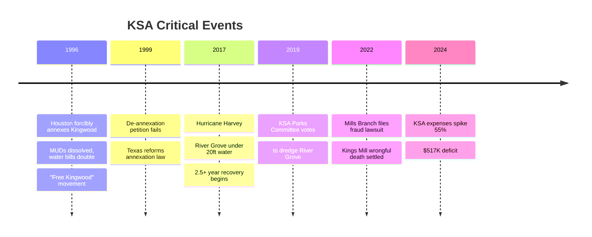
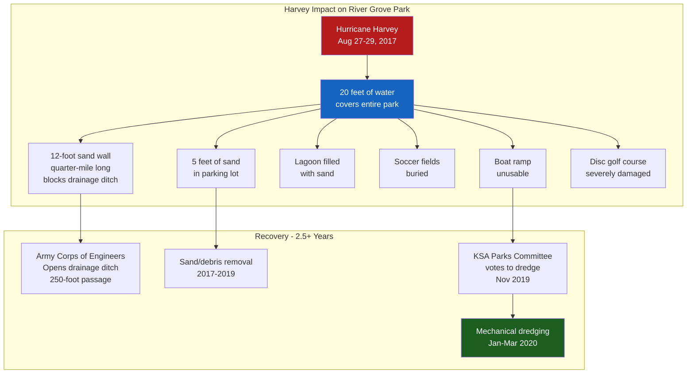
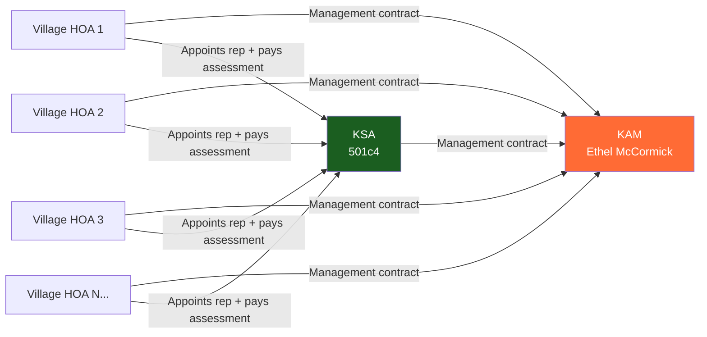

# KSA Controversies, Legal Actions & Key Events

## Timeline of Major Events

---

## 1. Houston Annexation (1996) — The Defining Crisis

### What Happened
- **December 31, 1996, 11:59 PM:** City of Houston forcibly annexed Kingwood
- Kingwood had ~53,000 residents across 15,000 acres
- 13 MUDs provided water, sewer, and drainage services independently

### The Fight Against Annexation
- Residents waged a bitter two-year battle
- **Federal lawsuit** filed (ultimately unsuccessful)
- **Offered to pay Houston** to avoid annexation
- **"Free Kingwood"** protest signs across the community
- Community meetings drew thousands

### Immediate Impact

| Before Annexation | After Annexation |
|-------------------|-----------------|
| 13 independent MUDs | MUDs dissolved; Houston provides water/sewer |
| Low water bills | Water bills **doubled/tripled** |
| Volunteer Fire Dept | Houston FD (unfamiliar with area) |
| Independent security | Houston PD |
| Local control | Houston City Council District E |
| No city taxes | Houston property tax added |

### Human Cost
- **11 deaths** attributed to emergency responders unfamiliar with Kingwood's geography in early post-annexation years
- Loss of the volunteer fire department that knew every street

### Long-term Legacy
- **1999:** Texas Legislature reforms annexation law:
  - 3-year service plans required before annexation
  - Public comment periods mandated
  - Arbitration remedies for annexed communities
- **2017:** Texas gives residents voting rights on proposed annexations
- Houston has conducted **no significant general-purpose annexation** since Kingwood
- Kingwood's experience is the cautionary tale that changed Texas law

### KSA Survived
- As a private nonprofit (not a government entity), KSA was not dissolved
- Retained ownership of all 5 parks (356.6 acres)
- Continued collecting assessments from member villages
- Role shifted from broad community services to parks + public safety liaison

---

## 2. Hurricane Harvey (2017) — Natural Disaster

### River Grove Park Damage

### Recovery Timeline
- **2017:** Immediate debris removal begins
- **2018:** Ongoing clearing; insurance/FEMA coordination
- **2019:** Parks Committee votes on dredging plan (November)
- **2020:** Mechanical dredging completed (January–March)
- **Total recovery:** Over 2.5 years for full restoration

---

## 3. Mills Branch Financial Fraud Lawsuit (2022–Present)

### Allegations
- **Plaintiff:** Mills Branch Village Community Association Inc.
- **Defendant:** Kingwood Service Association
- **Core Claim:** Multiyear, multi-million dollar excess fund fraud

### The Contract Provision (Article VIII — "Budget Excesses")
Under KSA's service contract with member villages:
- At fiscal year end, **any remaining unspent assessment amounts must be returned** to the member associations
- Mills Branch alleges KSA has **refused to return surplus funds** for multiple years
- The accumulated amount is alleged to be in the **millions of dollars**

### Timeline
| Date | Event |
|------|-------|
| Dec 8, 2022 | Mills Branch sends demand letter to KSA |
| 2023 (multiple) | Mills Branch sends arbitration requests |
| Throughout 2023 | KSA does not respond to demands or arbitration requests |
| 2023 (late) | Mills Branch files lawsuit, forcing the issue |
| Pending | Case abated; moving toward arbitration |

### Implications
- If KSA is required to return surplus funds, it could significantly reduce KSA's $3.1M in assets
- The 2024 expense spike ($1.57M, up 55% YoY) may relate to legal costs or settlement reserves
- Other village associations may file similar claims
- Raises governance questions about KSA financial transparency

---

## 4. Kings Mill Wrongful Death (2019–2022)

### What Happened
- **September 26, 2022:** 8-year-old John Chase deLarios struck in auto-pedestrian accident at Kings Mill Lane intersection
- Wrongful death

### Defendants Named
- Montgomery Kings Mill HOA
- **Ethel McAnulty McCormick** (f/k/a Kingwood Association Management)
- Prestige Association Management Group Corp.
- Leticia Thomas Frank

### Resolution
- Case **settled** (terms not publicly disclosed)
- McCormick was named in her capacity as the management company operator

---

## 5. Management Control Controversy

### Ethel McCormick / KAM
- McCormick runs **Kingwood Association Management (KAM)**, which manages KSA and many village HOAs
- She is listed as KSA's "Managing Agent" on 990 filings
- She receives $0 compensation directly from KSA (paid through KAM's management contract)
- KAM operates from the same address as KSA: 1075 Kingwood Dr, Suite 100

### Controversy
- McCormick **briefly stepped away** from management
- **FirstService Residential** (a national HOA management company) took over
- McCormick **returned and reclaimed control**
- Community message boards have featured complaints about:
  - Concentration of power in one management company
  - Lack of competitive bidding for management contracts
  - Transparency of KAM's fees and operations

### Structural Concern

The structural issue: KAM manages both KSA and the individual village HOAs that are supposed to hold KSA accountable. This creates a potential conflict of interest where the management company serves both the overseer and the overseen.

---

## 6. BBB Complaints

KSA has a profile on the Better Business Bureau but specific complaint details are not publicly available in search results. The organization is listed as a non-profit in Humble, TX.

---

## Relevance to RGDGC

1. **Governance Access:** Understanding KSA's decision-making helps RGDGC navigate requests for course improvements
2. **Financial Health:** KSA's 2024 deficit and pending litigation could affect parks maintenance budgets
3. **Management Relationships:** KAM/McCormick is the operational gatekeeper for park access and improvements
4. **Political Landscape:** Village HOA representatives on the KSA board are the people to lobby for disc golf investment
5. **Harvey Precedent:** KSA has demonstrated willingness to invest in River Grove recovery — precedent for future improvements

## Sources

- [Mills Branch vs KSA - Laws In Texas](https://lawsintexas.com/kingwood-services-association-sued-for-multiyear-financial-fraud-by-hoa-subdivision/)
- [Kings Mill Wrongful Death - Laws In Texas](https://lawsintexas.com/kingwood-hoa-ethel-mccormick-wrongful-death-lawsuit/)
- [Kingwood Annexation History](https://www.kingwood.com/community/annexation.php)
- [Texas Annexation Reform - TRERC](https://trerc.tamu.edu/article/annex-marks-spot-2317/)
- [KSA Dredging Vote - ReduceFlooding.com](https://reduceflooding.com/2019/11/18/ksa-parks-committee-votes-to-dredge-river-grove-park-boat-ramp-and-boardwalk/)
- [BBB - KSA](https://www.bbb.org/us/tx/humble/profile/non-profit-organizations/kingwood-service-association-0915-90018366)
