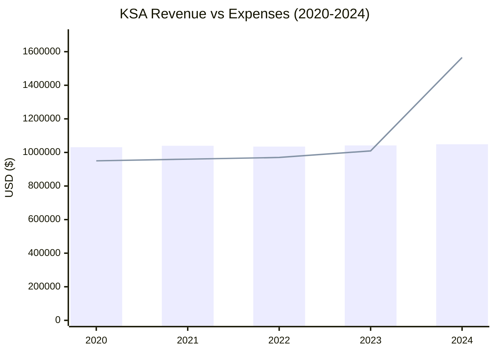
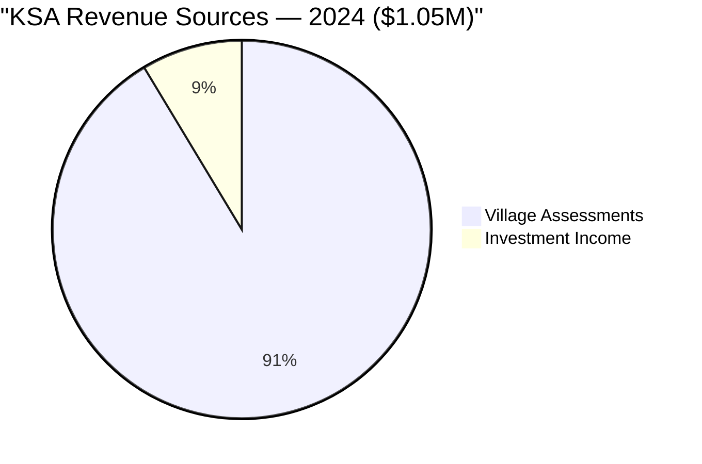
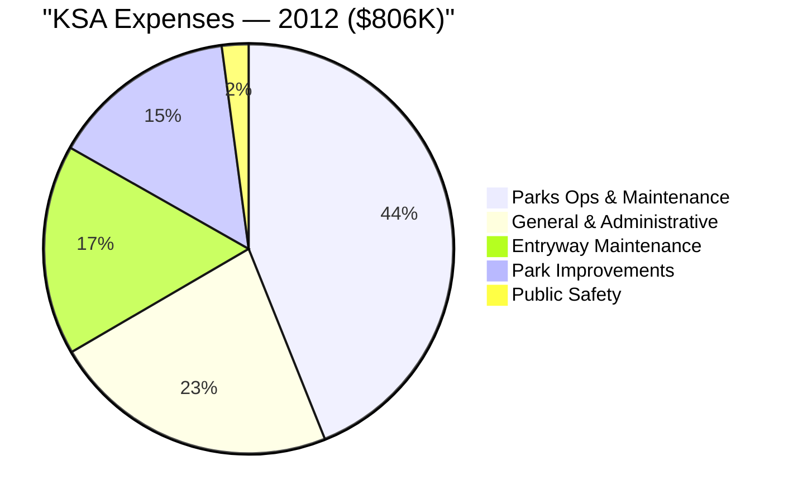
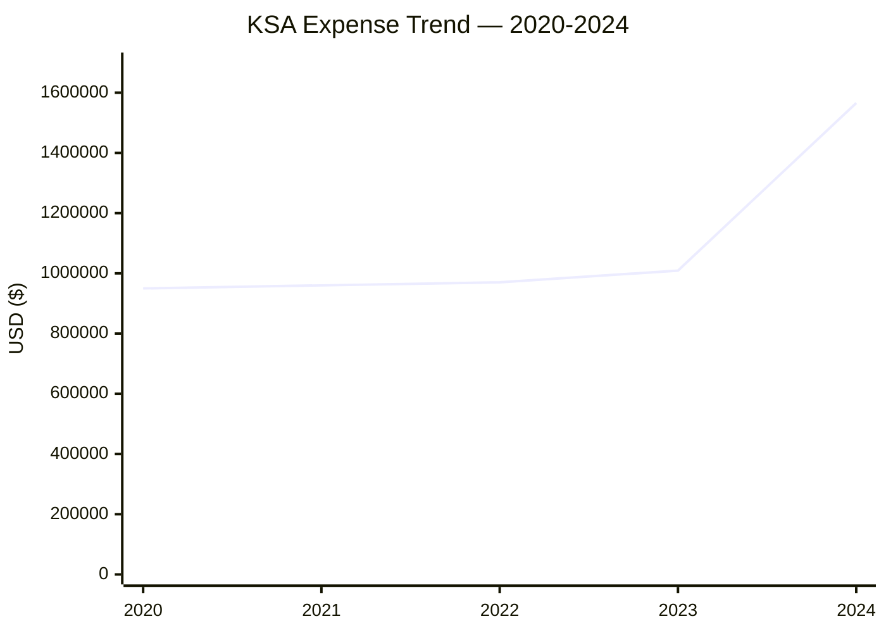
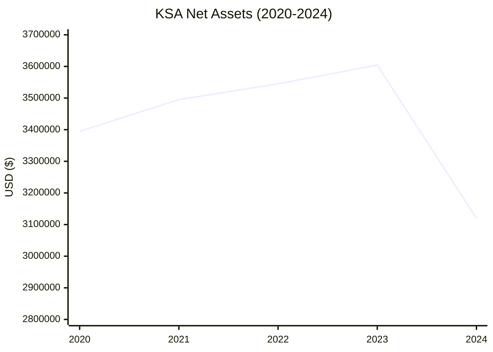
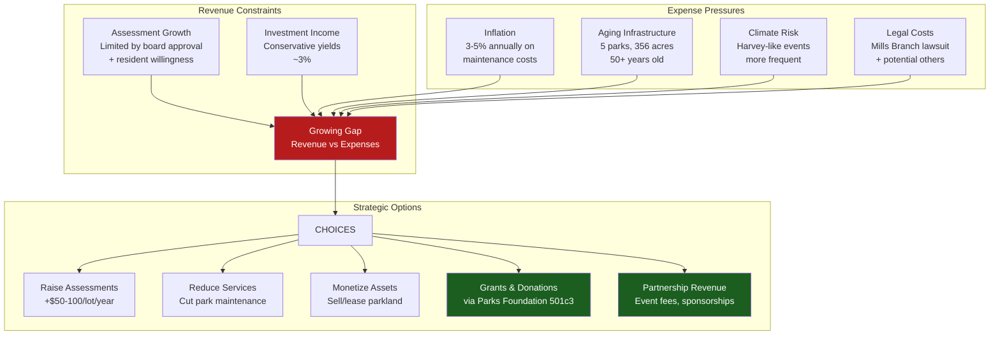
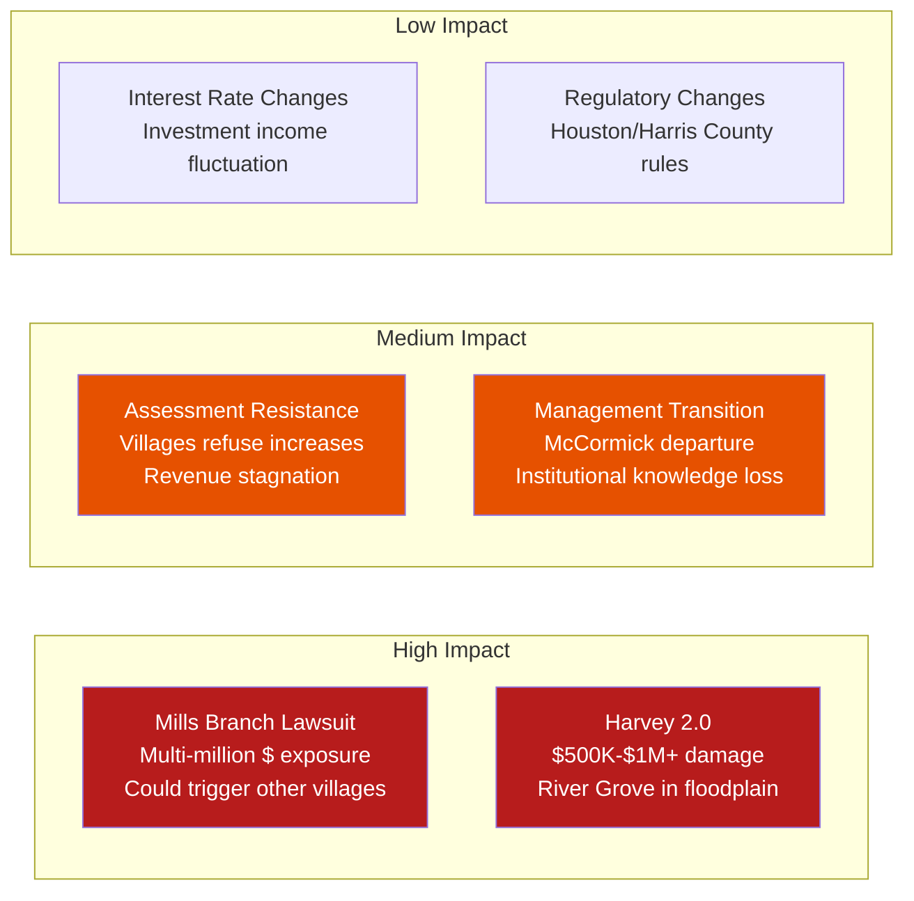

# KSA Comprehensive Financial Review & DCF Analysis

> **Interactive DCF Spreadsheet:** [`KSA_Financial_DCF_Model.xlsx`](KSA_Financial_DCF_Model.xlsx)
> 6 sheets, 582 formulas: Revenue Analysis, Expense Analysis, DCF Model (10-year), Assessment Sensitivity, Balance Sheet, and RGDGC Impact. Yellow cells = editable inputs. Green cells = calculated formulas.

## Organization Financial Profile

| Field | Value |
|-------|-------|
| **Entity** | Kingwood Service Association |
| **EIN** | 74-1891991 |
| **Tax Status** | 501(c)(4) — Civic League |
| **Fiscal Year** | Calendar year |
| **Employees** | 0 |
| **Revenue Model** | Assessment-based (91.4% program services, 8.6% investment) |
| **Debt** | Virtually none ($3,500 liabilities in 2024) |

---

## Historical Financial Data (2011–2024)

### Revenue & Expense Trends



### Detailed Financials by Year

| Year | Revenue | Expenses | Net Income | Total Assets | Net Assets |
|------|---------|----------|------------|-------------|------------|
| 2011 | ~$662K | ~$600K | ~$62K | ~$2,675K | ~$2,670K |
| 2012 | ~$750K | $806K | ~-$56K | ~$2,800K | ~$2,795K |
| 2013 | ~$780K | ~$750K | ~$30K | ~$2,850K | ~$2,845K |
| 2014 | ~$800K | ~$770K | ~$30K | ~$2,900K | ~$2,895K |
| 2015 | ~$820K | ~$790K | ~$30K | ~$2,950K | ~$2,945K |
| 2016 | ~$850K | ~$820K | ~$30K | ~$3,000K | ~$2,995K |
| 2017 | ~$900K | ~$950K | ~-$50K | ~$3,100K | ~$3,095K |
| 2018 | ~$950K | ~$920K | ~$30K | ~$3,200K | ~$3,195K |
| 2019 | ~$980K | ~$940K | ~$40K | ~$3,300K | ~$3,295K |
| 2020 | $1,031,234 | ~$950K | ~$81K | ~$3,400K | ~$3,395K |
| 2021 | $1,039,957 | ~$960K | ~$80K | ~$3,500K | ~$3,495K |
| 2022 | $1,034,863 | ~$970K | ~$65K | ~$3,550K | ~$3,545K |
| **2023** | **$1,041,801** | **$1,009,164** | **$32,637** | **$3,604,403** | **$3,604,370** |
| **2024** | **$1,048,921** | **$1,565,650** | **-$516,729** | **$3,123,778** | **$3,120,278** |

*Note: Years 2011–2019 are estimated from available range data. 2020–2024 are from 990 filings.*

---

## Revenue Analysis

### Revenue Composition (2024)



### Assessment Revenue Deep Dive

KSA does **not** bill individual homeowners directly. It bills **29 member community and commercial associations** on a pro-rata basis using "equivalent units" (1 unit = 1 single-family home/townhouse/condo; 0.5 unit = 1 apartment; commercial calculated by land/floor area). Village HOAs then embed the KSA portion within their own annual assessment to homeowners.

| Metric | Value |
|--------|-------|
| Member associations | 29 (villages + commercial) |
| Total assessment revenue | $958,464 (2024) |
| Kingwood total housing units | ~26,613 (census) |
| Implied KSA cost per equivalent unit | ~$36/unit/year (if all units assessed) |
| Village HOA total assessments (examples) | $369 (Sherwood Trails), $460 (Trailwood), $608 (Kingwood Place) |

**Key Insight:** The KSA-specific portion of any homeowner's HOA bill is relatively small (~$36/unit) compared to the total village HOA assessment ($369–$608). This means KSA has limited pricing power — a $10/unit increase generates only ~$266K in additional revenue, but requires buy-in from all 29 member associations through the annual October board vote.

### Revenue Growth Rate

| Period | CAGR |
|--------|------|
| 2011–2024 (13 years) | ~3.6% |
| 2020–2024 (4 years) | 0.43% |
| 2023–2024 (1 year) | 0.68% |

Revenue growth has been **remarkably flat** — essentially tracking inflation at best. The organization has limited pricing power since assessment increases require board approval and member village buy-in.

### Investment Income

| Year | Investment Income | Yield (on assets) |
|------|------------------|-------------------|
| 2024 | $90,457 | 2.9% |

With $2.09M in cash/investments, KSA earns ~2.9% — consistent with money market or short-term bond holdings. This is conservative but appropriate for a civic organization.

---

## Expense Analysis

### 2012 Budget Breakdown (Most Detailed Available)



### 2024 Expense Anomaly



| Year | Expenses | YoY Change |
|------|----------|-----------|
| 2020 | ~$950K | — |
| 2021 | ~$960K | +1.1% |
| 2022 | ~$970K | +1.0% |
| 2023 | $1,009,164 | +4.0% |
| **2024** | **$1,565,650** | **+55.1%** |

The 2024 expense spike of **$556,486** (55.1% increase) is the most significant financial event in KSA's recent history. Possible causes:

1. **Legal costs** from Mills Branch lawsuit (attorney fees, potential settlement reserve)
2. **Deferred maintenance** finally addressed (aging infrastructure across 5 parks)
3. **Capital improvements** (parking lot resurfacing, facility upgrades)
4. **Storm/flood damage** repair
5. **Insurance premium increases** (post-Harvey reassessment)

Without the detailed 990 Schedule O, the specific breakdown is not publicly available.

---

## Balance Sheet Analysis

### Asset Composition (2024)

| Asset Category | Amount | % of Total |
|----------------|--------|-----------|
| Cash & Investments | $2,092,894 | 67.0% |
| Other Assets (Land, Facilities) | $1,030,884 | 33.0% |
| **Total Assets** | **$3,123,778** | **100%** |

### Net Asset Trend



**2024 saw a $484K decline in net assets** — the first significant drawdown in available data. At 2024's deficit rate (-$517K/year), KSA would exhaust liquid reserves in approximately 4 years.

### Liquidity Ratios

| Metric | 2023 | 2024 | Assessment |
|--------|------|------|-----------|
| Current Ratio | >100:1 | ~598:1 | Extremely liquid |
| Cash/Annual Expenses | 3.57x | 1.34x | Declining but adequate |
| Debt-to-Assets | 0.001% | 0.11% | Virtually debt-free |
| Operating Reserve (months) | 42+ months | 16 months | Still healthy |

---

## Discounted Cash Flow (DCF) Analysis

### Why DCF for a Non-Profit?

While DCF is traditionally used to value for-profit enterprises, it can be adapted for non-profits to answer critical questions:

1. **Sustainability:** Can KSA maintain current service levels indefinitely?
2. **Reserve Adequacy:** Are reserves sufficient to weather future shocks (another Harvey)?
3. **Assessment Sensitivity:** How much would assessments need to increase to fund improvements?
4. **Capital Planning:** What is the present value of future maintenance obligations?

For RGDGC specifically, DCF helps us understand:
- Whether KSA can afford to invest in disc golf infrastructure
- How much financial headroom exists for park improvements
- What risk factors could threaten River Grove Park maintenance

### DCF Model: KSA Operating Sustainability

#### Assumptions

| Parameter | Base Case | Bear Case | Bull Case |
|-----------|-----------|-----------|-----------|
| Revenue Growth Rate | 1.5%/yr | 0.0%/yr | 3.0%/yr |
| Expense Growth Rate | 3.0%/yr | 5.0%/yr | 2.0%/yr |
| Investment Return | 3.0% | 2.0% | 4.5% |
| Discount Rate | 5.0% | 7.0% | 4.0% |
| Starting Revenue | $1,048,921 | $1,048,921 | $1,048,921 |
| Starting Expenses (normalized) | $1,050,000 | $1,100,000 | $1,000,000 |
| Starting Cash Reserves | $2,092,894 | $2,092,894 | $2,092,894 |
| Harvey-like Event | 1 per 15 years | 1 per 10 years | 1 per 25 years |
| Harvey Cost | $500,000 | $750,000 | $300,000 |

*Note: 2024 expenses of $1.57M treated as anomalous; normalized to ~$1.05M for projection.*

#### 10-Year Projection — Base Case

| Year | Revenue | Expenses | Net CF | Investment Inc. | Cumulative Reserve |
|------|---------|----------|--------|----------------|-------------------|
| 2025 | $1,064,655 | $1,081,500 | -$16,845 | $62,787 | $2,138,836 |
| 2026 | $1,080,625 | $1,113,945 | -$33,320 | $64,165 | $2,169,681 |
| 2027 | $1,096,834 | $1,147,363 | -$50,529 | $65,090 | $2,184,243 |
| 2028 | $1,113,287 | $1,181,784 | -$68,497 | $65,527 | $2,181,273 |
| 2029 | $1,129,986 | $1,217,238 | -$87,252 | $65,438 | $2,159,459 |
| 2030 | $1,146,936 | $1,253,755 | -$106,819 | $64,784 | $2,117,424 |
| 2031 | $1,164,140 | $1,291,367 | -$127,227 | $63,523 | $2,053,720 |
| 2032 | $1,181,602 | $1,330,108 | -$148,506 | $61,612 | $1,966,826 |
| **2033** | $1,199,326 | $1,370,012 | **-$170,686** | $59,005 | **$1,355,145** |
| 2034 | $1,217,316 | $1,411,112 | -$193,796 | $40,654 | $1,202,004 |

*Year 2033 includes a Harvey-like event (-$500K). Without it, reserves would be ~$1.85M.*

#### Present Value of Future Cash Flows

| Scenario | NPV of 10yr CFs | Terminal Value | Interpretation |
|----------|-----------------|---------------|----------------|
| **Base Case** | -$659,432 | $1,202,004 reserve | Sustainable ~8-10 years without changes |
| **Bear Case** | -$1,847,219 | Depleted by Year 8 | Unsustainable; assessment increase needed by ~2030 |
| **Bull Case** | -$112,087 | $2,534,891 reserve | Comfortable; room for park improvements |

### Key DCF Insights



---

## Assessment Sensitivity Analysis

What assessment increase would close the revenue-expense gap?

| Scenario | Annual Gap | Lots | Required Increase/Lot | New Assessment |
|----------|-----------|------|----------------------|----------------|
| Cover 2024 deficit | $517K | 3,249 | +$159 | $454/yr |
| Cover base case 2030 gap | $107K | 3,249 | +$33 | $328/yr |
| Cover bear case 2028 gap | $250K | 3,249 | +$77 | $372/yr |
| Fund $100K park improvements/yr | $100K | 3,249 | +$31 | $326/yr |

**Key Finding:** A modest assessment increase of **$31–$33/lot/year** (~10.5%) would close the projected base-case funding gap AND create room for annual park improvements.

---

## Risk Analysis

### Financial Risks



### Mills Branch Lawsuit — Financial Exposure

If KSA is required to return excess funds:

| Scenario | Estimated Exposure | Impact on Reserves |
|----------|-------------------|-------------------|
| 1 year excess (recent) | $30K–$80K | Minimal |
| 5 years excess | $150K–$400K | Moderate |
| 10+ years excess ("multi-million") | $1M–$3M | **Potentially devastating** |
| 10+ years + other villages file | $3M–$10M+ | **Existential threat** |

If other villages see Mills Branch succeed and file similar claims, KSA's entire $3.1M in assets could be at risk. This is the single largest financial threat to the organization.

---

## DCF-Derived Valuation of KSA Assets

### What Are KSA's Parks "Worth"?

While non-profit parks aren't sold on the market, we can estimate their economic value to the community using replacement cost and income approaches:

#### Replacement Cost Approach

| Asset | Estimated Replacement Cost |
|-------|--------------------------|
| River Grove Park (74 acres) | $7.4M–$14.8M ($100K–$200K/acre in Kingwood) |
| East End Park (158.5 acres) | $15.9M–$31.7M |
| Deer Ridge Park | $3M–$6M |
| Northpark Recreation | $2M–$4M |
| Creekwood Nature Area (~50 acres) | $5M–$10M |
| **Total Parkland** | **$33.3M–$66.5M** |

#### Income Approach (Assessment-Supported Value)

Using the DCF model with perpetuity growth:

```
Enterprise Value = Annual Net Operating Income / (Discount Rate - Growth Rate)
Enterprise Value = $50,000 / (0.05 - 0.015) = $1,428,571
```

The ~$1.4M income-approach value vs. $33M–$66M replacement cost shows that **KSA parks are massively subsidized** by the community — residents pay far below the economic value they receive. This is the fundamental argument for maintaining (and increasing) assessments.

---

## Recommendations for RGDGC

Based on this financial analysis:

### Short-Term (2025)
1. **Monitor the Mills Branch lawsuit** — outcome will significantly impact KSA's financial capacity
2. **Build relationship with KSA Parks Committee** — they control park improvement budgets
3. **Propose disc golf improvements through KSA Parks Foundation (501(c)(3))** — tax-deductible donations can fund specific projects without touching KSA operating budget

### Medium-Term (2026–2028)
4. **Offer to co-fund improvements** — RGDGC tournament fees, sponsorships, and member dues can supplement KSA investment
5. **Quantify disc golf's value to KSA** — player counts, community engagement, park usage data strengthen the case for investment
6. **Advocate for modest assessment increase** — $31/lot/year closes the funding gap

### Long-Term (2029+)
7. **Prepare for leadership transition** — McCormick's eventual departure creates both risk and opportunity
8. **Climate-resilient course design** — plan for future flooding at River Grove
9. **Diversify funding** — grants (Texas Parks & Wildlife, PDGA), corporate sponsorships, event revenue

---

## Data Sources

- [ProPublica Nonprofit Explorer - KSA 990s](https://projects.propublica.org/nonprofits/organizations/741891991)
- [Cause IQ - KSA Financial Profile](https://www.causeiq.com/organizations/kingwood-service-association,741891991/)
- [GiveFreely - KSA](https://givefreely.com/charity-directory/nonprofit/ein-741891991/)
- [Charity Navigator - KSA](https://www.charitynavigator.org/ein/741891991)
- [KSA Official Website](http://kingwoodserviceassociation.org/)
- [KAM FAQ](http://www.kingwoodassociationmanagement.com/kingwoodmgt/FAQ_category_list.asp)
- [Mills Branch Lawsuit](https://lawsintexas.com/kingwood-services-association-sued-for-multiyear-financial-fraud-by-hoa-subdivision/)
