# KSA Structural Analysis — Governance Gaps & Why Reform Is Needed

> **Context:** This document provides the factual basis for why Kingwood's park management needs modernization. It is not an accusation of fraud — it identifies structural governance gaps that create risk and justify the River Grove Parks Conservancy proposal. The legal case (see `legal-case/`) exists as Phase 4 backup leverage if partnership is refused.

## Executive Assessment

KSA's governance structure contains **systemic gaps** that prevent accountability and justify the community's demand for modernization:

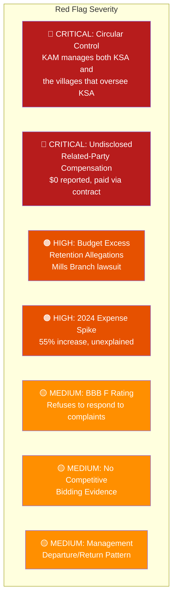

---

## 1. The Circular Control Structure (CRITICAL)

### The Problem

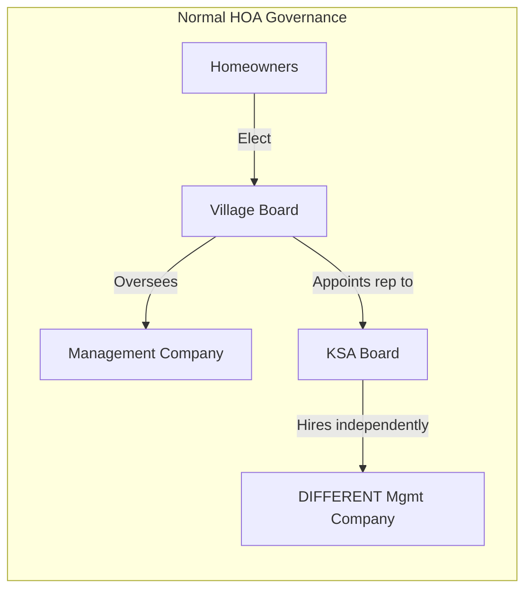

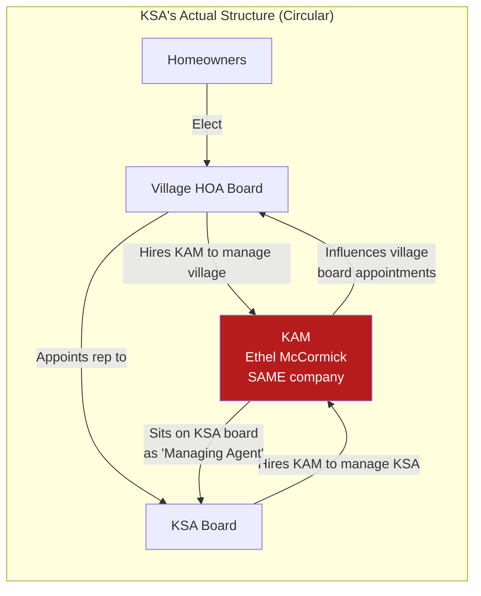

### Why This Is a Red Flag

| Normal Structure | KSA's Structure |
|-----------------|-----------------|
| Management company serves ONE level | KAM serves BOTH levels (villages + KSA) |
| Oversight body is independent | Oversight body (villages) is managed by same company |
| Board hires management independently | Board includes the management company's owner |
| Competitive bidding for contracts | No evidence of competitive bidding |
| Management company is accountable | Management company influences its own oversight |

### Legal Analysis

Under **Texas Business Organizations Code Chapter 22**, nonprofit directors owe:

1. **Duty of Loyalty** — Act in the organization's best interest, not personal interest
2. **Duty of Care** — Act as a reasonably prudent person would
3. **Duty of Obedience** — Follow governing documents and applicable law

McCormick simultaneously:
- **Owns** the management company (KAM) that receives the contract
- **Sits on** the KSA board that awards the contract
- **Manages** the village HOAs that appoint members to the KSA board
- **Serves as** registered agent for KSA

This is a textbook **interlocking directorate / self-dealing** arrangement. Under Texas law, self-dealing transactions are voidable unless (1) fully disclosed and (2) approved by disinterested parties.

---

## 2. The Complete Ownership & Money Flow

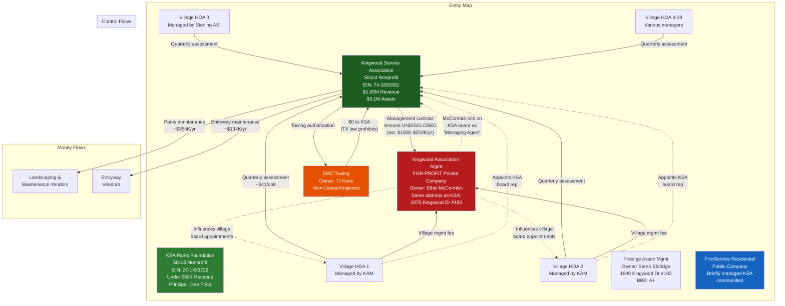

### Double-Dipping Analysis

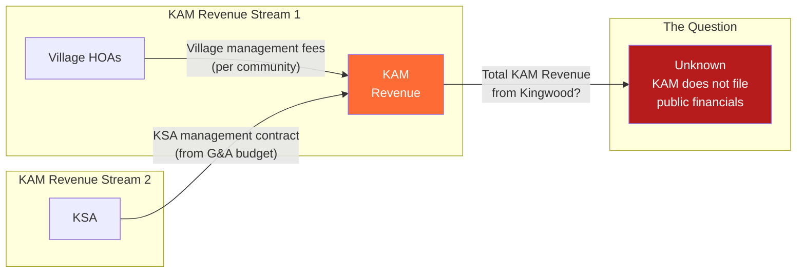

KAM collects management fees from **both sides**:
- From individual village HOAs for village-level management
- From KSA for community-wide management

The total amount KAM receives from the Kingwood ecosystem is **unknown** because KAM is a private company with no public financial disclosure requirement.

---

## 3. Documented Fraud Allegations

### Mills Branch Village v. KSA — "Multiyear Multi-Million Dollar Excess Fund Fraud"

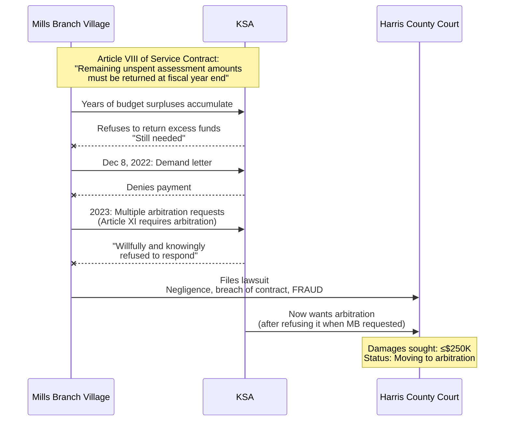

### Key Legal Questions

| Question | Significance |
|----------|-------------|
| How much surplus has KSA retained? | "Multi-million dollar" per lawsuit — could be $1M–$3M+ |
| How many years of non-return? | "Multiyear" — minimum 2+ years |
| Did other villages also lose excess funds? | If yes, total exposure could be $3M–$10M+ |
| Where did retained surplus funds go? | Into $3.6M reserve? Into higher KAM fees? Into undisclosed expenses? |
| Why did KSA refuse arbitration? | Arbitration is private — KSA's own contract requires it, yet they refused until sued |

### Cascade Risk

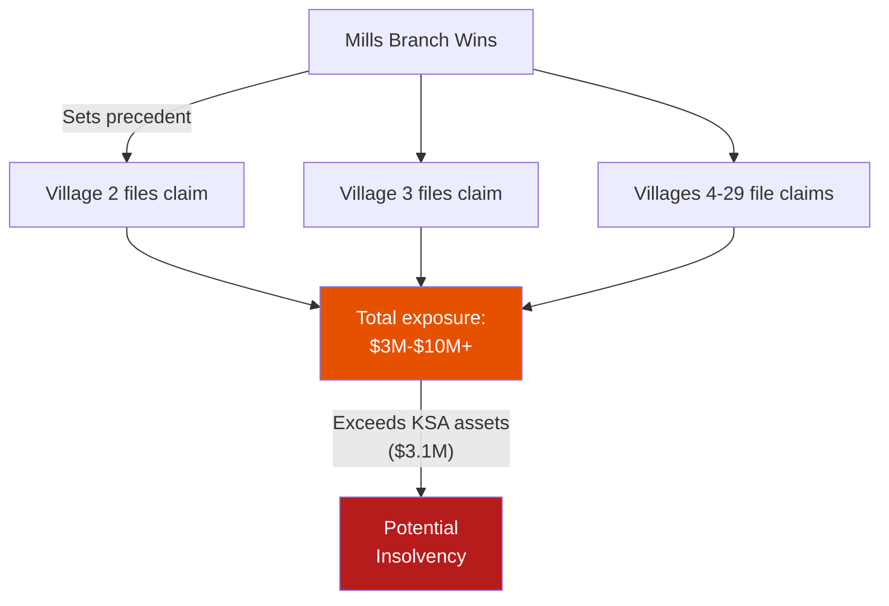

---

## 4. Financial Anomaly Analysis

### The 2024 Expense Spike

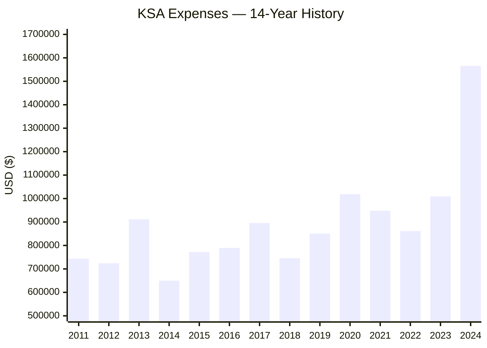

| Metric | Value |
|--------|-------|
| 2024 Expenses | $1,565,650 |
| 2023 Expenses | $1,009,164 |
| YoY Increase | **$556,486 (+55.1%)** |
| 14-Year Median Expense | ~$845,000 |
| 2024 vs Median | **+85%** |
| 2024 Net Loss | **-$516,729** |
| Reserve Drawdown | $501,210 in cash |

**Forensic Questions:**
1. Was the $556K increase approved in the annual budget vote?
2. What specific line items drove the increase?
3. Did KAM's management fee increase proportionally?
4. Were new vendors engaged without competitive bidding?
5. Is any of the $556K attributable to legal fees from the Mills Branch lawsuit?
6. Did the expense spike coincidentally follow the fraud lawsuit?

### Form 990 Reporting Concerns

| Issue | Detail |
|-------|--------|
| **$0 officer compensation** | McCormick is listed as "Managing Agent" with $0 compensation, but is paid through KAM's contract. This may violate Form 990 Part VII reporting requirements if she qualifies as a "key employee." |
| **$0 rental income** | 6+ active field leases to sports organizations, yet $0 reported as rental income. Either bundled in program services (misleading) or leases are at-cost (unusual). |
| **Schedule L (related party)** | Does the 990 disclose the KAM contract as a related-party transaction? If not, this is a reportable omission. |
| **BBB alternate name** | BBB lists "Kingwood Association Management" as an alternate name for KSA — suggesting the two entities are functionally interchangeable. |

### Historical Pattern Analysis

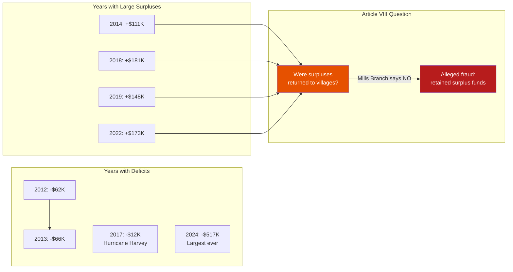

If KSA ran surpluses of $111K (2014), $181K (2018), $148K (2019), $173K (2022) — totaling **$613K in just those 4 years** — and did NOT return them per Article VIII, then those retained funds would have inflated the reserves to the $3.6M peak seen in 2023.

**This is exactly what Mills Branch alleges.**

---

## 5. BBB F Rating — What It Means

| BBB Metric | KSA |
|-----------|-----|
| **Rating** | **F** (lowest possible) |
| **Accredited** | No |
| **Complaints filed** | 2 |
| **Complaints responded to** | **0** |
| **Alternate name listed** | Kingwood Association Management |

An F rating means KSA/KAM **refuses to engage** with consumer complaints through official channels. Combined with refusing arbitration requests from Mills Branch, this suggests a pattern of avoiding accountability.

For comparison: **Prestige Association Management** (a competitor in Kingwood) has a BBB rating of **A+**.

---

## 6. The McCormick Departure/Return

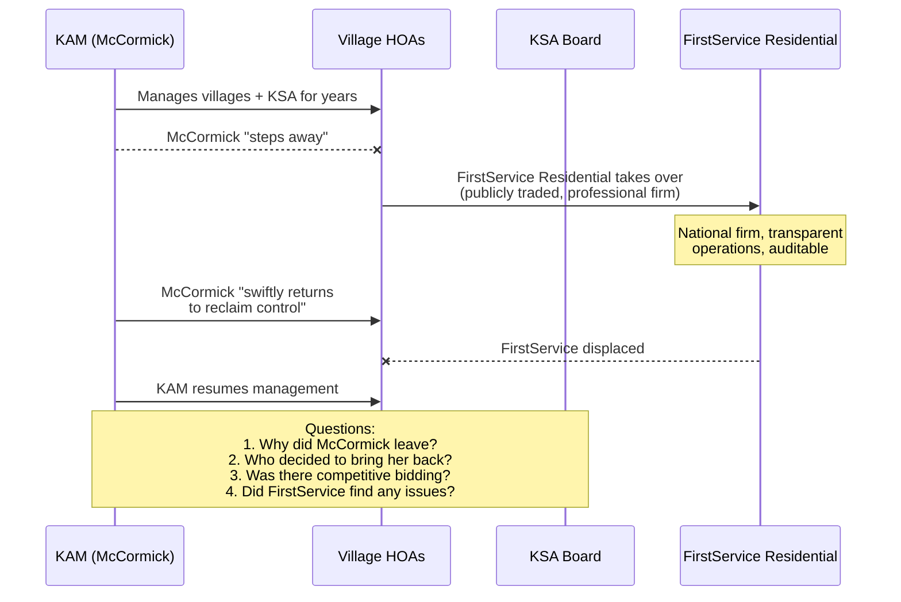

### Key Questions

1. **Why did McCormick leave?** Voluntary departure or forced out?
2. **What did FirstService Residential find** when they took over the books? Any discrepancies?
3. **Who voted to bring KAM back?** The same village boards that KAM had been managing?
4. **Was there a competitive process?** Or was KAM simply reinstated?
5. **Did fees change?** Did KAM's contract increase upon return?

---

## 7. Fraud Typology Assessment

Applying standard forensic accounting frameworks to KSA:

### ACFE Fraud Tree Analysis

| Fraud Type | Evidence Level | Details |
|-----------|---------------|---------|
| **Asset Misappropriation** | Low (unproven) | No evidence of stolen funds, but expense opacity prevents verification |
| **Financial Statement Fraud** | Medium | $0 officer compensation while managing agent owns contractor; $0 rental income with active leases; possible Schedule L omission |
| **Corruption / Self-Dealing** | High (structural) | Management company owner sits on board, manages both oversight and managed entities, no competitive bidding, same address |
| **Breach of Fiduciary Duty** | High (alleged in lawsuit) | Failure to return budget excesses per governing documents; refusal to submit to arbitration |

### Fraud Triangle Applied to KSA

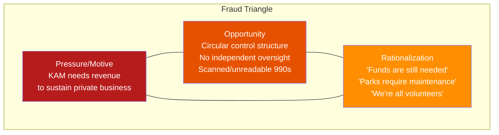

---

## 8. Comparable Texas HOA Fraud Cases

| Case | Parallel to KSA |
|------|-----------------|
| **Shadow Creek Ranch (Pearland, TX)** — Manager created fraudulent invoices, directed vendor payments to company she owned. DOJ prosecution. | McCormick owns management company receiving KSA contract. Vendor payment oversight question. |
| **Las Colinas Association (Irving, TX)** — Management company self-dealing, inflated contracts | KAM dual-management of KSA + villages |
| **Lakeshore Village HOA (Houston)** — Board members steering contracts to related businesses | McCormick sits on KSA board while owning KAM |
| **Olmos Park Terrace (San Antonio)** — Board president embezzled through fictitious vendor payments | KSA has 0 employees; all payments go to vendors/contractors |

National average HOA fraud: **$154,000** per case. 25% exceed **$1 million**. Average detection time: **18 months**.

---

## 9. Available Legal Remedies

### For Kingwood Residents

| Action | Mechanism | Who |
|--------|-----------|-----|
| **Demand books & records** | TX Business Organizations Code §22.351 + Property Code §209.005 | Any member/homeowner |
| **File IRS Form 13909** | Tax-exempt organization complaint if 990 is inaccurate | Anyone |
| **File TX AG complaint** | Consumer protection / nonprofit oversight | Anyone |
| **Sue derivatively** | On behalf of KSA against directors for breach of fiduciary duty | Members |
| **Sue directly** | For violation of governing documents (Article VIII excess funds) | Member associations |
| **Petition for court-ordered audit** | Texas law allows judicial intervention | Members |
| **Report to TDLR** | If towing arrangement involves prohibited kickbacks | Anyone |
| **File HOA complaint** | Texas Property Owners Association Division: hoa.texas.gov | Homeowners |

### IRS Form 13909 Process

1. Download [IRS Form 13909](https://www.irs.gov/pub/irs-pdf/f13909.pdf)
2. Include: names, actions, places, amounts, dates, evidence
3. Submit via email: eoclass@irs.gov
4. Or mail: TEGE Referrals Group, 1100 Commerce Street, MC 4910 DAL, Dallas, TX 75242
5. IRS will mail acknowledgment (unless anonymous)
6. IRS will not disclose actions taken (IRC §6103 confidentiality)

---

## 10. Conclusions

### What Can Be Stated With Confidence

1. **The structure is designed to minimize accountability.** KAM manages both the overseer (villages) and the overseen (KSA), creating circular control with no independent check.

2. **The 990 reporting is, at minimum, misleading.** $0 officer compensation while the managing agent owns the contractor receiving the largest portion of expenses is a disclosure concern.

3. **Mills Branch's lawsuit has merit on its face.** If Article VIII requires returning surpluses, and KSA accumulated $3.6M in assets while running annual surpluses, the question of where those surpluses went is legitimate.

4. **The 2024 expense spike is unexplained.** A 55% increase in a single year, causing the organization's largest-ever deficit, warrants detailed examination.

5. **KSA refuses accountability.** F rating from BBB (refused to respond to complaints). Refused arbitration with Mills Branch (then sought it when sued). No public financial detail beyond summary 990 data.

### What Cannot Be Determined Without Investigation

1. The actual amount of KAM's management contract
2. Whether KAM receives any indirect benefits from the towing arrangement
3. Whether vendors are related to McCormick or KAM
4. What caused the 2024 expense spike
5. Whether any surplus funds were improperly diverted
6. Whether FirstService Residential identified any discrepancies during their tenure

### Recommended Next Steps

1. **File Texas Public Information Act / books-and-records request** for KAM contract, vendor list, board minutes, and annual budgets vs actuals (2019–2024)
2. **Obtain and OCR the 990 PDFs** from ProPublica to extract Part IX expense detail and Schedule L related-party disclosures
3. **Photograph towing signage** at all 5 KSA parks to verify compliance and identify the towing company
4. **Attend the October KSA board meeting** (3rd Thursday, 7 PM, South Woodland Hills Community Room, 2030 Shadow Rock Drive) where the annual budget is presented
5. **Consult a Texas HOA attorney** specializing in nonprofit governance and fiduciary duty

---

## Sources

- [Mills Branch v. KSA — Laws In Texas](https://lawsintexas.com/kingwood-services-association-sued-for-multiyear-financial-fraud-by-hoa-subdivision/)
- [Kings Mill Wrongful Death — Laws In Texas](https://lawsintexas.com/kingwood-hoa-ethel-mccormick-wrongful-death-lawsuit/)
- [KSA BBB Profile (F Rating)](https://www.bbb.org/us/tx/humble/profile/non-profit-organizations/kingwood-service-association-0915-90018366)
- [ProPublica Nonprofit Explorer — KSA](https://projects.propublica.org/nonprofits/organizations/741891991)
- [Shadow Creek Ranch HOA Fraud — DOJ](https://www.justice.gov/usao-sdtx/pr/shadow-creek-ranch-manager-pleads-guilty-scamming-hoa-company)
- [Texas HOA Corruption — Love Investors](https://loveinvestors.com/blog/hoa-corruption-exposed-texas/)
- [Self-Dealing Breach of Fiduciary Duty](https://communityassociations.law/2024/04/01/self-dealing-by-director-is-a-breach-of-fiduciary-duty-2/)
- [Texas Nonprofit Fiduciary Duties — Freeman Law](https://freemanlaw.com/fiduciary-duties-of-the-board-of-directors-in-texas/)
- [IRS Form 13909](https://www.irs.gov/pub/irs-pdf/f13909.pdf)
