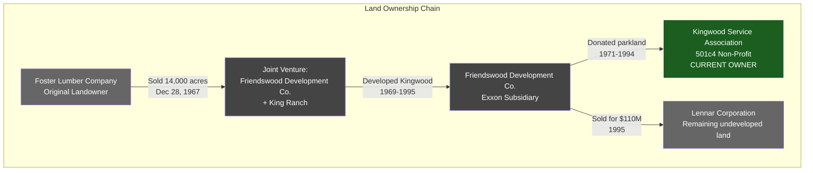
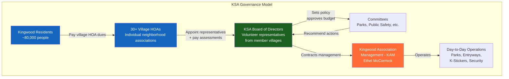
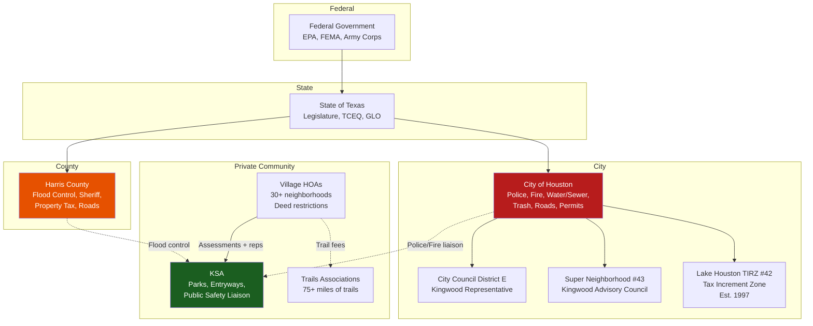
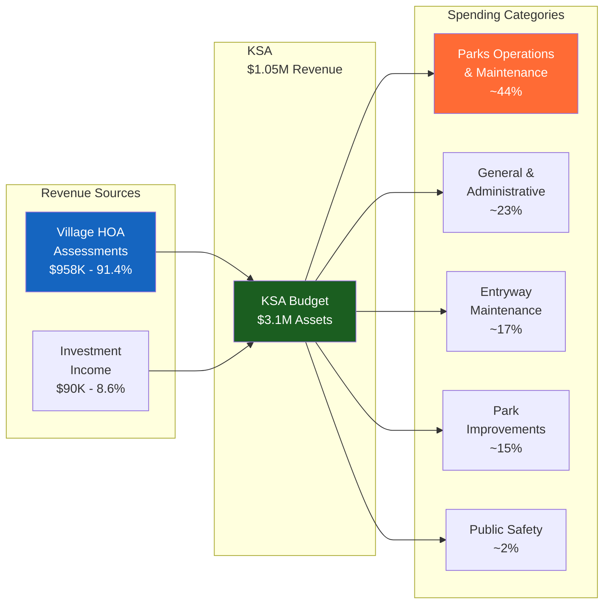
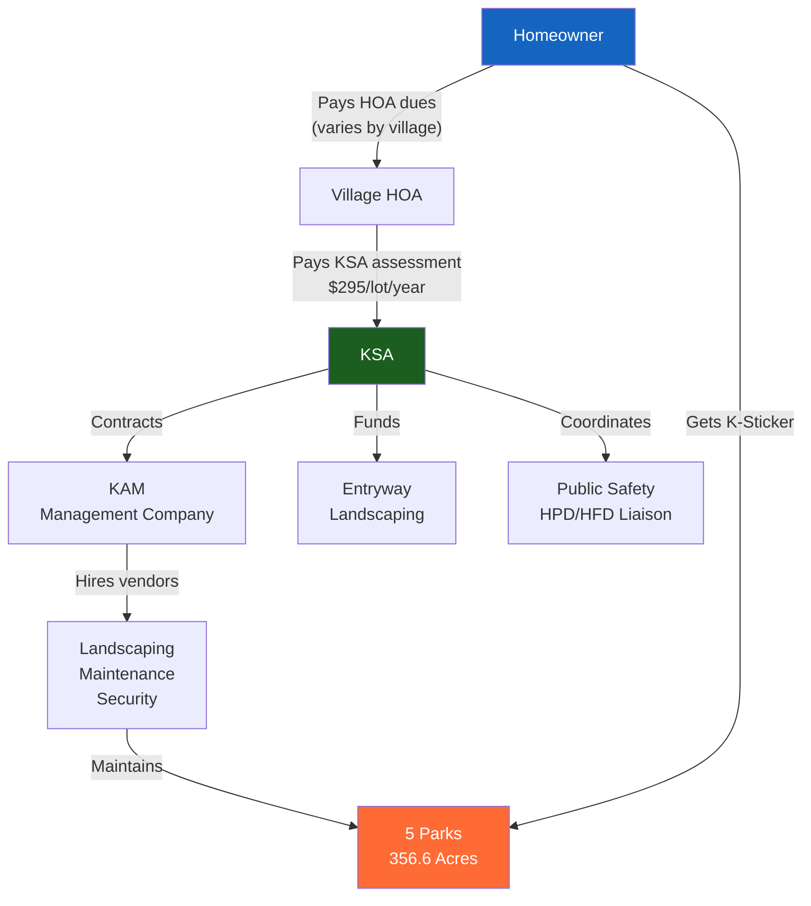
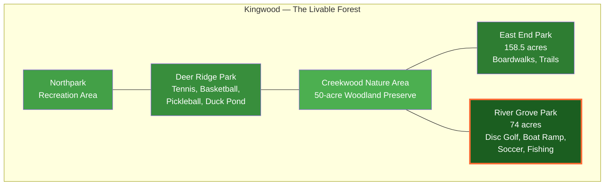
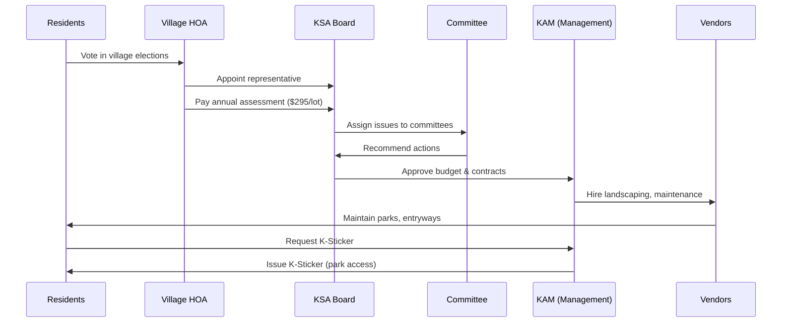

# KSA Ownership, Governance & Political Structure

## River Grove Park — Land Ownership

River Grove Park (74 acres) is **privately owned by the Kingwood Service Association**. It is NOT a public park, NOT county-owned, and NOT MUD-owned.

### Property Records

- **County:** Harris County, Texas
- **Property Search:** [HCAD Property Search](https://hcad.org/property-search/property-search)
- **Owner of Record:** Kingwood Service Association
- **Location:** South end of Woodland Hills Drive, Kingwood, TX
- **Acreage:** 74 acres
- **Tax Status:** Tax-exempt (501(c)(4) property)

---

## Governance Structure

### Key Points

- **Residents do NOT vote directly** for KSA board members
- Each **village HOA appoints a representative** to the KSA board (delegate model)
- Individual homeowners vote in **village HOA elections**, which indirectly influence KSA
- KSA has **0 employees** — all operations outsourced to KAM
- All board officers serve **unpaid** ($0 compensation)

### Current Board (2024–2025)

| Role | Name | Compensation |
|------|------|-------------|
| President | Delores Price | $0 |
| Vice President | William C. Manthei | $0 |
| Secretary | Maryanne Fortson | $0 |
| Treasurer | Scott Gilreath / John Kaskie | $0 |
| Managing Agent | Ethel McCormick | $0 from KSA (paid via KAM contract) |

---

## Political Structure — Overlapping Jurisdictions

### Who Does What in Kingwood

| Service | Provider | Notes |
|---------|----------|-------|
| Police | Houston PD | KSA coordinates via Public Safety Committee |
| Fire/EMS | Houston FD | Replaced volunteer FD after 1996 annexation |
| Water/Sewer | City of Houston | Replaced 13 MUDs after annexation; bills doubled |
| Trash/Recycling | City of Houston | Weekly service |
| Roads | City of Houston + Harris County | Shared jurisdiction |
| Flood Control | Harris County Flood Control District | Major issue post-Harvey |
| Parks (5 private) | **KSA** | 356.6 acres, K-Sticker access |
| Public Parks | City of Houston Parks Dept | Separate from KSA parks |
| Entryway Landscaping | **KSA** | Kingwood Dr. medians, entrances |
| Deed Restrictions | Village HOAs | Architectural control, landscaping |
| Trails (75+ miles) | Trails Associations | Separate from KSA |
| Property Tax | Harris County Tax Office | Funds city, county, school, MUD debt |
| Schools | Humble ISD | Independent school district |

---

## KSA Revenue Flow

---

## Assessment Flow — From Resident to Park

---

## KSA Parks Map (Relative Positions)

---

## Decision-Making Process

---

## Sources

- [ProPublica Nonprofit Explorer - KSA](https://projects.propublica.org/nonprofits/organizations/741891991)
- [KSA Official Website](http://kingwoodserviceassociation.org/)
- [Kingwood.com - Community Guide](https://www.kingwood.com/community/)
- [HCAD Property Search](https://hcad.org/property-search/property-search)
- [Hunters Ridge Village - KSA Info](https://huntersridgevillage.com/ksa)
