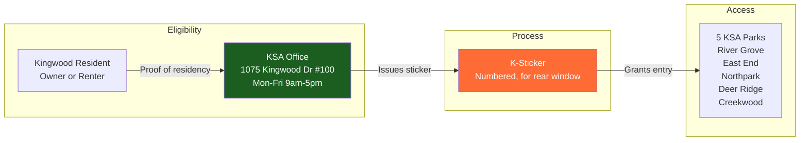
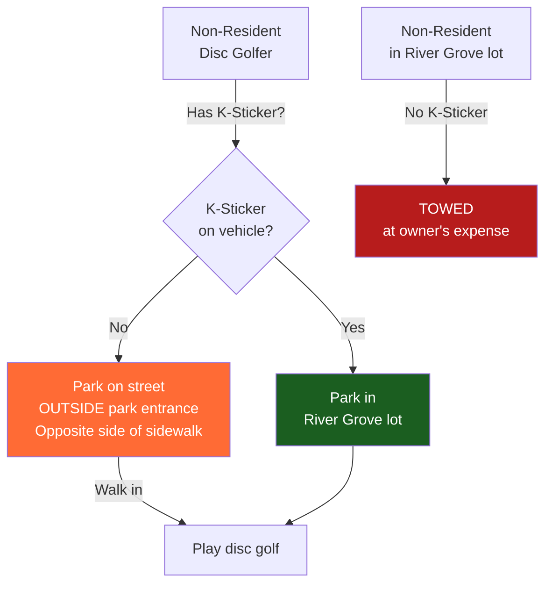

# K-Sticker System & Parking at River Grove Park

## What Are K-Stickers?

Numbered vehicle stickers that prove Kingwood residency and grant access to KSA-owned parks and facilities. Required on all vehicles and boat trailers entering KSA parks.

## How to Get a K-Sticker

| Requirement | Details |
|-------------|---------|
| **Who** | Any Kingwood resident (owner or renter) in a KSA member village |
| **Proof** | Driver's license, utility bill, or lease showing Kingwood address |
| **Where** | KSA Office: 1075 Kingwood Dr, Suite 100, Kingwood TX 77339 |
| **When** | Monday–Friday, 9:00 AM – 5:00 PM |
| **Phone** | (281) 358-5192 |
| **Placement** | Rear window of vehicle |

## Enforcement

- **Vehicles without a current K-Sticker are subject to towing at the owner's expense**
- This is **private property towing** under Texas law — not city/county parking enforcement
- KSA (via KAM) manages enforcement
- Towing company contracted by KSA (specific vendor not publicly disclosed)
- Enforcement is active — towing does occur

## Impact on Disc Golf at River Grove

### For Kingwood Residents (KSA Member Villages)
- Display K-Sticker, park freely in River Grove lot
- No issues

### For Non-Residents (Visiting Disc Golfers)

**Key Workaround:** Non-residents can park along the public road outside the park entrance (opposite the sidewalk) and walk in to play disc golf. The disc golf course itself is accessible on foot — enforcement targets **vehicles** in the **parking lot**, not pedestrians on the course.

### Implications for RGDGC

1. **Tournament Hosting:** Visiting players need clear parking instructions; cannot use River Grove lot without K-Stickers
2. **League Growth:** Limited to Kingwood residents unless alternative parking communicated
3. **Course Promotion:** UDisc listing should note parking restrictions for non-residents
4. **KSA Relationship:** Maintaining good relations with KSA is essential for:
   - Course improvements (new tee pads, baskets, signage)
   - Event permits
   - Parking accommodations for special events
   - Potential designated disc golf parking

## River Grove Park Access Rules

| Rule | Detail |
|------|--------|
| **Hours** | Dawn to dusk |
| **Vehicle Access** | K-Sticker required |
| **Boat Ramp** | K-Sticker required on vehicle AND trailer |
| **Pedestrian Access** | Open (walk-in from public road) |
| **Pets** | Leashed |
| **Alcohol** | Not permitted |
| **Fires** | Grills in designated areas only |
| **Reservations** | Pavilion/shelter reservations through KSA office |

## Sources

- [KSA K-Stickers Page](http://www.kingwoodserviceassociation.org/kingwoodservice/sub_category_list.asp?category=31&title='K'+Stickers)
- [Kingwood.com - K Stickers](https://www.kingwood.com/community/kingwood_k_sticker.php)
- [River Grove Park - 365 Things Houston](https://365thingsinhouston.com/park-spotlight-river-grove-park-kingwood/)
- [River Grove Park - Tammy James Homes](https://tammyjameshomes.com/river-grove-park-kingwood-texas/)
