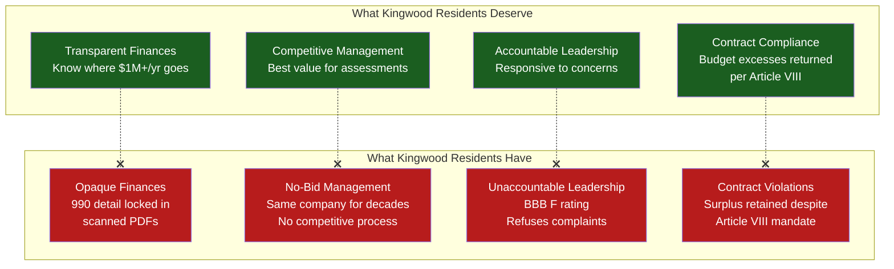
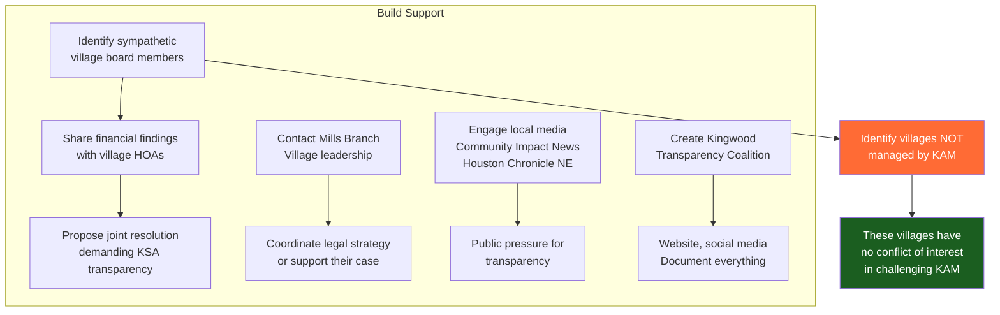
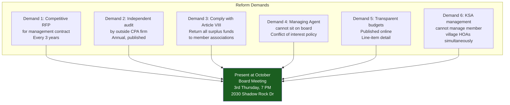
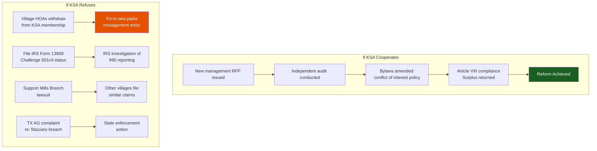
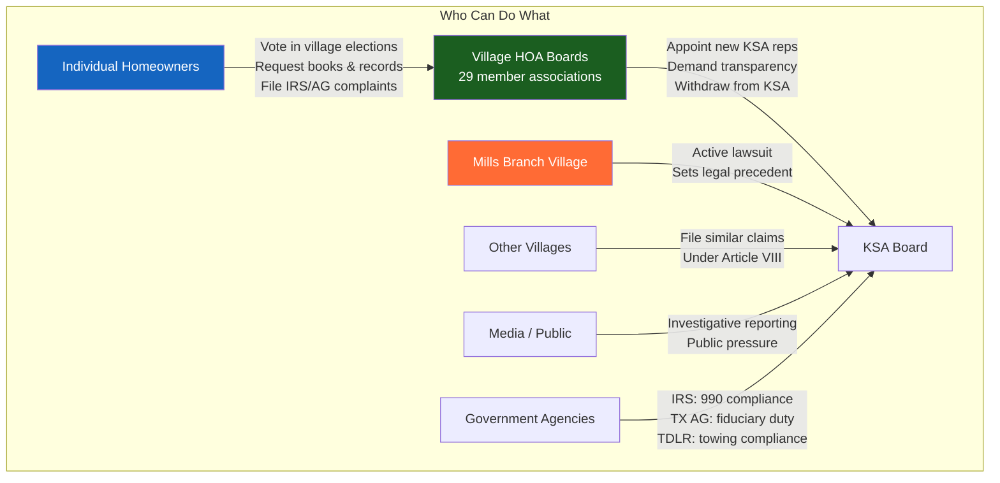
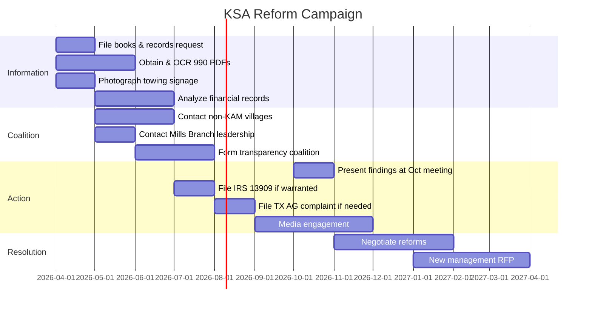

# The Case for KSA Governance Modernization

> A community strategy document. The goal is **partnership first** — offering KSA a better way to manage parks through technology, transparency, and youth employment. The legal and political leverage described below is Phase 4: only activated if partnership is refused.

---

## The Core Problem



---

## The Evidence (Summary)

### Financial Evidence

| Finding | Source | Significance |
|---------|--------|-------------|
| **$0 officer compensation** reported while managing agent owns the contractor | Form 990, all years | Possible 990 disclosure violation |
| **BBB F rating** — refused to respond to any complaints | BBB Profile | Pattern of avoiding accountability |
| **$556K expense spike (2024)** — 55% increase, unexplained | Form 990 FY2024 | Largest deficit in org history |
| **$3.6M in reserves accumulated** while governing docs require surplus return | Form 990 + Mills Branch lawsuit | Core fraud allegation |
| **$0 rental income** despite 6+ active field leases | Form 990, all years | Either misclassified or undisclosed |
| **KAM contract amount undisclosed** | Not on public 990 summary | Transparency failure |

### Structural Evidence

| Finding | Source | Significance |
|---------|--------|-------------|
| **KAM manages both KSA and villages** that oversee KSA | KAM website, community records | Circular control / conflict of interest |
| **McCormick sits on KSA board** as "Managing Agent" while owning KAM | Form 990 Part VII | Self-dealing position |
| **Same address** for nonprofit and for-profit entity | 1075 Kingwood Dr #100 | Entities functionally blurred |
| **BBB lists KAM as "alternate name"** for KSA | BBB Profile | Further entity confusion |
| **No competitive bidding** for management contract | No public evidence of RFP | Fiduciary duty concern |
| **McCormick returned after FirstService** without public process | Community reports | Control consolidation |

### Legal Evidence

| Finding | Source | Significance |
|---------|--------|-------------|
| **Mills Branch lawsuit: fraud, breach of contract** | Harris County Court | Active litigation re: retained surpluses |
| **KSA refused arbitration** (required by own contract) | Mills Branch lawsuit filing | Bad faith |
| **Kings Mill wrongful death** — McCormick named personally | Laws In Texas | Management liability pattern |
| **2 BBB complaints ignored** | BBB Profile | Refusal to engage |

---

## The Political Strategy

### Phase 1: Build the Record (Months 1-3)

```mermaid
graph TD
    subgraph "Information Gathering"
        A[File Books & Records Request<br/>TX BOC §22.351<br/>TX Property Code §209.005] --> B[Demand:<br/>• KAM management contract<br/>• All vendor contracts >$10K<br/>• Board minutes (5 years)<br/>• Annual budgets vs actuals<br/>• Reserve study]
        B --> C{KSA Responds?}
        C -->|"Yes"| D[Analyze records<br/>for discrepancies]
        C -->|"No / Refuses"| E[File TX AG complaint<br/>for obstruction]
    end

    subgraph "Parallel Actions"
        F[Obtain 990 PDFs<br/>from ProPublica] --> G[OCR + analyze<br/>Part IX expenses<br/>Schedule L related parties]
        H[Photograph towing signage<br/>at all 5 parks] --> I[Verify TDLR compliance<br/>Identify towing company]
        J[Attend October board meeting<br/>Ask budget questions publicly] --> K[Document responses<br/>or refusal to answer]
    end

    style E fill:#B71C1C,color:#fff
    style D fill:#1B5E20,color:#fff
```

### Phase 2: Coalition Building (Months 2-6)



### Phase 3: Demand Reform (Months 4-8)



### Phase 4: Enforce or Replace (Months 6-12)



---

## The Six Demands (Detailed)

### Demand 1: Competitive Management RFP

**Current State:** KAM has held the management contract for decades with no evidence of competitive bidding. The same company manages both KSA and many individual village HOAs.

**Reform:** Issue a public RFP for the KSA management contract every 3 years. Require minimum 3 bids. The winning bidder cannot simultaneously manage member village HOAs (to eliminate circular control).

**Precedent:** National industry standard. FirstService Residential, Associa, RealManage, and other national firms actively bid on community association management contracts.

**Cost to KSA:** $0 — competitive bidding typically reduces costs by 10-25%.

### Demand 2: Independent Annual Audit

**Current State:** No evidence of independent financial audit. Form 990 is prepared internally or by KAM. 990 PDFs are scanned images (not machine-readable), making analysis difficult.

**Reform:** Annual audit by an independent CPA firm (not chosen by KAM). Published online within 90 days of fiscal year end. Machine-readable (not scanned images).

**Cost to KSA:** $8,000–$15,000/year for an audit of this size. Less than 1% of annual expenses.

### Demand 3: Article VIII Compliance

**Current State:** Mills Branch Village alleges KSA has retained surplus funds for multiple years in violation of Article VIII of the service contract, which requires return of unspent assessment amounts at fiscal year end.

**Reform:** Immediate compliance with Article VIII. Calculate and return all accumulated surplus funds to member associations. Publish annual budget-vs-actual reports.

**Financial Impact:** If $1M–$3M in retained surpluses must be returned, KSA's reserves drop significantly. This is money that **belongs to the villages**, not KSA.

### Demand 4: Conflict of Interest Policy

**Current State:** McCormick owns KAM, sits on the KSA board as "Managing Agent," serves as registered agent, and operates from the same address. No conflict of interest policy is publicly available.

**Reform:** Adopt a formal conflict of interest policy:
- No person with a financial interest in a KSA vendor/contractor may serve on the KSA board
- The managing agent position is advisory only — no voting rights
- All related-party transactions must be disclosed in writing and approved by disinterested directors
- Annual conflict of interest disclosure by all board members

### Demand 5: Financial Transparency

**Current State:** Financial detail is locked in scanned PDF 990s. Budget categories are only known from presentations given in 2009 and 2012. No budget detail has been publicly available for 12+ years.

**Reform:** Publish online:
- Annual approved budget with line-item detail
- Quarterly financial statements
- All vendor contracts over $5,000
- Board meeting minutes within 30 days
- Reserve study (if one exists)

### Demand 6: Management Separation

**Current State:** KAM manages both KSA (the master association) and multiple individual village HOAs. The villages appoint KSA board members, but KAM manages those villages — creating circular control.

**Reform:** The KSA management company cannot simultaneously manage any KSA member village association. This eliminates the structural conflict of interest.

**Precedent:** Many master-planned communities use separate management companies for the master association and individual villages specifically to avoid this conflict.

---

## Who Has Standing to Act



### Critical Leverage Point: Villages NOT Managed by KAM

The most effective advocates for reform are village HOAs that use **different management companies** (Sterling ASI, SCS Management, Crest Management, CIA Services). These villages have no conflict of interest in challenging KAM's role:

| Management Company | Known Villages | Conflict with KAM? |
|-------------------|---------------|-------------------|
| **Sterling ASI** | Hunters Ridge, Greentree, North/South Woodland Hills, Trailwood | No — independent |
| **SCS Management** | Kings Manor | No — independent |
| **Crest Management** | Kingwood Place West | No — independent |
| **CIA Services** | Various | No — independent |
| **KAM (McCormick)** | Bear Branch, Kings Crossing Patio, others | YES — conflict |

**Strategy:** Build the reform coalition through non-KAM villages first. They can demand transparency without being undermined by their own management company.

---

## Legal Authorities

| Law | Application |
|-----|------------|
| **TX Business Organizations Code §22.351** | Right to inspect books and records of nonprofit |
| **TX Property Code §209.005** | Right to inspect HOA records (if KSA qualifies as POA) |
| **TX BOC Chapter 22** | Fiduciary duties of nonprofit directors (loyalty, care, obedience) |
| **IRS Form 13909** | Complaint about tax-exempt organization — if 990 is inaccurate |
| **TX Occupations Code §2308.257(c)** | Anti-kickback prohibition for towing |
| **Article VIII, KSA Service Contract** | Requires return of budget excesses to member associations |
| **Article XI, KSA Service Contract** | Requires arbitration for disputes (KSA violated this) |

---

## Timeline to Action



---

## What Success Looks Like

| Before Reform | After Reform |
|--------------|-------------|
| KAM: no-bid contract, decades-long | Competitive RFP every 3 years |
| McCormick on KSA board + owns contractor | Conflict of interest policy; no vendor on board |
| $0 officer comp reported (paid via contract) | Full related-party disclosure on 990 |
| Surplus retained despite Article VIII | Surplus returned annually per contract |
| BBB F rating, complaints ignored | Responsive complaint resolution process |
| Budget detail: last published 2012 | Annual budget published online, line-item |
| Scanned PDF 990s (unreadable) | Machine-readable, published within 90 days |
| KAM manages both KSA and villages | Separate management for master vs. village |
| $1M/year spent with no public accountability | Independent annual audit by outside CPA |

---

## Disclaimer

This document analyzes publicly available information including IRS Form 990 filings, BBB profiles, court records, and community sources. It does not constitute legal advice. The structural concerns and financial anomalies identified warrant formal investigation but do not, by themselves, prove fraud. Residents considering legal action should consult a licensed Texas attorney specializing in HOA law and nonprofit governance.

## Sources

All sources are documented in the companion files:
- [FRAUD_ANALYSIS.md](FRAUD_ANALYSIS.md) — Detailed forensic analysis with Mermaid diagrams
- [FINANCIAL_REVIEW.md](FINANCIAL_REVIEW.md) — Comprehensive financial review
- [KSA_Financial_DCF_Model.xlsx](KSA_Financial_DCF_Model.xlsx) — 7-sheet spreadsheet with 664 formulas including Forensic Evidence sheet
- [TOWING_AND_ENFORCEMENT.md](TOWING_AND_ENFORCEMENT.md) — Towing contracts and Texas law
- [OWNERSHIP_AND_GOVERNANCE.md](OWNERSHIP_AND_GOVERNANCE.md) — Ownership structure with Mermaid maps
- [EXECUTIVE_SUMMARY.md](EXECUTIVE_SUMMARY.md) — Year-by-year KSA history
- [CONTROVERSIES_AND_LEGAL.md](CONTROVERSIES_AND_LEGAL.md) — All lawsuits and controversies
