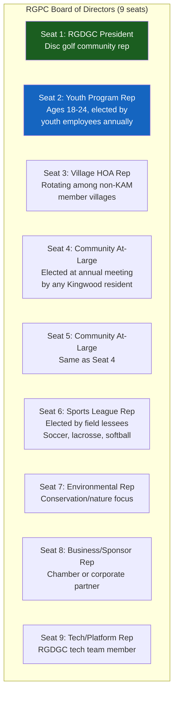
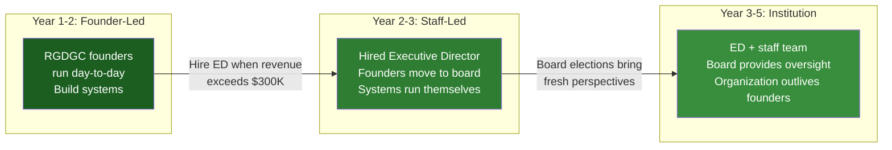
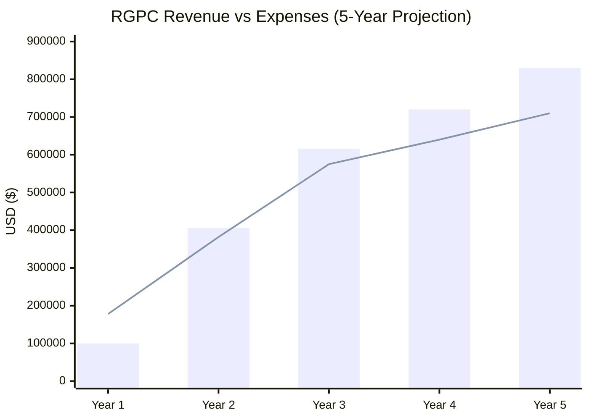
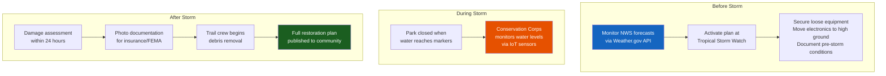
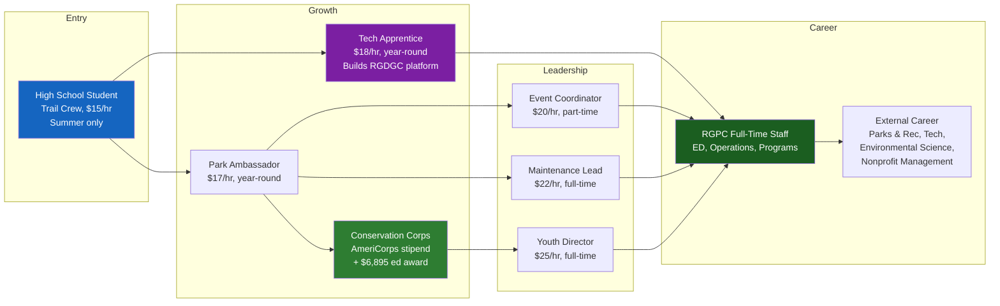
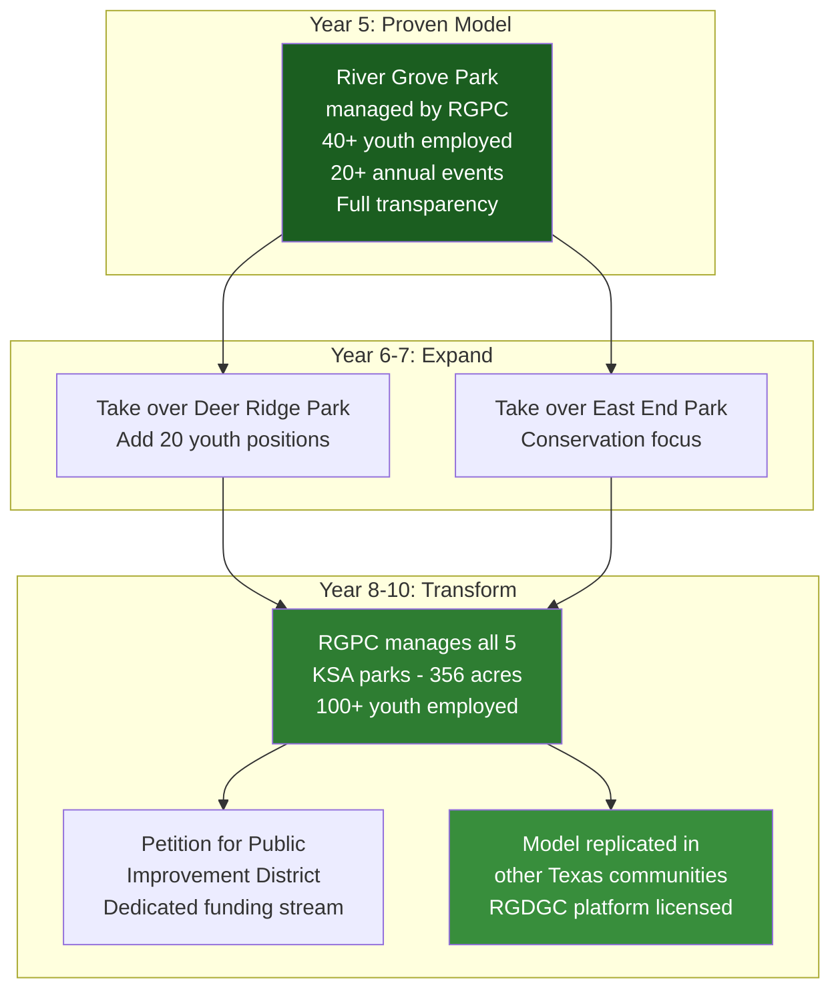
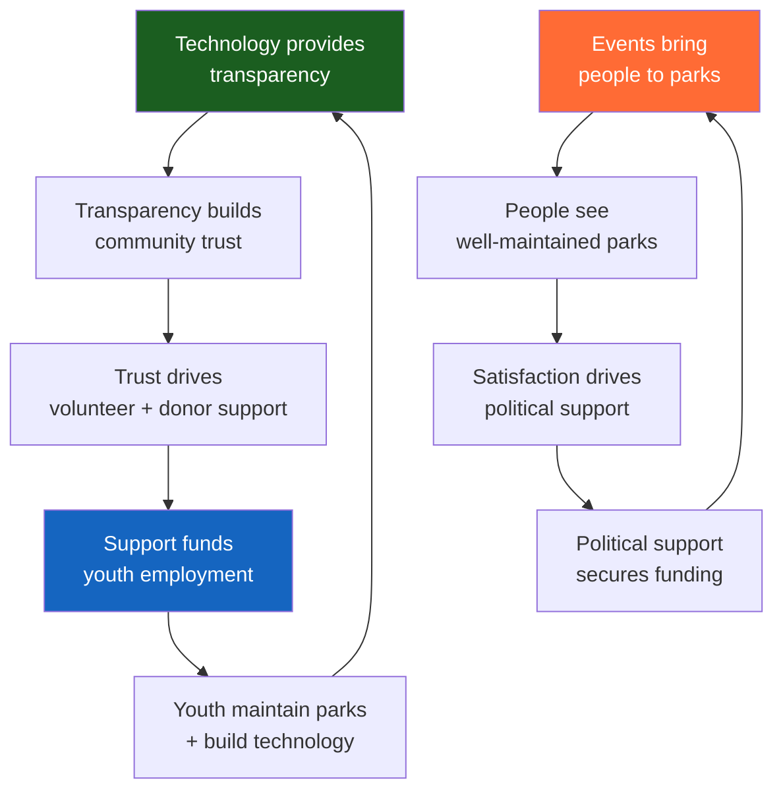

# River Grove Parks Conservancy — 5-Year Sustainability Plan

## Purpose

This document ensures RGPC doesn't become the next KSA — a well-intentioned organization that calcifies into opacity. Every system described here is designed to **prevent** the problems we identified in KSA: no transparency, no competitive process, no youth engagement, no technology, no accountability.

---

## I. Governance — Built to Last

### Board Structure

### Anti-KSA Provisions (Built Into Bylaws)

| KSA Problem | RGPC Prevention |
|-------------|----------------|
| Management company owner on board | **Bylaw: No person with financial interest in any RGPC vendor/contractor may serve on the board** |
| Same company manages both sides | **Bylaw: Management company cannot simultaneously serve any KSA member village HOA** |
| No competitive bidding | **Bylaw: All contracts >$10K require 3+ competitive bids. All contracts >$25K require public posting.** |
| No conflict of interest policy | **Bylaw: Annual written COI disclosure by every board member. Immediate recusal from any vote involving personal financial interest.** |
| No term limits | **Bylaw: 3-year terms, maximum 2 consecutive terms. Board must turn over.** |
| No financial transparency | **Bylaw: Real-time public budget dashboard. Quarterly financial reports published within 30 days. Annual independent audit by outside CPA.** |
| Scanned PDF 990s | **Bylaw: All financial filings machine-readable and published online within 48 hours of filing.** |
| No youth representation | **Bylaw: Seat 2 reserved for youth employee (18-24). If vacant, remains vacant until filled — cannot be reassigned.** |
| Unresponsive to complaints | **Bylaw: All formal complaints acknowledged within 5 business days, resolved or escalated within 30 days. Quarterly complaint summary published.** |
| No public meetings | **Bylaw: All board meetings open to public, streamed live, minutes published within 7 days.** |

### Succession Planning

### The "Bus Test"

Every critical function must survive any single person leaving:

| Function | Primary | Backup | Documented? |
|----------|---------|--------|-------------|
| Financial management | Treasurer | Board-appointed CPA firm | Automated in platform |
| Park maintenance | Maintenance Lead | Trail Crew Supervisor | Checklist in app |
| Event operations | Event Coordinator | Volunteer committee | Templates in platform |
| Technology platform | Tech Lead | RGDGC team (4+ developers) | Open source in repo |
| Youth program | Youth Director | AmeriCorps site supervisor | Program manual |
| Fundraising/grants | ED / Board Chair | Grant writer (contractor) | Calendar + templates |
| Community relations | ED | Board At-Large reps | Contact database in CRM |

---

## II. Financial Sustainability — Revenue Model Over Time

### 5-Year Revenue Projection

| Category | Year 1 | Year 2 | Year 3 | Year 4 | Year 5 |
|----------|--------|--------|--------|--------|--------|
| **Assessment Revenue** | $0 | $96,000 | $96,000 | $98,000 | $100,000 |
| **Events & Tournaments** | $15,000 | $45,000 | $75,000 | $100,000 | $120,000 |
| **Youth Program Grants** | $40,000 | $80,000 | $120,000 | $140,000 | $150,000 |
| **Corporate Sponsors** | $10,000 | $35,000 | $60,000 | $80,000 | $100,000 |
| **Facility Rentals** | $5,000 | $20,000 | $30,000 | $40,000 | $50,000 |
| **Field Leases** | $15,000 | $25,000 | $30,000 | $35,000 | $40,000 |
| **Pro Shop / Concessions** | $5,000 | $15,000 | $25,000 | $35,000 | $45,000 |
| **Grants (TPWD, etc.)** | $0 | $50,000 | $100,000 | $100,000 | $100,000 |
| **Donations (501c3)** | $10,000 | $25,000 | $40,000 | $50,000 | $60,000 |
| **Tech Licensing** | $0 | $10,000 | $25,000 | $25,000 | $40,000 |
| **$RGDG Token** | $0 | $5,000 | $15,000 | $17,000 | $25,000 |
| **TOTAL REVENUE** | **$100,000** | **$406,000** | **$616,000** | **$720,000** | **$830,000** |
| | | | | | |
| **TOTAL EXPENSES** | **$178,000** | **$382,000** | **$575,000** | **$640,000** | **$710,000** |
| **NET** | **-$78,000** | **+$24,000** | **+$41,000** | **+$80,000** | **+$120,000** |
| **Cumulative Reserve** | $0* | $24,000 | $65,000 | $145,000 | $265,000 |

*Year 1 gap funded by founding donations + volunteer labor offsets.*

### Revenue Diversification Rule

**No single revenue source may exceed 30% of total revenue.** This prevents the KSA problem where 91% of revenue comes from one source (assessments) with zero pricing power.

| Source | Year 1 % | Year 3 % | Year 5 % | Limit |
|--------|----------|----------|----------|-------|
| Assessment Revenue | 0% | 15.6% | 12.0% | 30% max |
| Events & Tournaments | 15.0% | 12.2% | 14.5% | 30% max |
| Youth Program Grants | 40.0% | 19.5% | 18.1% | 30% max |
| Corporate Sponsors | 10.0% | 9.7% | 12.0% | 30% max |
| All other sources | 35.0% | 43.0% | 43.4% | — |

### Financial Controls

| Control | Implementation | Frequency |
|---------|---------------|-----------|
| **Independent audit** | Outside CPA firm (not chosen by ED) | Annual |
| **Public budget dashboard** | RGDGC platform, real-time | Continuous |
| **Board approval thresholds** | >$5K requires board vote; >$25K requires 2/3 vote | Per transaction |
| **Dual signature** | All checks >$2,500 require two signatories | Per transaction |
| **Quarterly review** | Board reviews actuals vs. budget, publishes variance report | Quarterly |
| **Competitive bidding** | All contracts >$10K require 3+ bids | Per contract |
| **Expense reporting** | All board/staff expenses published with receipts | Monthly |

---

## III. Park Maintenance — Operational Calendar

### Annual Maintenance Cycle (River Grove Park — 74 acres)

| Month | Major Tasks | Staff | Budget |
|-------|------------|-------|--------|
| **January** | Tree assessment, trail inspection, equipment maintenance | Maintenance Lead + 2 crew | $8,000 |
| **February** | Trail repairs, drainage clearing (pre-rain season) | Full crew + Conservation Corps | $12,000 |
| **March** | Spring planting, mulching, disc golf course prep for season | Full crew + volunteers | $15,000 |
| **April** | Mowing begins (bi-weekly), event infrastructure setup | Full crew | $10,000 |
| **May** | Summer hiring (trail crew), pavilion prep, boat ramp maintenance | Full crew + 5 trail crew | $12,000 |
| **June** | Peak mowing, summer events begin, youth program full swing | Max staffing | $15,000 |
| **July** | Hurricane prep review, drainage maintenance, heat management | Full crew + Corps | $12,000 |
| **August** | Hurricane season peak — emergency prep, Harvey anniversary event | Maintenance focus | $10,000 |
| **September** | Fall transition, budget prep for next year, trail clearing | Full crew | $10,000 |
| **October** | Annual meeting, budget vote, fall planting, disc golf championship | Full crew + volunteers | $12,000 |
| **November** | Tree trimming, infrastructure winterization, grant applications due | Maintenance Lead + 2 | $8,000 |
| **December** | Equipment overhaul, annual report, holiday events | Reduced crew | $6,000 |
| **TOTAL** | | | **$130,000** |

### Flood Preparedness (River Grove is in a floodplain)

### Technology-Powered Maintenance

| System | What It Does | KSA Equivalent |
|--------|-------------|---------------|
| **Maintenance Request App** | Residents photo + GPS-tag issues, tracked to resolution | Call KAM, hope for response |
| **Work Order System** | Youth workers see daily tasks in app, log completion with photos | Paper lists |
| **Asset Tracking** | Every bench, basket, sign, trash can inventoried with QR code | None |
| **Mowing Schedule** | GPS-tracked mowing routes, automated scheduling | Manual |
| **Flood Sensors** | IoT water level monitors at key drainage points | None |
| **Tree Inventory** | GIS-mapped tree database with health assessments | None |

---

## IV. Youth Employment — Long-Term Pipeline

### Year 1-5 Growth

| Year | Trail Crew | Park Ambassadors | Tech Apprentices | Conservation Corps | Event Coordinators | Total | Annual Wages |
|------|-----------|-----------------|-----------------|-------------------|-------------------|-------|-------------|
| 1 | 5 | 3 | 2 | 0 | 0 | **10** | $140,000 |
| 2 | 8 | 5 | 3 | 3 | 2 | **21** | $280,000 |
| 3 | 15 | 10 | 5 | 5 | 5 | **40** | $450,000 |
| 4 | 15 | 10 | 7 | 7 | 5 | **44** | $510,000 |
| 5 | 18 | 12 | 8 | 8 | 6 | **52** | $600,000 |

### Career Pathways

### Partner Pipeline

| Partner | Role | Youth Served |
|---------|------|-------------|
| **Humble ISD** | CTE program referrals, release time, credit | 5-10 students/year |
| **Lone Star College - Kingwood** | Internship/co-op credit, workforce development | 3-5 interns/year |
| **HIRE Houston Youth** | Funded summer positions for ages 16-24 | 5-10 trail crew |
| **Texas Conservation Corps** | AmeriCorps positions, federal funding | 3-8 corps members |
| **SCA Houston Urban Green** | Paid summer conservation crew | 2-4 crew |
| **Junior League of Kingwood** | Volunteer mentors for youth workers | Mentorship |
| **Kingwood Women's Club** | Community volunteer matching | Event support |

### Alumni Network

After 5 years, RGPC will have employed **150+ Kingwood youth**. These alumni become:
- Future board members and donors
- Community advocates for parks
- Proof that the model works (for replication)
- Professional network for current youth employees

---

## V. Technology Platform Sustainability

### The RGDGC Stack Powers Everything

The platform being built in this repo isn't just for disc golf — it's the **operating system for the entire conservancy**:

| RGDGC Module | Conservancy Use | Maintenance |
|-------------|----------------|-------------|
| **FastAPI Backend** | All park operations data, financial tracking, work orders | RGDGC tech team + apprentices |
| **React Native App** | Resident check-in, maintenance requests, event registration | Open source, community PRs |
| **Admin Dashboard** | Staff scheduling, budget tracking, grant reporting | Board oversight |
| **PostgreSQL + PostGIS** | Asset inventory, GIS mapping, spatial analysis | Standard DB ops |
| **$RGDG Token** | Event payments, youth rewards, transparent treasury | Smart contract (immutable) |
| **OpenClaw Bot** | 24/7 resident support, rule lookups, event info | Skill files updated quarterly |
| **MCP Server** | Real-time data queries for Claude Code integration | Auto-syncs with DB |
| **QR Sticker System** | Digital park access, disc tracking, asset management | Already built |

### Open Source Strategy

The RGDGC platform is **open source**. This means:

1. **No vendor lock-in** — if the tech team disappears, anyone can maintain it
2. **Community contributions** — other disc golf clubs and parks can contribute features
3. **Replication** — other communities can fork the platform for their own parks
4. **Tech apprentice training** — real codebase with real users, not toy projects
5. **Licensing revenue** — other parks pay for hosted version while code stays open

### Tech Maintenance Budget

| Item | Annual Cost | Notes |
|------|------------|-------|
| Railway hosting (backend + DB) | $2,400 | PostgreSQL + Redis + FastAPI |
| Expo / App Store / Play Store | $1,500 | $99 Apple + $25 Google + EAS builds |
| Domain + email + SSL | $200 | rgpc.org or similar |
| Mapbox API (satellite/terrain) | $0–$1,200 | 50K free loads/month |
| Sentry error tracking | $0 | Free tier sufficient |
| Backup + disaster recovery | $600 | Automated DB backups |
| **Total** | **$5,900/year** | Less than 1% of budget |

---

## VI. Community Engagement — Keeping Momentum

### Annual Event Calendar

| Month | Event | Purpose | Revenue |
|-------|-------|---------|---------|
| January | New Year's Day Round | Kickoff | $500 |
| February | Volunteer Day | Trail repair + cleanup | $0 (volunteer) |
| March | Spring Tournament (PDGA) | Regional competition | $5,000 |
| April | Earth Day Festival | Conservation awareness, sponsors | $3,000 |
| May | Youth Hiring Fair | Recruit summer crew | $0 |
| June | Summer Flex League (weekly) | Regular programming | $3,000 |
| July | 4th of July at River Grove | Community celebration | $5,000 (sponsors) |
| August | Harvey Memorial Cleanup | Honor community, flood awareness | $0 (volunteer) |
| September | Fall Championship | Major tournament | $8,000 |
| October | Annual Meeting + Festival | Governance + celebration | $2,000 |
| November | Corporate Challenge | Team building events | $5,000 |
| December | Winter Flex + Toy Drive | Holiday community event | $2,000 |
| **TOTAL** | **12 anchor events + 20 smaller** | | **$33,500+** |

### Transparency Reports (Automated by Platform)

| Report | Frequency | Content | Published Where |
|--------|-----------|---------|----------------|
| **Financial Dashboard** | Real-time | Revenue, expenses, budget vs actual | RGPC website + app |
| **Monthly Summary** | Monthly | Events held, youth hours, maintenance completed | Email + Kingwood.com |
| **Quarterly Report** | Quarterly | Financial statements, KPIs, park usage data | Website + village boards |
| **Annual Report** | Annual | Full year review, youth outcomes, strategic plan update | Published document + annual meeting |
| **990 Filing** | Annual | IRS filing, machine-readable, published same day | Website + ProPublica |

### Community Feedback Loops

| Channel | Response Time | Tracked? |
|---------|-------------|----------|
| **App maintenance request** | Acknowledged <24 hrs, resolved <7 days | Yes — dashboard |
| **Email** | Response <48 hrs | Yes — CRM |
| **Kingwood.com post** | Response <24 hrs | Manual monitoring |
| **Board meeting public comment** | Addressed at meeting | Minutes published |
| **Annual survey** | Results published <30 days | Yes — analytics |

---

## VII. Risk Management

### Top 5 Risks and Mitigations

| Risk | Probability | Impact | Mitigation |
|------|------------|--------|-----------|
| **KSA refuses partnership** | 40% | High | Legal backup (Phase 4), PID petition, public pressure, demonstrate superiority |
| **Founder burnout** | 30% | High | Hire ED by Year 2, distribute leadership across 9-seat board, document everything |
| **Flood destroys infrastructure** | 20% | High | Insurance, emergency fund (10% of budget), flood-resilient design, FEMA documentation protocol |
| **Grant funding dries up** | 25% | Medium | Revenue diversification rule (<30% from any source), earned revenue growth, reserve fund |
| **Youth program liability** | 15% | Medium | Comprehensive insurance, certified training, safety protocols, background checks |

### Insurance Requirements

| Policy | Coverage | Annual Cost |
|--------|----------|------------|
| General liability | $2M/$5M | $3,000 |
| D&O (Directors & Officers) | $1M | $2,000 |
| Event liability (per event) | $1M | $500/event |
| Workers' compensation | State-required | $4,000 |
| Property/equipment | Replacement value | $1,500 |
| **Total** | | **$12,500/year** |

### Emergency Reserve Policy

**Maintain 3 months of operating expenses in reserve at all times.** At Year 3 expenses of $575K, this equals **$144K minimum reserve**. The reserve fund is untouchable for operations — board must vote to access it, and any drawdown must be replenished within 12 months.

---

## VIII. Long-Term Vision (Years 5-10)

### If RGPC Succeeds at River Grove

### The Endgame

By Year 10, RGPC could be:

- **Managing 356 acres** of Kingwood parkland
- **Employing 100+ youth** across all parks
- **Generating $2M+ in annual revenue** from diversified sources
- **Running 50+ community events** per year
- **Maintaining full financial transparency** via the RGDGC platform
- **Licensing the platform** to 10+ other community parks nationwide
- **Operating as a Public Improvement District** with dedicated, voter-approved funding

This is the Hermann Park Conservancy model applied to a suburban master-planned community, powered by open-source technology built by a disc golf club.

---

## IX. How This Is Maintained Over Time

### The Self-Reinforcing Cycle

The model is self-sustaining because:

1. **Youth workers maintain the parks** → parks look great → community supports the program
2. **Technology provides transparency** → transparency builds trust → trust brings donors
3. **Events bring people** → people see results → results drive political support
4. **Political support secures funding** → funding employs youth → cycle continues

**The opposite of KSA's death spiral:** opacity → distrust → complaints ignored → lawsuits → insolvency risk.

---

## Sources & References

- Hermann Park Conservancy: $8.3M/year, Houston precedent
- Memorial Park Conservancy: 1,100 acres, $30M budget
- NRPA park maintenance benchmarks: $7,823/acre/year median
- TPWD Local Park Grants: $21.2M awarded in 2026
- HIRE Houston Youth: city-funded summer internships
- Texas Conservation Corps: AmeriCorps, $2,400-2,720/mo
- UDisc growth report: 21.2M rounds/year nationally
- RGDGC platform architecture: see repo root CLAUDE.md
