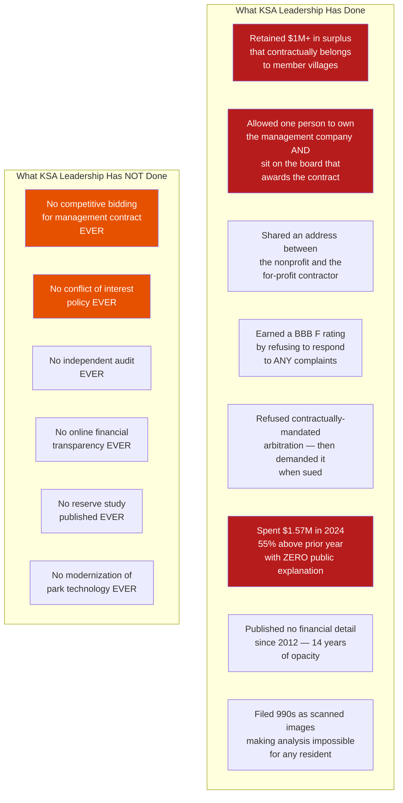
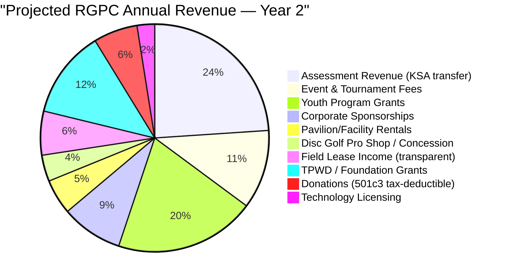

# River Grove Parks Conservancy — A Proposal to the Kingwood Community

## Why Kingwood's Parks Deserve Modern Management

### The Case for Change (Documented Facts)



### The Social Case

This isn't about one person. It's about a **50-year-old system that never modernized**.

KSA was created in 1976 by Exxon to manage a new suburb's common areas. The governance model — appointed delegates, outsourced management, paper-based finances — made sense when Kingwood had 5,000 residents and no internet.

Kingwood now has **64,000 residents**, generates **$1M+ annually** in assessments, manages **356 acres** of irreplaceable greenspace, and operates with:

- **Zero employees**
- **Zero technology**
- **Zero transparency**
- **Zero competitive process**
- **Zero youth engagement**
- **Zero modern infrastructure**

The current leadership isn't necessarily corrupt — they're **obsolete**. They run a million-dollar organization like it's 1986. And the community is paying the price in:

- Lost surplus funds ($1M+ retained)
- Lost accountability (BBB F rating)
- Lost opportunity (no events, no tourism, no technology, no jobs)
- Lost community trust (Mills Branch lawsuit)

### Who Suffers

| Group | How They're Affected |
|-------|---------------------|
| **Homeowners** | Pay ~$41/unit/year with zero visibility into how it's spent. Surplus not returned. |
| **Youth** | Zero employment opportunities in 356 acres of parkland. No internships, no trail crews, no tech programs. |
| **Disc golfers** | Course improvements depend on an unresponsive organization. Non-residents towed without alternative. |
| **Boaters** | Only 3.5% of sticker holders use the boat ramp, yet it consumed 49% of capital reserves to dredge. |
| **Sports leagues** | 6+ organizations lease fields with $0 reported rental income and no transparency on terms. |
| **Environmentalists** | 356 acres of riparian forest with zero conservation programming, zero watershed monitoring, zero ecological data. |
| **Local businesses** | Zero event programming means zero foot traffic, zero tourism, zero economic multiplier from parks. |

---

## The Proposal: River Grove Parks Conservancy

### What We're Proposing

Create the **River Grove Parks Conservancy (RGPC)** — a new 501(c)(3) nonprofit that partners with or replaces KSA for River Grove Park management, using the technology platform RGDGC is already building.

```mermaid
graph TB
    subgraph "Phase 1: Partnership (Year 1)"
        P1A[Form RGPC as 501c3] --> P1B[Sign MOU with KSA<br/>for River Grove Park<br/>co-management]
        P1B --> P1C[Deploy RGDGC tech platform<br/>for park operations]
        P1C --> P1D[Launch youth employment<br/>program - 10 positions]
        P1D --> P1E[Run first season of<br/>events and programming]
    end

    subgraph "Phase 2: Expansion (Year 2-3)"
        P2A[Demonstrate superior<br/>management metrics] --> P2B[Propose full River Grove<br/>management transfer]
        P2B --> P2C[Expand to Deer Ridge<br/>and East End parks]
        P2C --> P2D[Scale youth program<br/>to 25-40 positions]
    end

    subgraph "Phase 3: Institution (Year 3-5)"
        P3A[Petition for Public<br/>Improvement District] --> P3B[Secure TPWD grants<br/>for park improvements]
        P3B --> P3C[Become the regional<br/>model for community<br/>park management]
    end

    style P1A fill:#1B5E20,color:#fff
    style P2A fill:#2E7D32,color:#fff
    style P3A fill:#388E3C,color:#fff
```



### Why RGDGC Is Uniquely Positioned

The RGDGC platform already being built in this repo provides capabilities that KSA has **never had and will never build**:

| RGDGC Capability | KSA Equivalent | Impact |
|------------------|---------------|--------|
| **FastAPI Backend + PostgreSQL** | Paper ledgers, scanned PDFs | Real-time financial transparency |
| **React Native Mobile App** | None | Every resident can see park status, budgets, events |
| **Real-time Scoring & Analytics** | None | Track park usage, player engagement, community metrics |
| **League Management System** | Manual spreadsheets | Automated event management, standings, scheduling |
| **QR Sticker System** | Numbered K-stickers (1976 tech) | Digital check-in, usage analytics, instant validation |
| **$RGDG Token / Blockchain** | Cash-only transactions | Transparent treasury, member rewards, event payments |
| **OpenClaw AI Chatbot** | Phone calls to KAM (Mon-Fri 9-5) | 24/7 community support, rule lookups, event info |
| **Claude MCP Server** | Nothing | Real-time data queries, leaderboards, statistics |
| **AR Features** | Nothing | Training overlays, distance measurement, course guides |
| **PostGIS / Mapbox Integration** | Nothing | GPS course maps, satellite imagery, elevation data |
| **Admin Dashboard** | None | Volunteer management, event approvals, budget tracking |
| **Weather.gov Integration** | Nothing | Wind/weather alerts, course conditions |

**KSA's entire operation runs on a 1976 governance model with zero technology. RGDGC is building a 2026 platform that could manage not just disc golf but an entire park ecosystem.**

---

## The Economic Model

### Revenue Streams (River Grove Park — 74 acres)



| Revenue Stream | Year 1 | Year 2 | Year 3 | Notes |
|---------------|--------|--------|--------|-------|
| **Assessment Revenue** | $0 | $96,000 | $96,000 | KSA transfers River Grove share (~10% of $958K) |
| **Event & Tournament Fees** | $15,000 | $45,000 | $75,000 | Disc golf, 5Ks, festivals, corporate events |
| **Youth Program Grants** | $40,000 | $80,000 | $120,000 | TXCC, AmeriCorps, TPWD, Green Wave, corporate |
| **Corporate Sponsorships** | $10,000 | $35,000 | $60,000 | Hole sponsors, park bench dedications, naming rights |
| **Pavilion/Facility Rentals** | $5,000 | $20,000 | $30,000 | Weddings, reunions, corporate outings |
| **Field Lease Income** | $15,000 | $25,000 | $30,000 | Soccer, lacrosse — transparent, market-rate leases |
| **Disc Golf Pro Shop** | $5,000 | $15,000 | $25,000 | Discs, bags, merch, food/beverage |
| **TPWD/Foundation Grants** | $0 | $50,000 | $100,000 | 50% matching grants for park improvements |
| **Donations** | $10,000 | $25,000 | $40,000 | 501(c)(3) tax-deductible — trees, benches, memorials |
| **Technology Licensing** | $0 | $10,000 | $25,000 | License RGDGC platform to other parks/clubs |
| **$RGDG Token Revenue** | $0 | $5,000 | $15,000 | Transaction fees, member rewards |
| **TOTAL** | **$100,000** | **$406,000** | **$616,000** |

### Expense Budget

| Category | Year 1 | Year 2 | Year 3 | Notes |
|----------|--------|--------|--------|-------|
| **Park Maintenance** | $80,000 | $120,000 | $150,000 | Landscaping, mowing, repairs, trash |
| **Youth Employment (10→25→40)** | $40,000 | $100,000 | $160,000 | $15-18/hr, 20 hrs/week, seasonal + year-round |
| **Event Operations** | $10,000 | $30,000 | $50,000 | Tournament costs, equipment, permits |
| **Technology / Platform** | $15,000 | $20,000 | $25,000 | Hosting, maintenance, development |
| **Insurance** | $8,000 | $12,000 | $15,000 | General liability, D&O, event |
| **Admin / Management** | $20,000 | $40,000 | $60,000 | Part-time director (Y1), full-time (Y2+) |
| **Capital Improvements** | $0 | $50,000 | $100,000 | Tee pads, baskets, signage, trails |
| **Professional Services** | $5,000 | $10,000 | $15,000 | Legal, accounting, audit |
| **TOTAL** | **$178,000** | **$382,000** | **$575,000** |

### Year 1 Gap and How to Close It

Year 1 has a **$78,000 gap** (revenue $100K, expenses $178K). Solutions:

1. **Founding donation campaign** — $50K from disc golf community + Kingwood donors
2. **In-kind volunteer labor** — RGDGC members provide maintenance hours (reducing $80K line)
3. **Phased launch** — start with disc golf + events only, add broader park management in Q3-Q4
4. **Bridge grant** — TPWD Local Park Grant (50% match), AmeriCorps stipends cover youth wages

By Year 2, the model is **self-sustaining with a $24K surplus**.
By Year 3, it generates **$41K surplus** while employing 40 youth.

---

## Youth & Community Employment Program

### The Vision

**Turn 356 acres of underutilized parkland into Kingwood's largest youth employer.**

```mermaid
graph TD
    subgraph "Youth Employment Tiers"
        T1[Tier 1: Trail Crew<br/>Ages 16-18<br/>$15/hr, 20 hrs/week<br/>Seasonal (summer)<br/>Maintenance, cleanup,<br/>trail building]

        T2[Tier 2: Park Ambassadors<br/>Ages 18-22<br/>$17/hr, 25 hrs/week<br/>Year-round<br/>Visitor services, events,<br/>K-sticker validation]

        T3[Tier 3: Tech Apprentices<br/>Ages 18-24<br/>$18/hr, 30 hrs/week<br/>Year-round<br/>RGDGC platform development,<br/>GIS mapping, data analysis]

        T4[Tier 4: Conservation Corps<br/>Ages 18-25<br/>$2,400-2,720/mo (AmeriCorps)<br/>Year-round<br/>Watershed monitoring,<br/>habitat restoration,<br/>flood mitigation]

        T5[Tier 5: Event Coordinators<br/>Ages 21+<br/>$20/hr, part-time<br/>Seasonal<br/>Tournament operations,<br/>facility rentals, sponsors]
    end

    T1 -->|"Advancement"| T2
    T2 -->|"Advancement"| T3
    T2 -->|"Advancement"| T4
    T3 -->|"Advancement"| T5
    T4 -->|"Advancement"| T5

    style T1 fill:#1B5E20,color:#fff
    style T3 fill:#1565C0,color:#fff
    style T4 fill:#2E7D32,color:#fff
```

### Position Details

| Position | Count (Yr1→Yr3) | Age | Hours | Rate | Annual Cost | Funding Source |
|----------|-----------------|-----|-------|------|-------------|---------------|
| Trail Crew | 5→15 | 16-18 | 20/wk, 12 wk summer | $15/hr | $18,000→$54,000 | HIRE Houston Youth, TPWD |
| Park Ambassador | 3→10 | 18-22 | 25/wk, year-round | $17/hr | $66,300→$221,000 | Assessment revenue, grants |
| Tech Apprentice | 2→5 | 18-24 | 30/wk, year-round | $18/hr | $56,160→$140,400 | Technology revenue, sponsors |
| Conservation Corps | 0→5 | 18-25 | 40/wk, year-round | $2,560/mo | $0→$153,600 | AmeriCorps/TXCC (federal) |
| Event Coordinator | 0→5 | 21+ | 15/wk, seasonal | $20/hr | $0→$46,800 | Event revenue |
| **TOTAL** | **10→40** | | | | **$140,460→$615,800** |

### What Youth Learn

| Tier | Hard Skills | Soft Skills | Career Path |
|------|------------|-------------|-------------|
| Trail Crew | Chainsaw safety, trail construction, erosion control, native plant ID | Teamwork, punctuality, physical endurance | Landscaping, parks & rec, forestry |
| Park Ambassador | Customer service, conflict resolution, first aid, park management | Communication, leadership, problem-solving | Hospitality, parks management, public admin |
| Tech Apprentice | React Native, Python/FastAPI, PostgreSQL, GIS/Mapbox, data analysis | Project management, code review, documentation | Software engineering, data science, GIS |
| Conservation Corps | Water quality testing, habitat assessment, GPS/GIS, flood monitoring | Environmental science, grant writing, public speaking | Environmental science, conservation, hydrology |
| Event Coordinator | Event planning, sponsor relations, budget management, marketing | Negotiation, multitasking, deadline management | Event management, marketing, nonprofit admin |

### Partnerships for Funding

| Partner | Program | Funding | Youth Served |
|---------|---------|---------|-------------|
| **HIRE Houston Youth** | 8-week summer internship | City-funded wages | 5-10 trail crew |
| **Texas Conservation Corps** | AmeriCorps stipend + education award | Federal ($2,400-$2,720/mo + $6,895 ed award) | 3-5 corps members |
| **SCA Houston Urban Green** | Paid summer conservation | SCA-funded | 2-4 crew members |
| **Green Wave Initiative** | Harris County conservation | County-funded | 2-4 positions |
| **Humble ISD** | Career & Technical Education partnership | District-funded release time | 5-10 students |
| **Lone Star College** | Internship/co-op program | College credit | 3-5 interns |
| **TPWD** | Local Park Grant (50% match) | State grant | Funds infrastructure youth build |
| **Corporate sponsors** | Chevron, ExxonMobil, CenterPoint community grants | $10-50K grants | 2-5 positions per sponsor |

---

## Technology-Powered Park Management

### How RGDGC Platform Manages River Grove

```mermaid
graph TB
    subgraph "Resident Experience (Mobile App)"
        R1[Open RGDGC App] --> R2[See real-time park status<br/>Weather, events, conditions]
        R2 --> R3[Digital K-Sticker<br/>QR code validation<br/>No more windshield stickers]
        R3 --> R4[Book pavilion, field,<br/>event space online]
        R4 --> R5[See EXACTLY where<br/>assessment money goes<br/>Real-time budget dashboard]
        R5 --> R6[Report maintenance issue<br/>GPS-tagged, photo, tracked]
        R6 --> R7[Get AI answers from<br/>OpenClaw chatbot 24/7]
    end

    subgraph "Youth Worker Experience"
        Y1[Clock in via app<br/>GPS-verified at park] --> Y2[View today's tasks<br/>Trail maintenance, mowing,<br/>event setup]
        Y2 --> Y3[Log work with photos<br/>Before/after documentation]
        Y3 --> Y4[Track hours toward<br/>certifications and<br/>advancement]
    end

    subgraph "Admin Experience (Dashboard)"
        A1[Real-time budget vs actual] --> A2[Maintenance request queue]
        A2 --> A3[Event calendar + revenue]
        A3 --> A4[Youth program metrics]
        A4 --> A5[Park usage analytics<br/>from QR check-ins]
        A5 --> A6[Automated 990 data<br/>generation for tax filing]
    end

    subgraph "Community Transparency"
        T1[Public budget dashboard<br/>Every dollar visible] --> T2[Quarterly reports<br/>auto-generated]
        T2 --> T3[Board meetings streamed<br/>minutes published same day]
        T3 --> T4[Volunteer hours tracked<br/>community contribution visible]
    end

    style R5 fill:#1B5E20,color:#fff
    style T1 fill:#1B5E20,color:#fff
    style Y1 fill:#1565C0,color:#fff
```



### KSA vs. RGPC — Side by Side

| Capability | KSA (Current) | RGPC (Proposed) |
|-----------|--------------|----------------|
| **Financial transparency** | Scanned PDF 990s, 14 years since last published budget | Real-time public dashboard, every dollar tracked |
| **Resident communication** | Phone calls Mon-Fri 9-5 to KAM office | 24/7 mobile app + AI chatbot + push notifications |
| **Park access** | Physical K-sticker on windshield | Digital QR code in app, instant validation |
| **Maintenance requests** | Call KAM, hope for response | GPS-tagged photo reports, tracked to resolution |
| **Event management** | Manual, no public calendar | Online booking, automated scheduling, revenue tracking |
| **Budget process** | Annual meeting, no detail published | Participatory budgeting, line-item transparency |
| **Youth employment** | Zero | 10-40 positions across 5 tiers |
| **Technology** | None | FastAPI + React Native + PostgreSQL + Mapbox + AI |
| **Management oversight** | KAM manages both KSA and villages (circular) | Independent board, competitive contracts, annual audit |
| **Community engagement** | BBB F rating | Active social media, events, volunteer programs |
| **Environmental monitoring** | None | Conservation Corps, water quality, flood sensors |
| **Economic development** | Zero events, zero tourism | Tournaments, festivals, corporate events, tourism |
| **Cost per unit** | ~$41/unit/year (flat for 14 years) | Same or lower, with 10x the services |

---

## The Political Playbook

### Phase 1: Establish Credibility (Months 1-6)

**Don't attack KSA. Out-perform them.**

1. **Form River Grove Parks Conservancy** as a 501(c)(3)
2. **Launch volunteer maintenance program** — show up every Saturday, document everything
3. **Install course improvements** with RGDGC member funds (signage, benches, trash cans)
4. **Run 4+ events** at River Grove (tournaments, cleanups, family days)
5. **Deploy RGDGC app** — digital check-ins prove park usage with data
6. **Publish monthly transparency reports** — how many volunteers, hours, improvements, events
7. **Contact Bob Rehak** (ReduceFlooding.com) — brief him on the vision

### Phase 2: Build the Coalition (Months 4-10)

8. **Present to non-KAM village boards** (Sterling ASI villages: Hunters Ridge, Trailwood, Greentree)
9. **Present to Kingwood Chamber of Commerce** (Sparky Nolan, Ray Hernandez)
10. **Brief Fred Flickinger** (District E council member) — he's Kingwood-focused
11. **Present at Super Neighborhood Council #43** meeting
12. **Engage Kingwood Women's Club** (140 members, 12,850 volunteer hours)
13. **Launch youth hiring** — 5 trail crew positions via HIRE Houston Youth
14. **Run Kingwood.com awareness campaign** — post data, photos, results

### Phase 3: The Offer (Months 8-14)

15. **Present RGPC proposal to KSA Board** at October meeting with:
    - 6+ months of demonstrated results
    - Youth employment data
    - Financial transparency dashboard (live demo)
    - Letters of support from village boards, chamber, council member
    - Formal offer: RGPC manages River Grove under MOU with KSA

16. **Frame it as helping, not replacing:**
    > "KSA has maintained these parks for 50 years and we're grateful. We're offering to bring modern technology, youth employment, and community programming to River Grove — at no additional cost to KSA. Let us take the operational burden off your volunteer board so you can focus on the community-wide mission."

### Phase 4: Escalate If Needed (Months 12-18)

If KSA refuses partnership:

17. **Coordinate with Mills Branch** on legal strategy
18. **File books and records request** (TX BOC §22.351)
19. **Support reform candidates** for village HOA boards → new KSA delegates
20. **Present RGPC alternative** to every village board: "Here's what we could be doing"
21. **Petition for Public Improvement District** (TX Local Govt Code Ch. 372) — requires property owners >60% of appraised value + City Council approval
22. **Engage Community Impact News** — data-driven story comparing KSA opacity to RGPC transparency

---

## Why This Works in Kingwood's Political Context

| Kingwood Value | How RGPC Aligns |
|---------------|----------------|
| **Self-governance** (anti-annexation DNA) | Community-run conservancy, not government takeover |
| **Anti-establishment** (Toth beat Crenshaw by 15) | Challenge unaccountable entrenched management |
| **Fiscal conservatism** | Same assessment, 10x the services, full transparency |
| **Youth / family focus** | 10-40 jobs for Kingwood youth in their own parks |
| **Flood awareness** | Conservation Corps monitors watershed, flood sensors |
| **Technology adoption** | State-of-the-art platform vs. 1976 paper system |
| **Community pride** | "The Livable Forest" with a parks program worthy of the name |
| **Property values** | Better parks = higher home values (5-27% premium documented) |

### The One-Liner

> "We're not trying to take over. We're trying to bring Kingwood's parks into the 21st century — with technology, transparency, and jobs for our kids."

---

## Comparison: KSA's $1M vs. RGPC's $1M

**What KSA does with ~$1M/year:**
- Mow grass
- Maintain entryways
- Pay KAM (undisclosed amount)
- Coordinate with HPD (phone calls)
- Issue K-stickers (paper)
- That's it. No events. No youth. No technology. No transparency.

**What RGPC could do with the same money:**
- Everything KSA does (maintenance, entryways, safety)
- **Plus** 40 youth jobs
- **Plus** 20+ community events per year
- **Plus** real-time financial transparency for every resident
- **Plus** digital park access (no more towing honest mistakes)
- **Plus** conservation monitoring and flood preparedness
- **Plus** disc golf tourism and tournament revenue
- **Plus** corporate sponsorship programs
- **Plus** grant-funded capital improvements ($50-100K/year in matching grants)
- **Plus** an AI-powered community assistant available 24/7

---

## Sources

- All financial data from KSA 990 filings (2011-2024) via ProPublica
- NRPA park maintenance benchmarks: $7,823/acre/year median
- Memorial Park Conservancy: 1,100 acres, $30M budget (Houston precedent)
- Hermann Park Conservancy: $8.3M/year (Houston precedent)
- TPWD Local Park Grants: $21.2M awarded in 2026
- Texas Conservation Corps: AmeriCorps-funded, $2,400-2,720/mo
- HIRE Houston Youth: city-funded summer internships
- UDisc disc golf growth report: 21.2M rounds/year, 11,165 US courses
- USDGC economic impact: $3M+ from single tournament
- Property value premium: 5-27% for park-adjacent homes
- River Grove DGC 2019 KSA presentation precedent (Scott Campbell, Coleman Weatherspoon)
- Kingwood.com: 100K+ monthly interactions
- Bob Rehak / ReduceFlooding.com: 1.8M readers
- Community Impact News: 87,000 homes
