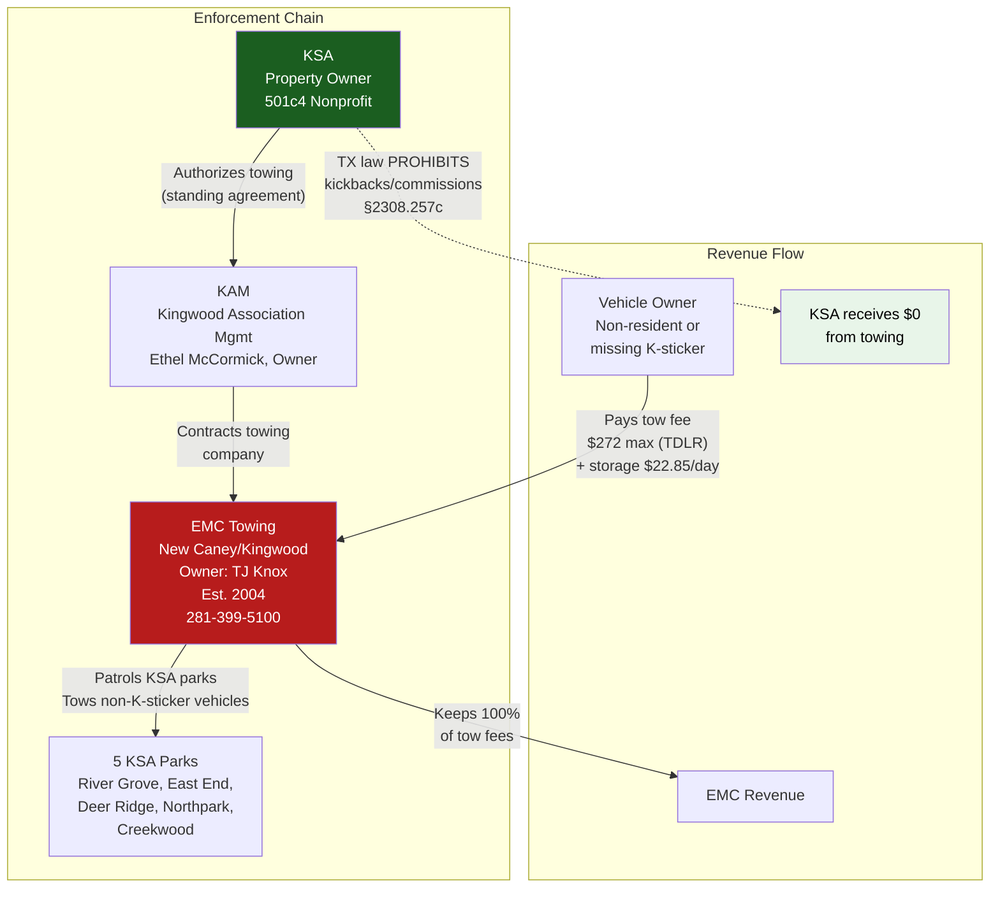
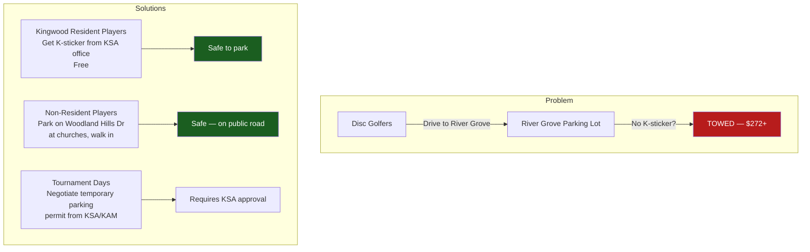

# KSA Towing Contracts & Parking Enforcement

## How Towing Works at KSA Parks

## Towing Company: EMC Towing

| Field | Details |
|-------|---------|
| **Company** | EMC Towing |
| **Location** | New Caney / Kingwood area |
| **Owner** | TJ Knox |
| **Established** | 2004 |
| **Phone** | (281) 399-5100 |
| **Contract With** | KSA (via KAM as managing agent) |

## Texas TDLR Fee Limits (Private Property Towing)

Texas Department of Licensing and Regulation sets maximum fees for non-consent private property tows:

| Fee Type | Maximum (2024) |
|----------|---------------|
| **Tow charge** (vehicle ≤10,000 lbs) | $272 |
| **Tow charge** (10,001–25,000 lbs) | $380 |
| **Drop fee** (owner returns before vehicle leaves) | $135 |
| **Daily storage** (vehicle ≤25 ft) | $22.85/day |
| **Daily storage** (vehicle >25 ft) | $39.99/day |
| **Notification fee** | Up to $50 |
| **Impoundment fee** | Up to $20 |
| **Total if retrieved same day** | **~$272–$342** |
| **Total after 3 days storage** | **~$340–$410** |

No storage charge if vehicle retrieved within 12 hours. Tow ticket must itemize each charge.

## Texas Law: Anti-Kickback Provision

**Texas Occupations Code §2308.257(c)** explicitly prohibits property owners from receiving payment or other consideration from towing companies in exchange for towing vehicles.

| What's Prohibited | What's Allowed |
|-------------------|---------------|
| Cash kickbacks per tow | Free parking enforcement patrols |
| Revenue sharing agreements | Free signage installation |
| Commission payments | Reduced-cost lot monitoring |
| Referral fees | Standard towing contract (company keeps fees) |

**Violation = Class C misdemeanor + TDLR enforcement action.**

### Revenue Impact on KSA

**KSA legally receives $0 from towing.** The towing company (EMC) profits from fees paid by vehicle owners. KSA's benefit is enforcement-only: keeping park spaces available for K-sticker residents.

However, indirect benefits may exist:
- Free parking lot patrols by towing company
- Free signage installation/maintenance
- Reduced enforcement costs for KAM

## Known Towing Incidents & Complaints

### Documented Case: Improper Tow at River Grove Park

| Detail | Information |
|--------|------------|
| **Date** | February 12 (year not specified in source) |
| **Location** | River Grove Park |
| **Situation** | Resident's car towed despite having valid K-sticker visible |
| **KAM Response** | Declined to reimburse |
| **Action** | Resident requested tow hearing in Justice of the Peace Court |
| **Hearing Date** | April 25 |
| **Ruling** | **Judge ruled in resident's favor** — tow made without probable cause |
| **Outcome** | KAM ordered to reimburse tow cost + $20 court costs |

### Enforcement Pattern at River Grove Park

- Reports indicate enforcement is **aggressive** — vehicles have been towed while owners were sitting at picnic tables in view of the vehicle
- KSA has been "cracking down" on K-sticker enforcement, especially at River Grove Park
- Non-residents visiting for disc golf are at particular risk
- **Workaround:** Park at churches on Woodland Hills Drive nearby and walk in

## Towing Signage Requirements (Texas Law)

Under Texas Occupations Code §2308.252–253, KSA parks must have:

| Requirement | Specification |
|-------------|--------------|
| Sign size | Minimum 18" × 24" |
| Lettering | Minimum 1 inch |
| Content | Towing company name, phone, tow lot address |
| Placement | Each entrance to the property |
| Visibility | Illuminated or reflective |
| Mounting | Permanently mounted |

**Non-compliant signage can invalidate tows** — a vehicle owner can contest the tow in Justice of the Peace court.

## Vehicle Owner Rights (§2308.257)

| Right | Details |
|-------|---------|
| **Retrieve personal property** | During business hours at no charge |
| **Payment methods** | Cash, credit card, and debit card must be accepted |
| **Contest the tow** | Request hearing in Justice Court within 14 days |
| **Drop fee** | If owner returns before vehicle leaves, 50% of tow fee max |
| **No after-hours fee** | Prohibited in City of Houston |

## Impact on RGDGC

### Recommendations for RGDGC

1. **UDisc listing** must prominently warn about K-sticker requirement and parking alternatives
2. **Tournament planning** requires advance coordination with KAM for temporary parking arrangements
3. **League members** should confirm K-sticker status at season start
4. **Non-resident guests** need clear directions to Woodland Hills church parking

## Sources

- [KSA K-Stickers Page](http://www.kingwoodserviceassociation.org/kingwoodservice/sub_category_list.asp?category=31&title='K'+Stickers)
- [TDLR Consumer Towing Info](https://www.tdlr.texas.gov/towing/consumerinfo.htm)
- [TDLR 2024 VSF Rates](https://www.tdlr.texas.gov/news/2024/01/03/new-vsf-storage-fees-start-jan-1-2024/)
- [EMC Towing](https://www.towing.com/US/TX/New-Caney--Kingwood/77357/EMC-Towing)
- [Texas Occupations Code Ch. 2308](https://statutes.capitol.texas.gov/Docs/OC/htm/OC.2308.htm)
