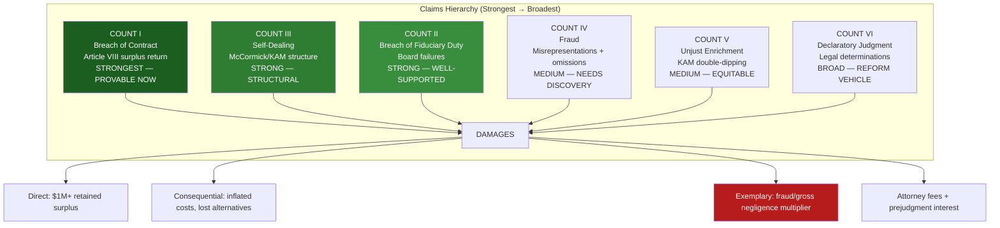
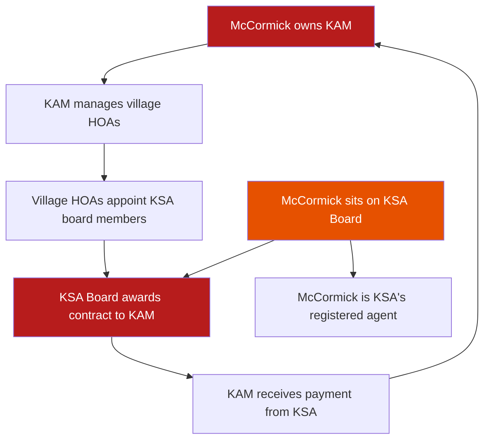
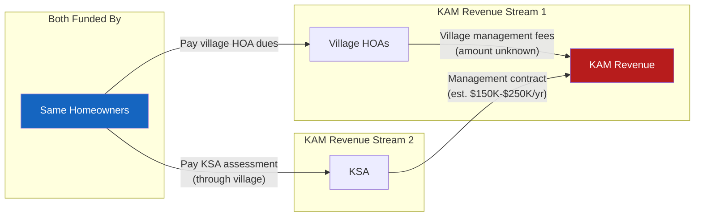

# LEGAL THEORIES — CAUSES OF ACTION, ELEMENTS & AUTHORITY

**Matter:** In Re Kingwood Service Association
**Date:** March 22, 2026

---

## Overview

Six causes of action, each independently sufficient to sustain judgment. The strongest claims are breach of contract (provable with the Service Contract and 990 data alone) and self-dealing (provable from the structural arrangement). The fraud and fiduciary breach claims require discovery to complete but are well-supported by circumstantial evidence.

---

## COUNT I: BREACH OF CONTRACT

### Elements (Texas)

| Element | Proof |
|---------|-------|
| 1. Valid enforceable contract | Service Contract between KSA and each Member Association |
| 2. Plaintiff performed or tendered performance | Members paid quarterly assessments every year |
| 3. Defendant breached | KSA retained surplus funds instead of returning per Article VIII |
| 4. Plaintiff suffered damages | Amount of retained surplus + interest |

### Specific Contractual Provisions Breached

**Article VIII — Budget Excesses:**
> "Remaining unspent assessment amounts at fiscal year end shall be returned to the Member Associations."

- KSA ran surpluses in 10 of 14 documented years (2011–2024)
- Cumulative surplus from positive years: ~$1,007,694
- No evidence any surplus was returned

**Article XI — Arbitration:**
> Disputes shall be submitted to arbitration.

- Mills Branch Village sent multiple arbitration requests in 2023
- KSA "willfully and knowingly refused to respond" to any request
- This is both a breach AND constitutes waiver of the arbitration right

### Key Authorities

- *Pathfinder Oil & Gas, Inc. v. Great Western Drilling, Ltd.*, 574 S.W.3d 882 (Tex. 2019) — breach of contract elements
- *In re Weekley Homes, L.P.*, 180 S.W.3d 127 (Tex. 2005) — waiver of arbitration through inconsistent conduct
- *Perry Homes v. Cull*, 258 S.W.3d 580 (Tex. 2008) — waiver of arbitration by substantially invoking the judicial process

### Why This Is Our Strongest Claim

1. **Binary proof:** Either surpluses were returned or they weren't. 990 data proves surpluses existed. Discovery will prove they were retained.
2. **No intent element:** Breach of contract requires no proof of fraudulent intent.
3. **Contract speaks for itself:** Article VIII is unambiguous — "shall be returned."
4. **Damages are calculable:** Sum of each year's surplus + prejudgment interest.

---

## COUNT II: BREACH OF FIDUCIARY DUTY

### Elements (Texas Nonprofit)

| Element | Proof |
|---------|-------|
| 1. Fiduciary relationship existed | Board Defendants are directors/officers of a TX nonprofit (BOC §22.221) |
| 2. Defendant breached fiduciary duty | Multiple breaches: self-dealing tolerance, no competitive bidding, Article VIII non-compliance |
| 3. Plaintiff suffered injury | Retained funds, inflated management costs, loss of governance |
| 4. Breach proximately caused injury | Direct causal chain |

### Three Fiduciary Duties and How Each Was Breached

**Duty of Loyalty (Act in the corporation's best interest, not personal interest):**
- Allowed McCormick — owner of the management contractor — to serve on the board
- No conflict of interest policy
- No recusal requirement for management contract votes
- Awarded management contract without competitive bidding to a board member's company

**Duty of Care (Act as an ordinarily prudent person):**
- Failed to obtain competitive bids for the management contract
- Failed to monitor Article VIII compliance
- Approved a 55% expense increase without adequate disclosure
- Failed to respond to BBB complaints and arbitration requests

**Duty of Obedience (Follow governing documents and law):**
- Failed to comply with Article VIII surplus return requirement
- Failed to comply with Article XI arbitration requirement
- Failed to ensure accurate IRS Form 990 reporting

### Key Authorities

- *Loy v. Harter*, 128 S.W.3d 397 (Tex. App. — Houston [14th Dist.] 2004) — fiduciary duties of nonprofit directors
- *Ritchie v. Rupe*, 443 S.W.3d 856 (Tex. 2014) — scope of fiduciary duties in closely-held entities
- *Johnson v. Brewer & Pritchard, P.C.*, 73 S.W.3d 193 (Tex. 2002) — breach of fiduciary duty elements
- Tex. Bus. Orgs. Code §22.221 — duties of directors of nonprofit corporations
- Tex. Bus. Orgs. Code §22.230 — interested transactions in nonprofits

---

## COUNT III: SELF-DEALING / INTERESTED TRANSACTION

### Elements (Texas BOC §22.230)

| Element | Proof |
|---------|-------|
| 1. Director had financial interest in transaction | McCormick owns KAM, which receives management contract |
| 2. Transaction between corporation and interested party | KSA awards management contract to KAM |
| 3. Transaction not approved by disinterested directors after full disclosure | No evidence of disclosure, recusal, or independent approval |
| 4. Transaction not fair to the corporation | No competitive bidding; same company manages both sides |

### The Circular Control Structure (Diagrammatic Proof)

### Why This Structure Is Per Se Suspect

Under Texas Business Organizations Code §22.230, a transaction between a nonprofit and a director (or an entity in which the director has a financial interest) is **voidable** unless:

1. The material facts of the interest are **fully disclosed** to the board; AND
2. The transaction is **approved by a majority of disinterested directors**; AND
3. The transaction is **fair to the corporation** at the time it is authorized.

McCormick's arrangement fails all three tests:
- **Disclosure:** No public evidence that McCormick's financial interest in KAM is formally disclosed at board meetings
- **Disinterested approval:** Directors who were appointed by village HOAs managed by KAM cannot be truly "disinterested"
- **Fairness:** A no-bid contract awarded to a board member's company is presumptively unfair

### Key Authorities

- Tex. Bus. Orgs. Code §22.230 — interested transactions in nonprofits
- *International Bankers Life Ins. Co. v. Holloway*, 368 S.W.2d 567 (Tex. 1963) — self-dealing by corporate fiduciary
- *Gearhart Indus., Inc. v. Smith Int'l, Inc.*, 741 F.2d 707 (5th Cir. 1984) — burden shift when self-dealing proven
- Restatement (Third) of Agency §8.01 — duty to avoid conflicts of interest

---

## COUNT IV: FRAUD

### Elements (Texas)

| Element | Proof |
|---------|-------|
| 1. Material misrepresentation or omission | Surplus characterized as "still needed"; $0 compensation reported; $0 rental income |
| 2. The representation was false | Surpluses were retained, not needed; McCormick is compensated via KAM; leases exist |
| 3. Speaker knew it was false or was reckless | Board knew of Article VIII and surpluses |
| 4. Speaker intended the other party to rely | Members relied by continuing to pay assessments without demanding surplus return |
| 5. Other party actually relied | Members paid assessments for 14+ years |
| 6. Reliance caused injury | $1M+ in retained surplus; inflated management costs |

### Specific Misrepresentations and Omissions

**Affirmative Misrepresentation:**
- KSA told Mills Branch that surplus funds were "still needed" — contradicting Article VIII's requirement to return them

**Omissions:**
- Form 990 reports $0 officer compensation for McCormick → omits the KAM contract through which she is compensated
- Form 990 reports $0 rental income → omits at least 6 active field leases
- No disclosure of KAM management contract amount to Member Associations or public
- No disclosure of McCormick's personal financial interest in KAM at board meetings

### Key Authorities

- *Ernst & Young, L.L.P. v. Pacific Mut. Life Ins. Co.*, 51 S.W.3d 573 (Tex. 2001) — fraud elements
- *Formosa Plastics Corp. USA v. Presidio Engineers & Contractors, Inc.*, 960 S.W.2d 41 (Tex. 1998) — fraud by nondisclosure
- *Bradford v. Vento*, 48 S.W.3d 749 (Tex. 2001) — fraud by omission where duty to disclose exists

### Heightened Pleading Standard

Texas Rule of Civil Procedure 9(b) equivalent: fraud must be pled with particularity. Our complaint specifies:
- **Who:** McCormick and Board Defendants
- **What:** Retention of surplus funds, false 990 reporting, undisclosed self-dealing
- **When:** Each fiscal year 2011–2024
- **Where:** KSA Board meetings, IRS Form 990 filings
- **How:** Characterizing surplus as "still needed," reporting $0 compensation, omitting related-party disclosures

---

## COUNT V: UNJUST ENRICHMENT

### Elements (Texas)

| Element | Proof |
|---------|-------|
| 1. Defendant obtained benefit | KAM received management fees from KSA AND village HOAs |
| 2. At plaintiff's expense | Funded by Member Association assessments |
| 3. Retention would be unjust | No competitive bidding, self-dealing structure, double-dipping |

### The Double-Dipping Theory

Kingwood homeowners fund KAM twice: once through village HOA fees and again through KSA assessments. McCormick's position on both sides of the relationship — managing the villages AND the master association — enables this double extraction.

### Key Authorities

- *Heldenfels Bros., Inc. v. City of Corpus Christi*, 832 S.W.2d 39 (Tex. 1992) — unjust enrichment elements
- *Southwestern Bell Tel. Co. v. Marketing on Hold Inc.*, 308 S.W.3d 909 (Tex. 2010) — unjust enrichment as independent claim

---

## COUNT VI: DECLARATORY JUDGMENT

### Issues for Declaration

1. **Article VIII compliance:** Has KSA complied with Article VIII's surplus return requirements for fiscal years 2011–2024?

2. **Self-dealing:** Does McCormick's simultaneous ownership of KAM and service on the KSA Board constitute a prohibited self-dealing arrangement under Texas Business Organizations Code §22.230?

3. **Management contract validity:** Is the KAM management contract voidable as a self-dealing interested transaction?

4. **Arbitration waiver:** Has KSA waived its right to compel arbitration by refusing to participate in arbitration when requested by Plaintiffs?

5. **Fiduciary duties:** What are the specific fiduciary duties owed by KSA Board members to Member Associations, and have those duties been breached?

### Authority

- Tex. Civ. Prac. & Rem. Code, Chapter 37 — Uniform Declaratory Judgments Act

---

## EXEMPLARY DAMAGES

### Availability

Under Texas Civil Practice & Remedies Code §41.003, exemplary damages are available when the claimant proves by clear and convincing evidence that the harm resulted from **fraud, malice, or gross negligence**.

### Elements Supporting Exemplary Damages

| Factor | Evidence |
|--------|----------|
| **Duration** | 13+ years of surplus retention (2011–2024) |
| **Awareness** | Board knew of Article VIII; surplus amounts were calculated annually |
| **Concealment** | $0 compensation reported; KAM contract amount undisclosed |
| **Repeated refusal** | Refused arbitration, refused BBB complaints, refused surplus return |
| **Financial motive** | McCormick profits from larger KSA budget via KAM fees |
| **Vulnerability of victims** | Homeowners have no direct voice; village boards managed by KAM |
| **Pattern** | Same conduct year after year for 13+ years |

### Cap

Texas exemplary damages are capped at the greater of:
- 2x economic damages + noneconomic damages (up to $750K); OR
- $200,000

Given potential economic damages exceeding $1M, the exemplary cap could be **$2M+**.

---

## REMEDIES SOUGHT

### Monetary

| Remedy | Estimated Range | Basis |
|--------|----------------|-------|
| Retained surplus (Article VIII) | $1,000,000 – $1,500,000 | Sum of all surplus years + interest |
| Prejudgment interest (5%) | $200,000 – $400,000 | 5% on surplus from date of each breach |
| Excess management fees | $200,000 – $500,000 | Difference between KAM cost and competitive market rate |
| Exemplary damages | $200,000 – $2,000,000 | Fraud/gross negligence multiplier |
| Attorney fees | $150,000 – $400,000 | Reasonable fees for complex litigation |
| **TOTAL POTENTIAL** | **$1,750,000 – $4,800,000** | |

### Equitable / Injunctive

1. Court-ordered independent forensic audit (2011–2024)
2. Court-ordered competitive RFP for management contract
3. Court-ordered conflict of interest policy
4. Court-ordered annual independent audit
5. Disgorgement of unjustly enriched management fees
6. Constructive trust on retained surplus funds
