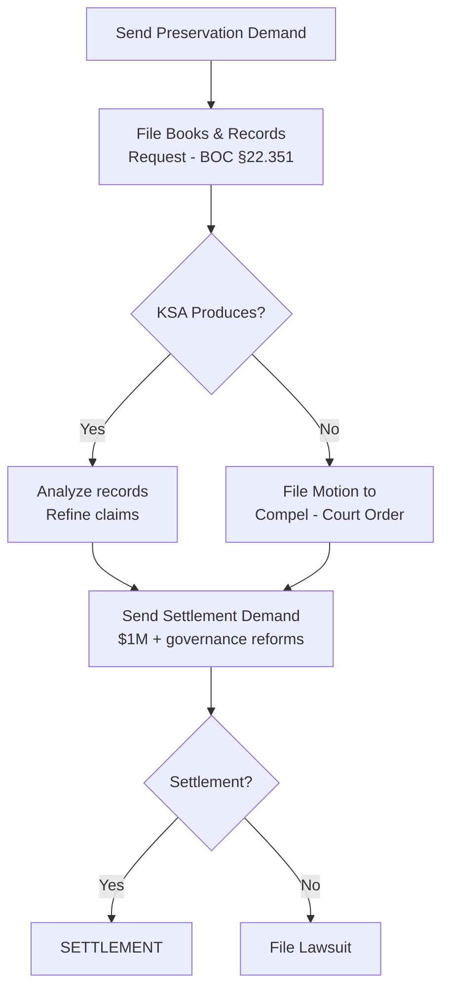

# CASE STRATEGY MEMORANDUM

**Matter:** In Re Kingwood Service Association
**Date:** March 22, 2026
**Classification:** Attorney-Client Privileged / Work Product

---

## I. STRATEGIC ASSESSMENT

### A. Strengths

1. **The contract is clear.** Article VIII says "shall be returned." There is no ambiguity to litigate.
2. **The numbers prove it.** 990 data shows 10 surplus years. Net asset growth proves retention.
3. **The structure is indefensible.** No jury will accept that the management company owner should sit on the board that awards the contract.
4. **KSA waived arbitration.** By refusing to participate when Mills Branch requested it, KSA cannot now compel it.
5. **Mills Branch paved the road.** Their lawsuit established the legal theory and forced KSA into a defensive posture.
6. **Multiple plaintiffs available.** Up to 29 Member Associations can file. Aggregate claims dwarf KSA assets.
7. **Discovery will be devastating.** Once the KAM contract, vendor list, and board minutes are produced, the full picture emerges.
8. **BBB F rating is jury poison.** An organization that refuses to respond to complaints.

### B. Weaknesses

1. **No smoking gun yet.** We don't have internal emails or board minutes proving intent to defraud.
2. **"Still needed" defense.** KSA will argue reserves are prudent for an org managing 356 acres and $3M+ in assets.
3. **Article VIII interpretation.** KSA may argue "remaining unspent amounts" means something other than the surplus (e.g., only unencumbered amounts after all reserves).
4. **Arbitration risk.** If the court compels arbitration despite KSA's prior refusal, we lose jury trial and public discovery.
5. **Causation on management fees.** Proving excess fees requires a competitive market comparison, which involves expert testimony.
6. **KSA insolvency.** If we win big, KSA can't pay. We'd be suing a nonprofit into bankruptcy, which has optics risk.

### C. Risk Assessment

| Risk | Probability | Impact | Mitigation |
|------|------------|--------|-----------|
| Compelled to arbitration | 25% | Medium (lose jury, limited discovery) | Argue waiver; file anti-suit motion |
| "Prudent reserves" defense succeeds | 15% | High (defeats Article VIII claim) | Article VIII doesn't carve out reserves; it says "shall be returned" |
| McCormick destroys evidence | 10% | High | Preservation demand filed immediately; spoliation sanctions available |
| KSA declares insolvency | 20% | Medium | Personal liability for Board Defendants; D&O insurance |
| Public sympathy for "volunteer board" | 30% | Low-Medium | Frame as McCormick (for-profit) exploiting volunteer board |

---

## II. LITIGATION STRATEGY

### Phase 1: Pre-Litigation (Months 1-2)

**Key Actions:**
1. Send preservation demand (Day 1)
2. File books and records request (Day 1)
3. Obtain and OCR all available 990 PDFs (Week 1)
4. Engage forensic accountant (Week 2)
5. Send settlement demand (Week 4)
6. File lawsuit if no settlement by Day 60

### Phase 2: Early Litigation (Months 3-6)

**Primary Objective:** Survive arbitration challenge and commence discovery.

1. **Arbitration Motion:** KSA will move to compel arbitration. We oppose on waiver grounds:
   - KSA refused Mills Branch's multiple arbitration requests in 2023
   - KSA only invoked arbitration after being sued — classic waiver
   - *Perry Homes v. Cull*, 258 S.W.3d 580 (Tex. 2008)

2. **Written Discovery:** Serve all interrogatories, RFPs, and RFAs within 30 days of filing.

3. **Third-Party Subpoenas:** Prioritize bank records, FirstService Residential records, and TX SOS filings.

4. **Temporary Restraining Order:** If evidence of asset dissipation, seek TRO freezing KSA accounts.

### Phase 3: Discovery (Months 4-10)

**Primary Objective:** Prove the full scope of self-dealing and surplus retention.

Critical discovery targets (in priority order):

1. **KAM management contract** — the single most important document
2. **Bank records** — follow every dollar
3. **Board minutes** — prove knowledge and approval (or lack thereof)
4. **McCormick deposition** — the central fact witness; 2-day deposition
5. **FirstService Residential records** — what they found, why they left
6. **Vendor list** — identify any related-party vendors
7. **Article VIII calculations** — annual surplus/return records

### Phase 4: Expert Reports (Months 8-12)

1. **Forensic accountant** — quantify damages, trace funds, identify anomalies
2. **HOA management expert** — testify on industry standards (competitive bidding, conflict of interest policies, governance best practices)
3. **Damages expert** — calculate prejudgment interest, market-rate management fees, exemplary damages basis

### Phase 5: Mediation / Settlement (Month 10-12)

**Settlement Framework:**

| Component | Demand | Floor |
|-----------|--------|-------|
| Cash (retained surplus + interest) | $1,415,870 | $750,000 |
| Independent audit (funded by KSA) | Required | Required |
| Competitive RFP for management | Required | Required |
| Conflict of interest policy | Required | Required |
| McCormick board resignation | Required | Negotiable |
| Annual independent audit (ongoing) | Required | Required |
| Article VIII compliance (ongoing) | Required | Required |
| Attorney fees | $400,000 | $200,000 |
| **Total Cash** | **$1,815,870** | **$950,000** |

### Phase 6: Trial (If No Settlement — Months 14-18)

**Trial Theme:** "The fox guarding the henhouse — for 13 years, one person controlled both the money and the oversight, and nobody was watching."

**Trial Structure (5-7 days):**

| Day | Topic |
|-----|-------|
| 1 | Opening + Structure witnesses (how KSA works, Article VIII, governance) |
| 2 | Financial witnesses (990 data, surplus calculations, bank records) |
| 3 | McCormick deposition clips + self-dealing evidence |
| 4 | Forensic accountant + damages expert |
| 5 | FirstService Residential witness + management expert |
| 6 | Closing arguments |

---

## III. DEFENDANT STRATEGY — WHAT THEY'LL ARGUE AND HOW WE RESPOND

| Defense | Response |
|---------|----------|
| "Reserves are prudent" | Article VIII doesn't carve out reserves. "Shall be returned" means shall be returned. If KSA wanted a reserve policy, it should have amended the contract. |
| "McCormick is just a managing agent, not a director" | 990 lists her as an officer. She votes or influences votes. She controls day-to-day operations. She is a de facto officer. |
| "Village boards chose KAM freely" | Village boards managed by KAM cannot freely choose to replace KAM. That's the circularity. |
| "This should be in arbitration" | KSA waived arbitration by refusing to participate when Mills Branch requested it. |
| "Plaintiffs have no standing — only villages are members" | Villages ARE plaintiffs. Individual homeowners have derivative standing. |
| "The 2024 expenses were for legitimate purposes" | Then produce the documentation. The burden shifts to KSA to explain a 55% spike. |
| "McCormick receives $0 from KSA" | She receives compensation through KAM, funded by KSA. This is form over substance. |

---

## IV. COALITION LITIGATION STRATEGY

### Multi-Plaintiff Approach

**Why:** More plaintiffs = more damages = more settlement pressure. If 10 villages each claim $250K, that's $2.5M — approaching KSA's total assets.

**How:**
1. Lead with 3-5 non-KAM-managed villages (Sterling ASI, SCS, Crest clients)
2. Coordinate with Mills Branch as co-plaintiff or align strategies
3. Present unified settlement demand
4. File as a class or consolidated action if appropriate

### Coordinating with Mills Branch

| Approach | Pros | Cons |
|----------|------|------|
| **Join their case** | Existing procedural history; lower costs | May be constrained by their legal strategy |
| **File separately, coordinate** | Independent strategy; more pressure | Higher costs; risk of inconsistent rulings |
| **Intervene** | Leverage existing case; add claims | Must show interest in existing matter |

**Recommendation:** File separately but coordinate with Mills Branch counsel. This creates maximum pressure (multiple fronts) while maintaining strategic independence.

---

## V. PUBLIC STRATEGY

### Media

| Action | Timing | Purpose |
|--------|--------|---------|
| Background briefing to Community Impact News (Kingwood edition) | Pre-filing | Prepare coverage |
| Press release on filing day | Day of filing | Public awareness |
| Op-ed in Kingwood Observer / Houston Chronicle NE | Week 2 | Frame the narrative |
| Social media campaign (#KingwoodTransparency) | Ongoing | Community pressure |

### Community Engagement

| Action | Timing |
|--------|--------|
| Presentation at Kingwood Area Chamber of Commerce | Month 2 |
| Village HOA board presentations (non-KAM villages first) | Months 2-4 |
| Attend KSA October board meeting — public comments | October 2026 |
| Community town hall | Month 4 |

### Framing

**DO:** Frame as accountability and transparency. "Your money, your parks, your right to know."

**DON'T:** Frame as personal attack on volunteers. The Board Defendants are named for legal completeness, but the narrative villain is the **structure** (and McCormick as the architect of that structure).
