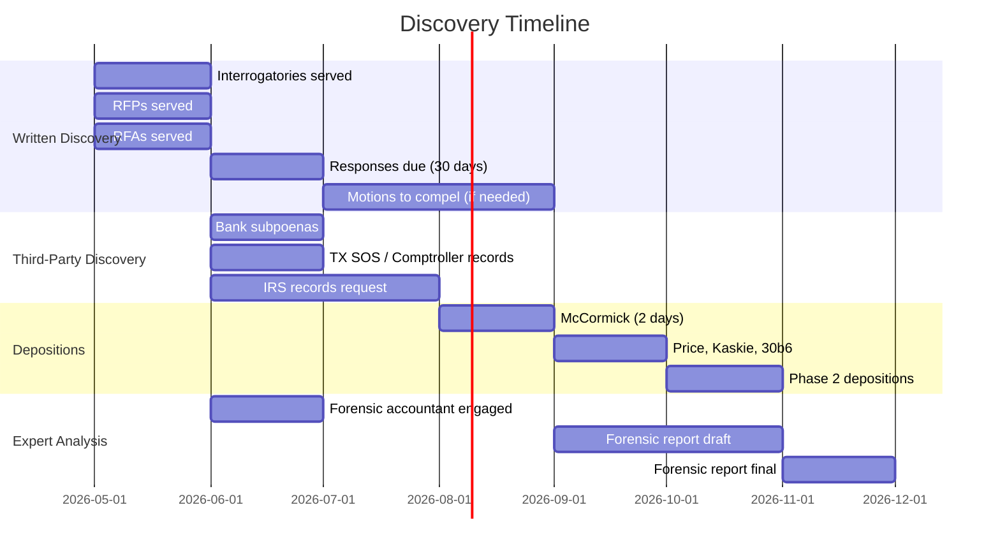

# DISCOVERY PLAN

**Matter:** In Re Kingwood Service Association
**Date:** March 22, 2026

---

## Discovery Objectives

1. **Quantify retained surplus** — prove exact amounts owed under Article VIII
2. **Expose KAM contract terms** — determine management fee amount, basis, and history
3. **Establish self-dealing** — document McCormick's financial interest and board involvement
4. **Identify the 2024 expense spike** — determine what caused 55% increase
5. **Map all vendor relationships** — identify any related-party vendors
6. **Trace money flows** — follow assessment dollars from homeowner to final expenditure

---

## I. INTERROGATORIES TO KSA

### Financial Operations

1. For each fiscal year from 2011 through 2024, state the total amount of budget surplus (revenue minus expenses) calculated at fiscal year end, and identify (a) whether any surplus was returned to Member Associations pursuant to Article VIII; (b) the amount returned to each Member Association; (c) the date of each return; and (d) if not returned, the stated reason for retention.

2. Identify the total amount paid by KSA to Kingwood Association Management, Inc. (KAM) under the management contract for each fiscal year from 2011 through 2024, broken down by (a) base management fee; (b) any performance bonuses; (c) any reimbursed expenses; and (d) any other payments.

3. For fiscal year 2024, itemize all expenses exceeding $10,000, identifying for each (a) the vendor/payee; (b) the amount; (c) the date; (d) the purpose; and (e) whether the expense was included in the approved annual budget.

4. Identify the specific cause(s) of the $556,486 increase in expenses from fiscal year 2023 ($1,009,164) to fiscal year 2024 ($1,565,650).

5. Identify all bank accounts, investment accounts, and financial institutions holding KSA funds, including (a) the account type; (b) the institution; (c) the account holder name; (d) all authorized signatories; and (e) the current balance.

6. State whether KSA has ever conducted or commissioned a reserve study. If so, identify the date, preparer, and conclusions. If not, explain why not.

### Governance

7. Identify every individual who has served on the KSA Board of Directors from 2011 to the present, including their (a) name; (b) village or entity they represent; (c) dates of service; (d) how they were appointed; and (e) whether they serve on any board of an entity also managed by KAM.

8. Describe the process by which the KAM management contract was awarded, including (a) whether an RFP was issued; (b) whether alternative management companies were considered; (c) how many bids were received; (d) who made the final decision; and (e) whether McCormick recused herself from any vote.

9. State whether KSA has a written conflict of interest policy. If so, produce it. If not, state why not.

10. Describe the circumstances under which McCormick and/or KAM departed from managing KSA and/or any Member Association communities, and the circumstances under which McCormick/KAM returned, including (a) the date of departure; (b) the reason for departure; (c) the name of the replacement management company; (d) the date of return; (e) whether a competitive process preceded the return; and (f) who voted to reinstate KAM.

### Towing

11. Identify the towing company contracted by KSA and/or KAM for enforcement at KSA parks, including (a) the company name; (b) the contract terms; (c) the contract dates; (d) the number of vehicles towed per year (2019–2024); and (e) whether KSA or KAM receives any direct or indirect compensation from the towing company.

### Related Parties

12. Identify all entities (other than KSA) for which KAM or McCormick provides management services, and for each entity state (a) the name; (b) the annual management fee; (c) whether the entity is a KSA Member Association.

13. Identify all vendors or contractors that have received payments from KSA exceeding $25,000 in any single year from 2011 to 2024, and for each state (a) whether any KSA Board member, KAM employee, or McCormick has any ownership interest, employment relationship, or family relationship with the vendor; (b) whether the vendor was selected through competitive bidding.

---

## II. REQUESTS FOR PRODUCTION TO KSA

### Contracts & Governing Documents

1. The current KSA Articles of Incorporation and all amendments.
2. The current KSA Bylaws and all amendments.
3. The Service Contract between KSA and each Member Association (all versions in effect from 2011 to present).
4. The management contract between KSA and KAM (all versions in effect from 2011 to present), including all amendments, addenda, and fee schedules.
5. Any management contract between KSA and any management company other than KAM (including FirstService Residential).
6. All RFPs, bid solicitations, or proposals related to the management contract from 2011 to present.
7. All towing contracts between KSA/KAM and any towing company from 2011 to present.
8. All field lease agreements between KSA and sports organizations or other lessees from 2011 to present.

### Financial Records

9. All IRS Form 990 filings (complete, including all schedules and attachments) from 2001 to present.
10. All annual budgets (proposed and approved) from 2011 to present.
11. All year-end financial statements from 2011 to present.
12. All bank statements for all KSA accounts from 2019 to present.
13. All check registers or payment ledgers from 2019 to present.
14. All invoices, receipts, or payment documentation from vendors exceeding $10,000 in any single payment from 2019 to present.
15. All documents relating to the 2024 expense increase, including invoices, contracts, approvals, and board communications.
16. All documents relating to any calculation of "budget excess" or surplus under Article VIII from 2011 to present.
17. All documents relating to any return of surplus funds to Member Associations under Article VIII from 2011 to present.
18. All reserve studies or capital planning documents.
19. All insurance policies (general liability, property, D&O, umbrella) from 2019 to present, including premium invoices.

### Board & Governance Records

20. All KSA Board of Directors meeting minutes from 2011 to present.
21. All KSA Parks Committee meeting minutes from 2019 to present.
22. All KSA Board agendas from 2019 to present.
23. All written communications (email, letter, memo) between McCormick and KSA Board members regarding the management contract, Article VIII, budget surpluses, or the Mills Branch lawsuit from 2019 to present.
24. All conflict of interest disclosure forms or policies from 2011 to present.
25. All communications with Mills Branch Village regarding surplus return requests or arbitration from 2022 to present.

### McCormick / KAM Specific

26. All financial statements for KAM from 2019 to present.
27. All tax returns for KAM from 2019 to present.
28. All documents showing compensation paid to McCormick by any Kingwood-related entity from 2019 to present.
29. All management contracts between KAM and KSA Member Association village HOAs from 2019 to present.

---

## III. REQUESTS FOR ADMISSION TO KSA

1. Admit that Article VIII of the Service Contract between KSA and its Member Associations requires KSA to return remaining unspent assessment amounts to Member Associations at the end of each fiscal year.

2. Admit that for fiscal year 2024, KSA's total revenue ($1,048,921) exceeded the amount necessary to fund the approved budget.

3. Admit that for fiscal year 2018, KSA generated a surplus of $180,829 (revenue of $926,473 minus expenses of $745,644).

4. Admit that KSA did not return any portion of the fiscal year 2018 surplus to Member Associations.

5. Admit that Ethel McCormick is the owner of Kingwood Association Management, Inc.

6. Admit that Ethel McCormick serves as "Managing Agent" on the KSA Board of Directors.

7. Admit that the management contract between KSA and KAM was not the result of a competitive bidding process.

8. Admit that KSA and KAM operate from the same physical address: 1075 Kingwood Drive, Suite 100, Kingwood, Texas 77339.

9. Admit that KSA reports zero employees on its IRS Form 990 for all years from 2011 to present.

10. Admit that KSA reports zero officer compensation on its IRS Form 990 for all years from 2011 to present.

11. Admit that McCormick receives compensation from KAM for management services provided to KSA.

12. Admit that KSA received written requests for arbitration from Mills Branch Village Community Association during 2023.

13. Admit that KSA did not respond to any arbitration request from Mills Branch Village during 2023.

14. Admit that the Better Business Bureau has assigned KSA a rating of "F."

15. Admit that KSA did not respond to complaints filed with the Better Business Bureau.

16. Admit that KAM provides management services to KSA Member Association village HOAs in addition to managing KSA itself.

17. Admit that KSA has not adopted a written conflict of interest policy.

18. Admit that KSA's total expenses in fiscal year 2024 ($1,565,650) exceeded the prior year ($1,009,164) by 55.1%.

---

## IV. DEPOSITION SCHEDULE

### Priority Depositions (Phase 1)

| Deponent | Topics | Duration | Priority |
|----------|--------|----------|----------|
| **Ethel McCormick** | KAM contract terms, management fees, self-dealing, Board role, departure/return, all financial operations | 2 days | HIGHEST |
| **Delores Price** (KSA President) | Board governance, Article VIII decisions, budget approval, management contract, 2024 expenses | 1 day | HIGH |
| **John Kaskie** (KSA Treasurer) | Financial operations, surplus calculations, investment decisions, expense approvals | 1 day | HIGH |
| **KSA 30(b)(6) Designee** | Corporate testimony on Article VIII compliance, management contract, financial operations | 1 day | HIGH |

### Phase 2 Depositions

| Deponent | Topics | Duration |
|----------|--------|----------|
| **William Manthei** (VP) | Board decisions, knowledge of self-dealing |  ½ day |
| **Maryanne Fortson** (Secretary) | Board minutes, correspondence, arbitration refusal | ½ day |
| **KAM 30(b)(6) Designee** | KAM operations, fees collected, villages managed | 1 day |
| **KSA's CPA / Tax Preparer** | 990 preparation, surplus calculations, related-party disclosures | ½ day |
| **FirstService Residential rep** | Transition to/from FSR, any issues discovered, reason for departure | ½ day |

### Phase 3 Depositions (As Needed)

| Deponent | Topics |
|----------|--------|
| Major vendors (landscaping, insurance) | Contract terms, competitive bidding, relationship to KAM/McCormick |
| EMC Towing representative | Contract terms, tow volumes, any payments to KSA/KAM |
| Village HOA board members (non-KAM) | Knowledge of Article VIII, surplus expectations |
| IRS Revenue Agent (if 13909 filed) | 990 accuracy, related-party disclosure requirements |

---

## V. THIRD-PARTY SUBPOENAS

See [05_SUBPOENA_LIST.md](05_SUBPOENA_LIST.md) for detailed third-party subpoena plan.

---

## VI. DISCOVERY TIMELINE

