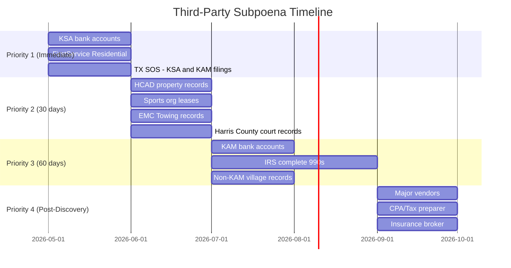

# THIRD-PARTY SUBPOENA PLAN

**Matter:** In Re Kingwood Service Association
**Date:** March 22, 2026

---

## Subpoena Strategy

Third-party subpoenas serve two critical functions: (1) independently verify financial data that Defendants may contest or fail to produce, and (2) discover relationships and transactions that Defendants have incentive to conceal.

---

## I. FINANCIAL INSTITUTIONS

### A. KSA Bank Accounts

| Institution | Records Sought | Purpose |
|-------------|---------------|---------|
| All banks holding KSA accounts (identified via 990 or discovery) | All account statements, cancelled checks, wire transfers, deposit records (2011–present) | Trace all money in and out; verify surplus retention; identify all payees |
| Investment custodian(s) | All investment account statements, trade confirmations, yield reports (2011–present) | Verify investment income reported on 990; identify who controls investment decisions |

### B. KAM Bank Accounts

| Institution | Records Sought | Purpose |
|-------------|---------------|---------|
| All banks holding KAM accounts | All deposits FROM KSA, Member Associations, and Kingwood-related entities (2019–present) | Quantify total KAM revenue from Kingwood ecosystem; prove double-dipping |

---

## II. GOVERNMENT RECORDS

### A. IRS

| Record | Purpose |
|--------|---------|
| Complete Form 990 with all schedules (particularly Schedule L — Related Parties, Schedule O — Supplemental Information, Part IX — Statement of Functional Expenses) for 2011–2024 | Machine-readable versions (ProPublica only has scanned images); verify related-party disclosures; identify detailed expense categories |

### B. Texas Secretary of State

| Record | Purpose |
|--------|---------|
| KSA certificate of formation, articles, amendments, registered agent history | Confirm corporate history and McCormick's role |
| KAM certificate of formation, articles, registered agent, officers | Confirm McCormick as owner; identify any other officers/directors |
| Any other entities listing McCormick as officer, director, or registered agent | Discover related entities |

### C. Texas Comptroller

| Record | Purpose |
|--------|---------|
| KSA franchise tax account status and filing history | Confirm active status; any compliance issues |
| KAM franchise tax account status and filing history | Confirm active status; verify KAM is a for-profit entity |

### D. Harris County Appraisal District (HCAD)

| Record | Purpose |
|--------|---------|
| Property records for all parcels owned by KSA | Confirm park ownership, assessed values, tax-exempt status |
| Property records for 1075 Kingwood Drive, Suite 100 | Who owns the office space? Does KSA pay rent to KAM or vice versa? |

### E. Harris County Clerk

| Record | Purpose |
|--------|---------|
| All lawsuits naming KSA, KAM, or McCormick as parties | Complete litigation history |
| All liens, judgments, or encumbrances on KSA property | Any undisclosed liabilities |

### F. Harris County Justice of the Peace Courts

| Record | Purpose |
|--------|---------|
| All tow hearings involving vehicles towed from KSA parks (2019–present) | Volume of towing activity; outcomes; any pattern of improper tows |

### G. Texas Department of Licensing and Regulation (TDLR)

| Record | Purpose |
|--------|---------|
| Complaints filed against towing operations at KSA parks | Enforcement pattern; any findings of violation |
| Towing company license for EMC Towing (or identified contractor) | Verify licensing compliance |

### H. City of Houston

| Record | Purpose |
|--------|---------|
| Any permits issued for events at KSA parks | Revenue from event permits |
| Any complaints filed against KSA | Enforcement history |

---

## III. FORMER MANAGEMENT COMPANY

### FirstService Residential

| Record | Purpose |
|--------|---------|
| All records created during FSR's management of Kingwood communities | What did FSR find when they took over? Any discrepancies? |
| Transition documents (incoming and outgoing) | What financial records were provided? Were there issues? |
| Any communications regarding the transition back to KAM | Who initiated the return? What was the process? |
| FSR's management contract terms | Comparison to KAM terms; was KAM cheaper or more expensive? |

**This is a high-priority subpoena.** FirstService Residential is a publicly-traded, well-governed company that likely maintained thorough records during its tenure. If there were financial irregularities, FSR's records may document them.

---

## IV. SPORTS ORGANIZATIONS (FIELD LESSEES)

| Organization | Park | Records Sought |
|-------------|------|---------------|
| Kingwood Alliance Soccer Club | River Grove + Northpark | Lease agreement; annual payments to KSA; any correspondence re: lease terms |
| Kingwood Youth Lacrosse (KYLAX) | River Grove | Same |
| Kingwood/Forest Cove Baseball Assn | Deer Ridge | Same |
| Kingwood Girls Softball Association | Northpark | Same |
| Kingwood Adult Softball Association | Northpark | Same |
| Kingwood Horsemen's Assn / Trail's End Stables | Deer Ridge | Same |

**Purpose:** KSA reports $0 in rental income on Form 990 despite 6+ active leases. These subpoenas will establish (a) whether lease payments are made, (b) how much, (c) how they are characterized, and (d) whether they appear in KSA's financial records.

---

## V. VENDORS AND CONTRACTORS

### A. Major Vendors (Identified Through Discovery)

Once the vendor list is obtained through discovery, subpoena records from:

| Vendor Category | Records Sought | Purpose |
|----------------|---------------|---------|
| Primary landscaping contractor | Contract, invoices, payments received, any relationship to KAM/McCormick | Verify largest expense category; identify any related-party vendor |
| Insurance broker/carrier | Premium invoices, policy details, claims history | Verify insurance costs; identify who makes insurance decisions |
| CPA / Tax preparer | Engagement letters, work papers, 990 preparation files | How was 990 prepared? Did preparer identify self-dealing? |
| Attorney (if identified) | Billing records for KSA matters (may be limited by privilege) | Quantify legal costs, especially 2024 |

### B. EMC Towing

| Record | Purpose |
|--------|---------|
| Contract with KSA/KAM | Terms of towing arrangement |
| Number of vehicles towed from KSA parks per year (2019–present) | Volume of enforcement |
| All payments from KSA/KAM to EMC, and from EMC to KSA/KAM | Any prohibited kickbacks? |
| Any in-kind services provided to KSA/KAM | Free patrols, signage, etc. |

---

## VI. MEMBER ASSOCIATIONS

### Non-KAM Managed Villages (Priority)

Subpoena these villages for their records of KSA communications, surplus return history, and any complaints:

| Village | Management Company | Records Sought |
|---------|-------------------|---------------|
| Hunters Ridge | Sterling ASI | All correspondence from KSA re: Article VIII, surplus returns, budget approvals |
| Trailwood | Sterling ASI | Same |
| Greentree | Sterling ASI | Same |
| Kings Manor | SCS Management | Same |
| Kingwood Place West | Crest Management | Same |

**Purpose:** These non-KAM villages are independent witnesses. Their records of KSA communications will establish what KSA told villages about surplus funds and Article VIII compliance.

---

## VII. SUBPOENA PRIORITY AND TIMELINE

---

## VIII. COST ESTIMATE

| Category | Estimated Cost |
|----------|---------------|
| Subpoena preparation and service (20-25 subpoenas) | $5,000–$8,000 |
| Document production review | $15,000–$30,000 |
| Forensic accountant review of bank records | $20,000–$40,000 |
| Deposition costs (court reporter, videographer) | $10,000–$20,000 |
| **Total Discovery Phase** | **$50,000–$98,000** |
