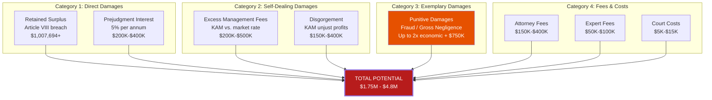
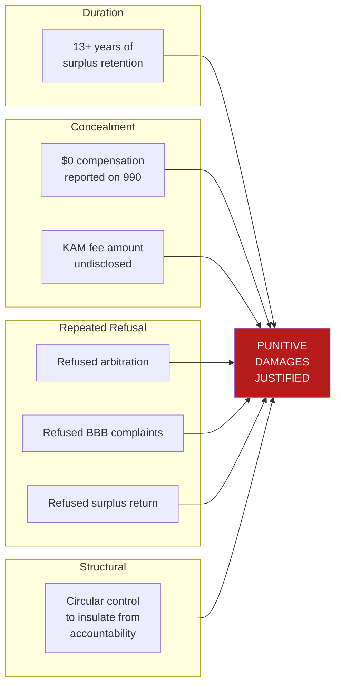
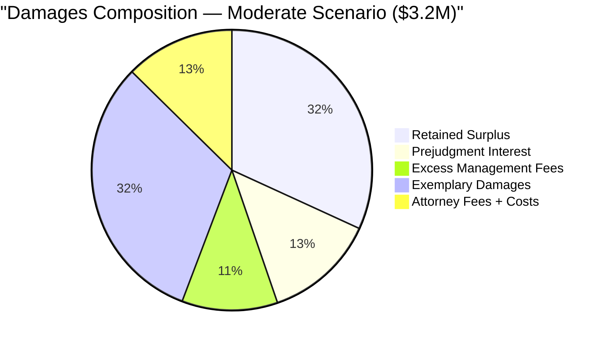

# DAMAGES MODEL

**Matter:** In Re Kingwood Service Association
**Date:** March 22, 2026

---

## Damages Overview

---

## I. DIRECT DAMAGES: RETAINED SURPLUS (Article VIII)

### Calculation Methodology

For each fiscal year where revenue exceeded expenses, the surplus should have been returned to Member Associations under Article VIII. The damages equal the sum of all unreturned surpluses plus prejudgment interest.

### Year-by-Year Surplus Analysis

| Fiscal Year | Revenue | Expenses | Surplus/(Deficit) | Status | Cumulative Retained |
|-------------|---------|----------|-------------------|--------|-------------------|
| 2011 | $819,888 | $743,479 | **$76,409** | Retained | $76,409 |
| 2012 | $662,415 | $724,047 | ($61,632) | Deficit | $76,409 |
| 2013 | $845,378 | $911,275 | ($65,897) | Deficit | $76,409 |
| 2014 | $760,477 | $649,890 | **$110,587** | Retained | $186,996 |
| 2015 | $838,333 | $771,855 | **$66,478** | Retained | $253,474 |
| 2016 | $904,564 | $789,390 | **$115,174** | Retained | $368,648 |
| 2017 | $884,034 | $895,731 | ($11,697) | Deficit (Harvey) | $368,648 |
| 2018 | $926,473 | $745,644 | **$180,829** | Retained | $549,477 |
| 2019 | $998,251 | $850,536 | **$147,715** | Retained | $697,192 |
| 2020 | $1,031,234 | $1,018,430 | **$12,804** | Retained | $709,996 |
| 2021 | $1,039,957 | $948,240 | **$91,717** | Retained | $801,713 |
| 2022 | $1,034,863 | $861,519 | **$173,344** | Retained | $975,057 |
| 2023 | $1,041,801 | $1,009,164 | **$32,637** | Retained | $1,007,694 |
| 2024 | $1,048,921 | $1,565,650 | ($516,729) | Deficit | $1,007,694 |

**Total Retained Surplus: $1,007,694**

*Note: Deficit years do NOT offset surplus years under Article VIII. The contractual obligation attaches at each fiscal year end independently. KSA cannot retroactively apply a surplus from Year X to cover a deficit from Year Y.*

### Prejudgment Interest

Under Texas law (Tex. Fin. Code §304.003), prejudgment interest accrues at 5% per annum from the date of breach. Each year's retained surplus is a separate breach, with interest accruing from the fiscal year end.

| Year | Surplus Retained | Years of Interest (to 2026) | Interest (5%) |
|------|-----------------|---------------------------|--------------|
| 2011 | $76,409 | 15 | $57,307 |
| 2014 | $110,587 | 12 | $66,352 |
| 2015 | $66,478 | 11 | $36,563 |
| 2016 | $115,174 | 10 | $57,587 |
| 2018 | $180,829 | 8 | $72,332 |
| 2019 | $147,715 | 7 | $51,700 |
| 2020 | $12,804 | 6 | $3,841 |
| 2021 | $91,717 | 5 | $22,929 |
| 2022 | $173,344 | 4 | $34,669 |
| 2023 | $32,637 | 3 | $4,896 |
| **TOTAL** | **$1,007,694** | | **$408,176** |

**Total Direct Damages (Surplus + Interest): $1,415,870**

---

## II. SELF-DEALING DAMAGES: EXCESS MANAGEMENT FEES

### Theory

If the KAM management contract was awarded through self-dealing rather than competitive bidding, the appropriate damages are the difference between what KSA paid KAM and what it would have paid under a competitively-bid contract.

### Market Rate Analysis

| Source | Typical HOA Management Fee | Basis |
|--------|---------------------------|-------|
| National average | $10–$20 per unit/month | Community Associations Institute data |
| Houston metro area | $12–$18 per unit/month | Regional HOA management market |
| Master association (larger scope) | $8–$15 per unit/month | Economies of scale |

### KAM Fee Estimation

KAM's management fee is embedded in KSA's G&A budget:

| Year | G&A Budget | Est. KAM Fee (50-70% of G&A) |
|------|-----------|------|
| 2009 | $153,319 | $76,660 – $107,323 |
| 2012 | $182,783 | $91,392 – $127,948 |
| 2024 (est.) | $250,000+ | $125,000 – $175,000+ |

### Competitive Market Comparison

| Metric | KAM (estimated) | Competitive Market | Difference |
|--------|-----------------|-------------------|-----------|
| Per-unit fee | Unknown (est. $5-$8/unit/yr) | $3-$5/unit/yr (master assn rate) | $2-$3/unit/yr |
| Annual fee (23,354 units) | $125,000-$175,000 | $70,000-$117,000 | $55,000-$60,000/yr |
| 14-year excess | | | **$770,000-$840,000** |

### Conservative Damages Estimate

Using the conservative assumption that KAM's fee exceeds market by $15,000–$35,000/year:

**Excess management fees (14 years): $210,000 – $490,000**

*Note: This estimate is highly preliminary. Discovery of the actual KAM contract amount and competitive market bids will refine this significantly.*

---

## III. EXEMPLARY (PUNITIVE) DAMAGES

### Statutory Framework

Under Tex. Civ. Prac. & Rem. Code §41.003, exemplary damages require proof by clear and convincing evidence of **fraud, malice, or gross negligence**.

### Cap Calculation

Exemplary damages are capped at the greater of:
- (a) 2x economic damages + noneconomic damages up to $750,000; OR
- (b) $200,000

| Scenario | Economic Damages | Cap Calculation | Exemplary Cap |
|----------|-----------------|----------------|--------------|
| Conservative | $1,415,870 | 2 × $1,415,870 = $2,831,740 | **$2,831,740** |
| Moderate | $1,905,870 | 2 × $1,905,870 = $3,811,740 | **$3,811,740** |
| Aggressive | $2,415,870 | 2 × $2,415,870 = $4,831,740 | **$4,831,740** |

### Factors Supporting Exemplary Award

---

## IV. ATTORNEY FEES AND COSTS

### Statutory Basis

- Tex. Civ. Prac. & Rem. Code §38.001 — attorney fees for breach of contract
- Service Contract provisions (if fees clause exists)
- Tex. Civ. Prac. & Rem. Code §37.009 — attorney fees in declaratory judgment actions

### Estimated Fees

| Phase | Estimated Cost |
|-------|---------------|
| Pre-litigation investigation | $15,000–$25,000 |
| Pleadings and early motions | $20,000–$35,000 |
| Written discovery | $25,000–$40,000 |
| Third-party subpoenas | $10,000–$20,000 |
| Depositions (8-12) | $40,000–$80,000 |
| Expert witnesses | $50,000–$100,000 |
| Mediation/settlement negotiations | $10,000–$20,000 |
| Trial preparation | $30,000–$50,000 |
| Trial (5-7 days) | $50,000–$100,000 |
| **TOTAL** | **$250,000–$470,000** |

---

## V. TOTAL DAMAGES SUMMARY

| Category | Conservative | Moderate | Aggressive |
|----------|-------------|----------|-----------|
| Retained Surplus | $1,007,694 | $1,007,694 | $1,007,694 |
| Prejudgment Interest | $408,176 | $408,176 | $408,176 |
| Excess Management Fees | $210,000 | $350,000 | $490,000 |
| Disgorgement (KAM) | $0 | $150,000 | $400,000 |
| Exemplary Damages | $200,000 | $1,000,000 | $2,831,740 |
| Attorney Fees + Costs | $250,000 | $400,000 | $470,000 |
| **TOTAL** | **$2,075,870** | **$3,315,870** | **$5,607,610** |

### Solvency Impact on KSA

| Scenario | Judgment | KSA Total Assets | Shortfall | Result |
|----------|---------|------------------|-----------|--------|
| Conservative | $2,075,870 | $3,123,778 | +$1,047,908 | Solvent but severely impaired |
| Moderate | $3,315,870 | $3,123,778 | **-$192,092** | **Technically insolvent** |
| Aggressive | $5,607,610 | $3,123,778 | **-$2,483,832** | **Deeply insolvent** |

**In the moderate and aggressive scenarios, a judgment would render KSA insolvent — threatening the future of all five parks including River Grove.**

This is both a risk for RGDGC and a powerful settlement lever: KSA's Board has a fiduciary duty to settle rather than risk organizational destruction.

---

## VI. SETTLEMENT FRAMEWORK

### Pre-Litigation Settlement Demand

| Term | Amount/Action |
|------|-------------|
| Cash payment (retained surplus + interest) | $1,000,000 |
| Independent forensic audit (2011–2024) | KSA-funded, ~$15K |
| Competitive RFP for management contract | Within 90 days |
| Conflict of interest policy adoption | Immediate |
| Annual independent CPA audit (ongoing) | KSA-funded, ~$12K/yr |
| McCormick resignation from KSA Board | Immediate |
| Article VIII compliance (ongoing) | Annually |
| **Total Cash Demand** | **$1,015,000** |

### Why KSA Should Settle

1. **Litigation costs**: $250K–$470K in defense costs even if KSA wins
2. **Discovery exposure**: Full financial records become public
3. **Cascade risk**: Other villages will file if Mills Branch succeeds
4. **Reputational damage**: Media coverage of fraud allegations
5. **Insolvency risk**: Moderate judgment exceeds total assets
6. **Board personal liability**: Individual directors named; D&O insurance may not cover fraud
