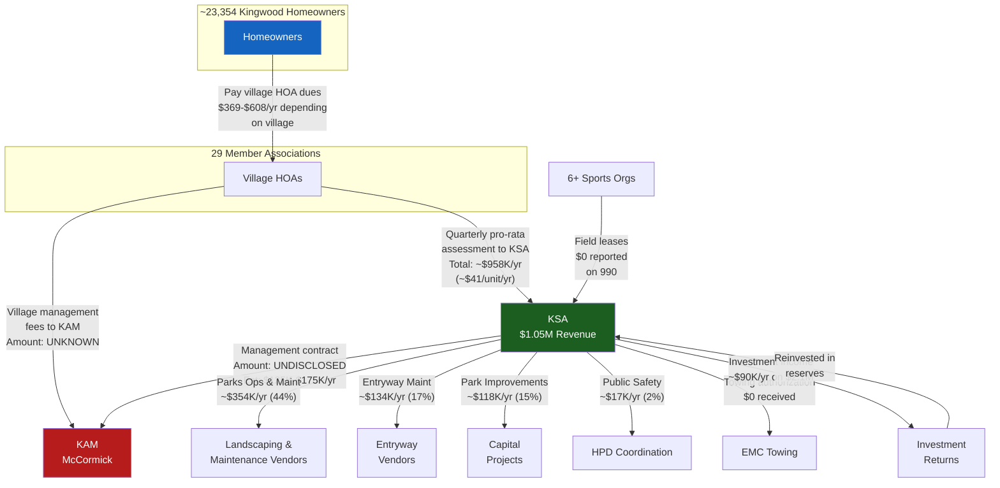
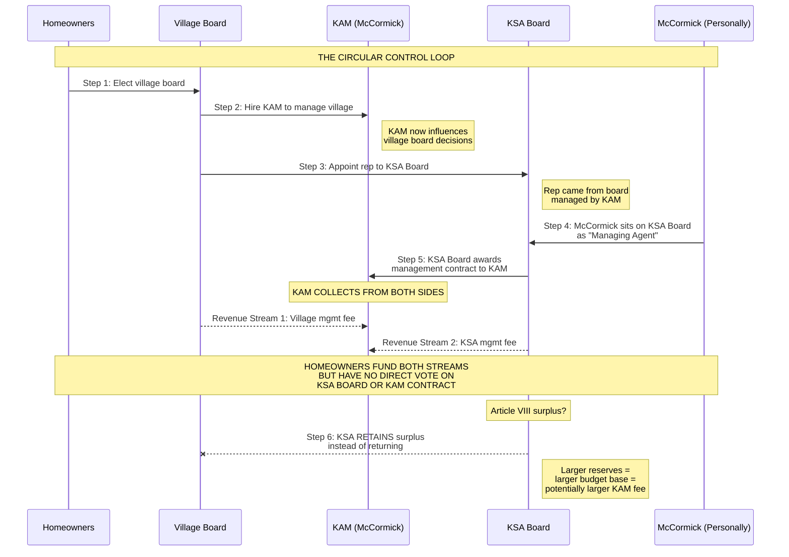
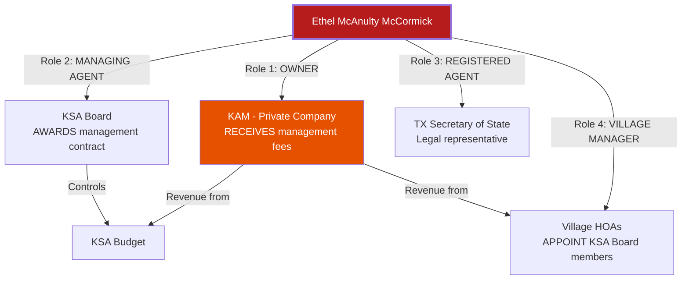
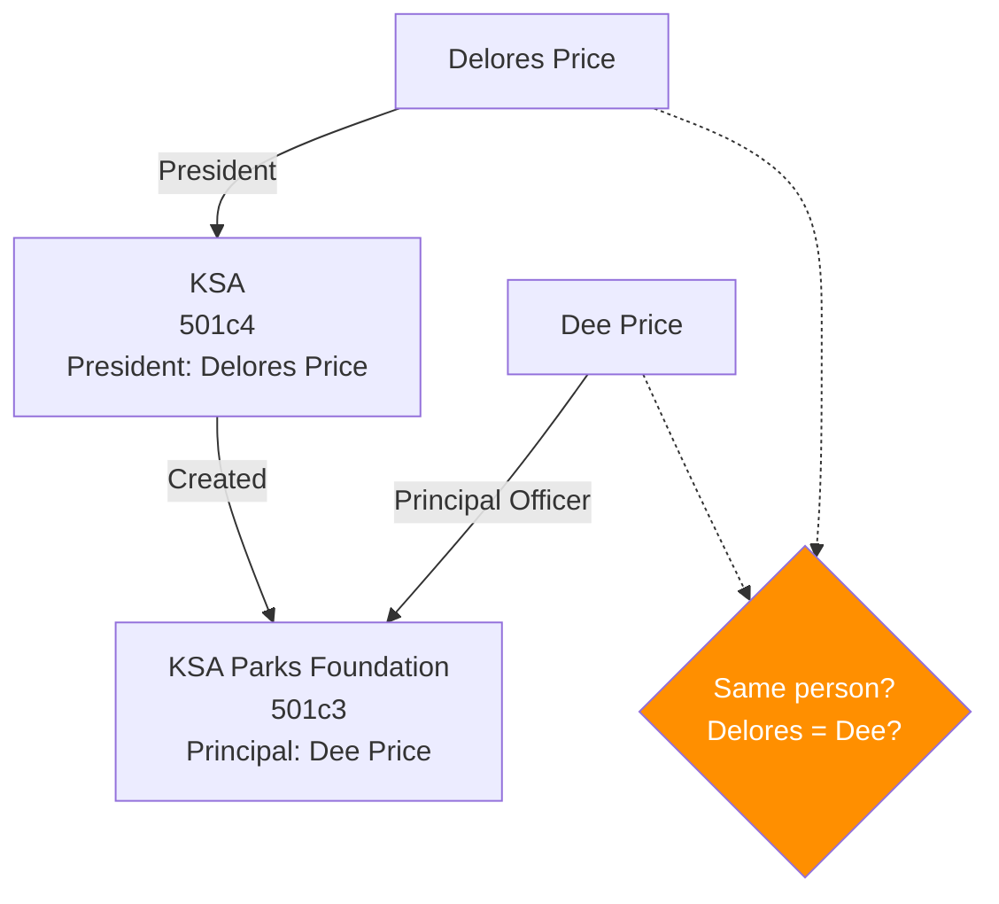
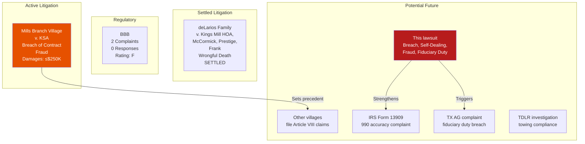

# ENTITY RELATIONSHIP MAP

**Matter:** In Re Kingwood Service Association
**Date:** March 22, 2026

---

## Master Entity Map

```mermaid
graph TB
    subgraph "DEFENDANTS"
        KSA[Kingwood Service Association<br/>501c4 Nonprofit<br/>EIN: 74-1891991<br/>Chartered: Sept 1976<br/>Assets: $3.12M<br/>Revenue: $1.05M/yr<br/>Employees: 0<br/>BBB: F]

        KAM[Kingwood Association<br/>Management, Inc.<br/>FOR-PROFIT Corporation<br/>Owner: Ethel McCormick<br/>Same address as KSA]

        EM[Ethel McAnulty McCormick<br/>• Owner of KAM<br/>• KSA "Managing Agent"<br/>• KSA Registered Agent<br/>• Village HOA Manager<br/>• Named in wrongful death suit]

        DP[Delores Price<br/>KSA President<br/>$0 compensation<br/>Also: KSA Parks Foundation<br/>Principal Officer]

        WM[William C. Manthei<br/>KSA Vice President<br/>$0 compensation]

        MF[Maryanne Fortson<br/>KSA Secretary<br/>$0 compensation]

        JK[John Kaskie<br/>KSA Treasurer<br/>$0 compensation]
    end

    subgraph "RELATED ENTITIES"
        KSAPF[KSA Parks Foundation<br/>501c3 Nonprofit<br/>EIN: 27-1433729<br/>Revenue: Under $50K<br/>Principal: Dee Price<br/>Files 990-N]

        EMC[EMC Towing<br/>Owner: TJ Knox<br/>New Caney/Kingwood<br/>Est. 2004]

        PRES[Prestige Association<br/>Management Group Corp<br/>Owner: Sarah Eldridge<br/>1849 Kingwood Dr #103<br/>BBB: A+<br/>Named in wrongful death<br/>alongside McCormick]
    end

    subgraph "KAM-MANAGED VILLAGES (Partial)"
        V_BC[Bear Branch Village]
        V_KCP[Kings Crossing Patio]
        V_OTH[Other KAM Villages<br/>Count Unknown]
    end

    subgraph "NON-KAM VILLAGES (Independent)"
        V_HR[Hunters Ridge<br/>Mgr: Sterling ASI]
        V_TW[Trailwood<br/>Mgr: Sterling ASI]
        V_GT[Greentree<br/>Mgr: Sterling ASI]
        V_KM[Kings Manor<br/>Mgr: SCS Management]
        V_KPW[Kingwood Place West<br/>Mgr: Crest Management]
    end

    subgraph "OTHER MANAGEMENT COMPANIES"
        STER[Sterling ASI]
        SCS[SCS Management]
        CREST[Crest Management]
        CIA[C.I.A. Services]
        FSR[FirstService Residential<br/>Public Company<br/>Briefly managed KSA<br/>communities — displaced<br/>when McCormick returned]
    end

    %% Ownership/Control
    EM -->|"Owns"| KAM
    EM -->|"Sits on board as<br/>'Managing Agent'"| KSA
    EM -->|"Registered Agent"| KSA

    %% KSA Board
    DP -->|"President"| KSA
    WM -->|"Vice President"| KSA
    MF -->|"Secretary"| KSA
    JK -->|"Treasurer"| KSA

    %% Related entities
    DP -->|"Principal Officer"| KSAPF
    KSA -->|"Created"| KSAPF
    KSA -->|"Towing contract"| EMC

    %% Management flows
    KSA -->|"Management contract<br/>Amount UNDISCLOSED"| KAM
    V_BC -->|"Village mgmt fee"| KAM
    V_KCP -->|"Village mgmt fee"| KAM
    V_OTH -->|"Village mgmt fees"| KAM

    V_HR -->|"Management"| STER
    V_TW -->|"Management"| STER
    V_GT -->|"Management"| STER
    V_KM -->|"Management"| SCS
    V_KPW -->|"Management"| CREST

    %% Assessment flows
    V_BC -->|"Assessment"| KSA
    V_KCP -->|"Assessment"| KSA
    V_OTH -->|"Assessment"| KSA
    V_HR -->|"Assessment"| KSA
    V_TW -->|"Assessment"| KSA
    V_GT -->|"Assessment"| KSA
    V_KM -->|"Assessment"| KSA
    V_KPW -->|"Assessment"| KSA

    style KAM fill:#B71C1C,color:#fff
    style EM fill:#B71C1C,color:#fff
    style KSA fill:#1B5E20,color:#fff
    style KSAPF fill:#2E7D32,color:#fff
    style FSR fill:#1565C0,color:#fff
    style V_HR fill:#FF6B35,color:#fff
    style V_TW fill:#FF6B35,color:#fff
    style V_GT fill:#FF6B35,color:#fff
    style V_KM fill:#FF6B35,color:#fff
    style V_KPW fill:#FF6B35,color:#fff
```

---

## Money Flow — Complete Picture



---

## The Self-Dealing Loop (Detailed)



---

## Overlapping Roles — McCormick



### Conflict Analysis

| Role | Duty | Conflict |
|------|------|---------|
| KAM Owner | Maximize KAM revenue | KAM revenue comes FROM KSA budget |
| KSA Board Member | Minimize KSA costs, maximize member value | Lower KSA costs = lower KAM revenue |
| Registered Agent | Represent KSA's legal interests | KSA's legal interests may conflict with KAM's |
| Village Manager | Serve village boards | Village boards should oversee KSA; KAM manages both sides |

**Every role McCormick holds conflicts with at least one other role she holds.** This is the definition of self-dealing.

---

## KSA Parks Foundation — Independence Question



**Note:** "Delores Price" (KSA President) and "Dee Price" (Parks Foundation Principal) appear to be the same person. If confirmed, the Parks Foundation is not independent from KSA — it is controlled by the same individual who controls KSA.

This matters because:
- The Parks Foundation is a 501(c)(3) — tax-deductible donations
- If controlled by the same person as KSA, donations could be directed to serve KSA interests rather than independent charitable purposes
- The Foundation files 990-N (under $50K revenue) — minimal IRS scrutiny

---

## Address Analysis

| Entity | Address |
|--------|---------|
| Kingwood Service Association | **1075 Kingwood Dr, Suite 100** |
| Kingwood Association Management | **1075 Kingwood Dr, Suite 100** |
| McCormick (Registered Agent for KSA) | **1075 Kingwood Dr, Suite 100** |
| KSA Parks Foundation | **1075 Kingwood Dr, Suite 100** |

All four entities — the nonprofit, the for-profit management company, the registered agent, and the charitable foundation — share a single address.

**Prestige Association Management** (the competitor named alongside McCormick in the wrongful death lawsuit) operates from a **different address**: 1849 Kingwood Dr, Suite 103.

---

## Known Litigation Map


