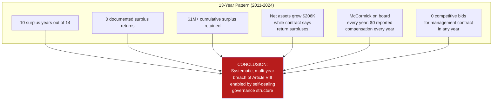

# CHRONOLOGICAL MISCONDUCT TIMELINE

**Matter:** In Re Kingwood Service Association
**Date:** March 22, 2026

---

## Purpose

This timeline documents the chronological sequence of events establishing the pattern of self-dealing, surplus retention, and accountability avoidance by KSA, KAM, and Ethel McCormick. Each entry is coded by evidentiary status.

**Legend:**
- **[PROVEN]** — Established by public records (990 filings, court records, BBB)
- **[ALLEGED]** — Alleged in litigation or credible reports
- **[INFERRED]** — Reasonable inference from established facts
- **[INVESTIGATE]** — Requires discovery to confirm

---

## Pre-History (1976–2010)

| Date | Event | Status |
|------|-------|--------|
| **Sept 13, 1976** | KSA incorporated in Texas by Friendswood Development Co. (Exxon subsidiary) | [PROVEN] |
| **1976–1990s** | KAM/McCormick begins managing Kingwood communities (exact date unknown) | [INVESTIGATE] |
| **Oct 1991** | IRS grants KSA 501(c)(4) tax-exempt status | [PROVEN] |
| **1994** | Friendswood donates East End Park (158.5 acres) to KSA | [PROVEN] |
| **1995** | Exxon sells Friendswood Development to Lennar for $110M. KSA continues independently | [PROVEN] |
| **Dec 31, 1996** | Houston forcibly annexes Kingwood. KSA survives as private nonprofit | [PROVEN] |
| **~2000s** | McCormick establishes herself as managing agent of KSA and multiple village HOAs | [INFERRED] |
| **Apr 2010** | KSA terminates Texas HeatWave Soccer Club lease at Deer Ridge + Northpark; gives all leagues 90 days to renegotiate | [PROVEN] |
| **2010** | KSA Parks Foundation (501(c)(3)) created. EIN 27-1433729. Principal: Dee Price | [PROVEN] |

---

## The Documented Period (2011–2024)

### 2011

| Event | Status |
|-------|--------|
| KSA Revenue: $819,888. Expenses: $743,479. **Surplus: $76,409** | [PROVEN — 990] |
| Net Assets: $2,913,747 | [PROVEN — 990] |
| Article VIII requires surplus return. **No evidence of return** | [INFERRED] |
| McCormick listed as Managing Agent, $0 compensation | [PROVEN — 990] |

### 2012

| Event | Status |
|-------|--------|
| Revenue: $662,415. Expenses: $724,047. **Deficit: -$61,632** | [PROVEN — 990] |
| Published budget: $806,003. G&A (including KAM fee): $182,783 | [PROVEN — KSA presentation] |
| Liabilities: $170,172 (highest on record) — then suddenly drop | [PROVEN — 990] |

### 2013

| Event | Status |
|-------|--------|
| Revenue: $845,378. Expenses: $911,275. **Deficit: -$65,897** | [PROVEN — 990] |
| Liabilities drop from $170,172 to $4,640 — **a $165,532 swing** | [PROVEN — 990] |
| River Grove DGC expanded from 9 to 18 holes | [PROVEN — UDisc] |

### 2014

| Event | Status |
|-------|--------|
| Revenue: $760,477. Expenses: $649,890. **Surplus: $110,587** | [PROVEN — 990] |
| Net Assets increase by $110,587 — **proving surplus was retained, not returned** | [PROVEN — 990] |
| McCormick: $0 compensation. 0 employees | [PROVEN — 990] |

### 2015

| Event | Status |
|-------|--------|
| Revenue: $838,333. Expenses: $771,855. **Surplus: $66,478** | [PROVEN — 990] |
| Net Assets increase by $66,480 — **surplus retained** | [PROVEN — 990] |

### 2016

| Event | Status |
|-------|--------|
| Revenue: $904,564. Expenses: $789,390. **Surplus: $115,174** | [PROVEN — 990] |
| Net Assets increase by $115,174 — **surplus retained** | [PROVEN — 990] |

### 2017

| Event | Status |
|-------|--------|
| **Hurricane Harvey** (Aug 27–29): River Grove Park under 20 feet of water | [PROVEN] |
| Revenue: $884,034. Expenses: $895,731. **Deficit: -$11,697** | [PROVEN — 990] |
| No FEMA reimbursement visible on 990 | [PROVEN — 990] |

### 2018

| Event | Status |
|-------|--------|
| Revenue: $926,473. Expenses: $745,644. **Surplus: $180,829** — largest on record | [PROVEN — 990] |
| Net Assets increase by $246,543 — **significantly exceeds surplus, suggesting additional asset recognition** | [PROVEN — 990] |
| Liabilities: $82,355 | [PROVEN — 990] |
| Article VIII surplus of $180,829 should have been returned. **No evidence of return** | [INFERRED] |

### 2019

| Event | Status |
|-------|--------|
| Revenue: $998,251. Expenses: $850,536. **Surplus: $147,715** | [PROVEN — 990] |
| Net Assets increase by $147,715 — **surplus retained** | [PROVEN — 990] |
| Liabilities drop from $82,355 to **$0** | [PROVEN — 990] |
| Nov 2019: KSA Parks Committee votes to dredge River Grove boat ramp/boardwalk | [PROVEN] |
| **McCormick departs** (approximate). FirstService Residential takes over management | [ALLEGED] |

### 2020

| Event | Status |
|-------|--------|
| Revenue: $1,031,234. Expenses: $1,018,430. **Surplus: $12,804** | [PROVEN — 990] |
| COVID-19 increases park usage. Disc golf sees nationwide growth | [PROVEN] |
| River Grove dredging completed (Jan–Mar 2020) | [PROVEN] |
| **McCormick returns** — "swiftly reclaims control" from FirstService Residential | [ALLEGED] |
| Process for McCormick's return: **unknown — competitive bid? Board vote?** | [INVESTIGATE] |

### 2021

| Event | Status |
|-------|--------|
| Revenue: $1,039,957. Expenses: $948,240. **Surplus: $91,717** | [PROVEN — 990] |
| Net Assets: $3,449,227 — **surplus retained** | [PROVEN — 990] |

### 2022

| Event | Status |
|-------|--------|
| Revenue: $1,034,863. Expenses: $861,519. **Surplus: $173,344** | [PROVEN — 990] |
| Net Assets: $3,604,370 — **surplus retained** | [PROVEN — 990] |
| **Sept 26, 2022:** 8-year-old John Chase deLarios struck and killed at Kings Mill Lane intersection | [PROVEN — lawsuit] |
| **McCormick named as defendant** in wrongful death lawsuit (personally, as Ethel McAnulty McCormick) | [PROVEN — lawsuit] |
| **Dec 8, 2022:** Mills Branch Village sends demand letter to KSA re: Article VIII surplus return | [PROVEN — lawsuit] |
| KSA denies payment, claims funds are "still needed" | [ALLEGED — lawsuit] |

### 2023

| Event | Status |
|-------|--------|
| Revenue: $1,041,801. Expenses: $1,009,164. **Surplus: $32,637** | [PROVEN — 990] |
| Net Assets: $3,637,007 — **all-time peak. Surplus retained** | [PROVEN — 990] |
| Multiple arbitration requests sent by Mills Branch to KSA (Article XI requires arbitration) | [PROVEN — lawsuit] |
| KSA **"willfully and knowingly refused to respond"** to any arbitration request | [ALLEGED — lawsuit] |
| KSA Board President attempted to discuss at Board meeting — insufficient response | [ALLEGED — lawsuit] |
| Kings Mill wrongful death lawsuit **settled** | [PROVEN] |
| River Grove DGC expanded to 21 holes | [PROVEN — UDisc] |

### 2024

| Event | Status |
|-------|--------|
| Revenue: $1,048,921. Expenses: **$1,565,650** — **55.1% increase, largest ever** | [PROVEN — 990] |
| **Deficit: -$516,729** — largest deficit in KSA history | [PROVEN — 990] |
| Cash reserves decline from $2,594,104 to $2,092,894 — **$501,210 drawdown** | [PROVEN — 990] |
| Net Assets decline from $3,637,007 to $3,120,278 — **$516,729 loss** | [PROVEN — 990] |
| Cause of 55% expense increase: **UNDISCLOSED** | [INVESTIGATE] |
| Mills Branch files lawsuit — breach of contract, negligence, fraud | [PROVEN — lawsuit] |
| KSA now seeks arbitration (after refusing it) | [PROVEN — lawsuit] |
| BBB rating: **F** — failed to respond to 2 complaints | [PROVEN — BBB] |

### 2025–2026

| Event | Status |
|-------|--------|
| Assessment fee: $295/lot/year (though KSA portion is only ~$41/unit) | [PROVEN — KAM FAQ] |
| Mills Branch case status: moving toward arbitration | [PROVEN — last known status] |
| This legal action prepared | Current |

---

## Pattern Summary

---

## Key Evidentiary Gaps (To Be Filled by Discovery)

| Gap | Discovery Method | Priority |
|-----|-----------------|----------|
| Exact KAM management fee amount (all years) | RFP #4 (management contract) | CRITICAL |
| Whether surplus was ever returned (any year) | Interrogatory #1, RFA #4 | CRITICAL |
| Cause of 2024 expense spike | Interrogatory #4, RFP #15 | CRITICAL |
| McCormick departure/return circumstances | Interrogatory #10, FSR subpoena | HIGH |
| Whether competitive bidding ever occurred | Interrogatory #8, RFA #7 | HIGH |
| Whether conflict of interest policy exists | Interrogatory #9, RFA #17 | HIGH |
| Field lease payments (if any) | Sports org subpoenas | MEDIUM |
| Vendor relationships to KAM/McCormick | Interrogatory #13 | HIGH |
| What FirstService Residential found | FSR subpoena | HIGH |
| KAM total revenue from Kingwood | KAM bank subpoena | HIGH |
