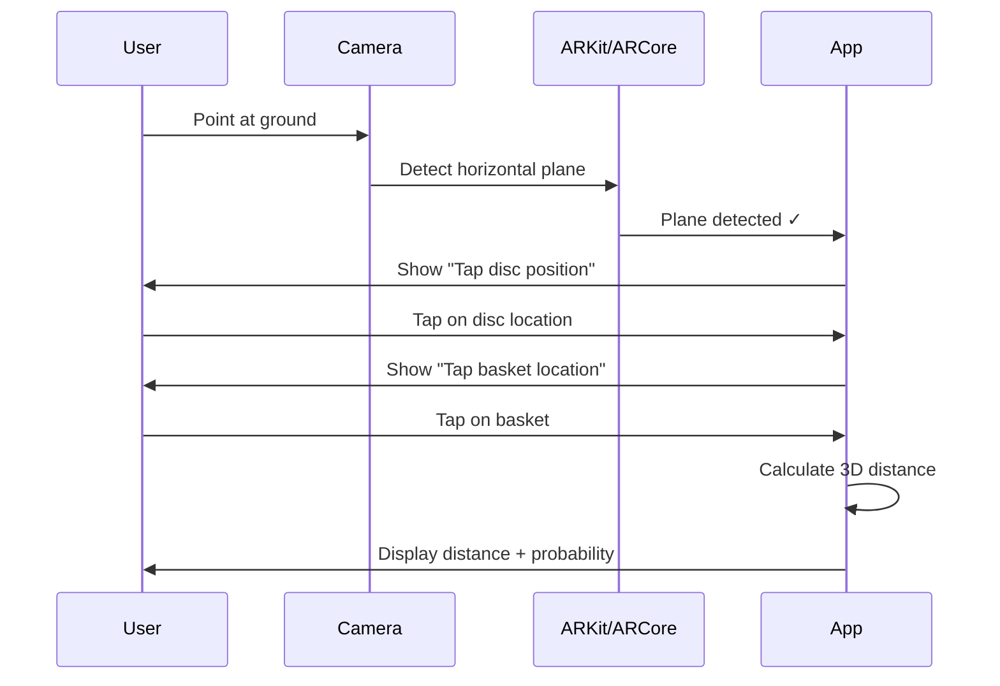

# RGDGC AR Features

## Overview

The RGDGC app includes augmented reality (AR) features to enhance disc golf training, particularly for putting practice. This document details the AR implementation plan, technical architecture, and user experience design.

---

## 1. Feature Summary

| Feature | Description | Platform | Priority |
|---------|-------------|----------|----------|
| **AR Distance Measurement** | Measure disc-to-basket distance using camera | iOS/Android | P1 |
| **AR Putting Overlay** | Show make probability and trajectory | iOS/Android | P1 |
| **AR Stance Guide** | Overlay optimal foot position and arm angle | iOS/Android | P2 |
| **AR Flight Path** | Visualize disc flight path in 3D | iOS/Android | P2 |
| **AR Course Map** | Overlay hole layout on real terrain | iOS/Android | P3 |

---

## 2. Competitive Analysis

### 2.1 Existing AR Golf/Disc Golf Apps

| App | AR Features | Strengths | Limitations |
|-----|-------------|-----------|-------------|
| **Hole19** | Distance to green, hole flyover | Beautiful UI, GPS accuracy | No putting analysis |
| **PuttView X** | Green reading, break lines | Elite putting analysis | $3,000+ hardware required |
| **4Par** | AR range finder | Quick distance measurement | Golf-focused only |
| **Shot Tracer** | Ball flight visualization | Professional look | Post-processing, not real-time |
| **UDisc** | No AR features | Great stats tracking | No AR capability |

### 2.2 RGDGC Differentiation

Our AR features focus specifically on **disc golf putting** with:
- Real-time make probability display
- Personal skill parameter integration
- Environmental condition overlays
- Practice mode with gamification
- Free/accessible technology (no expensive hardware)

---

## 3. AR Distance Measurement

### 3.1 User Flow



### 3.2 Technical Implementation

**iOS (ARKit + RealityKit):**

```swift
import ARKit
import RealityKit

class ARDistanceViewController: UIViewController, ARSessionDelegate {
    
    @IBOutlet var arView: ARView!
    
    var discAnchor: AnchorEntity?
    var basketAnchor: AnchorEntity?
    var measurementState: MeasurementState = .waitingForDisc
    
    enum MeasurementState {
        case waitingForDisc
        case waitingForBasket
        case complete
    }
    
    override func viewDidLoad() {
        super.viewDidLoad()
        
        let config = ARWorldTrackingConfiguration()
        config.planeDetection = [.horizontal]
        config.environmentTexturing = .automatic
        arView.session.run(config)
        arView.session.delegate = self
        
        // Add tap gesture
        let tapGesture = UITapGestureRecognizer(target: self, action: #selector(handleTap))
        arView.addGestureRecognizer(tapGesture)
    }
    
    @objc func handleTap(_ gesture: UITapGestureRecognizer) {
        let location = gesture.location(in: arView)
        
        // Raycast to find ground plane
        guard let result = arView.raycast(
            from: location,
            allowing: .existingPlaneGeometry,
            alignment: .horizontal
        ).first else { return }
        
        let position = result.worldTransform.columns.3
        let anchor = AnchorEntity(world: [position.x, position.y, position.z])
        
        switch measurementState {
        case .waitingForDisc:
            // Place disc marker
            let discMarker = createMarker(color: .orange, label: "Disc")
            anchor.addChild(discMarker)
            arView.scene.addAnchor(anchor)
            discAnchor = anchor
            measurementState = .waitingForBasket
            showInstruction("Now tap the basket location")
            
        case .waitingForBasket:
            // Place basket marker
            let basketMarker = createMarker(color: .yellow, label: "Basket")
            anchor.addChild(basketMarker)
            arView.scene.addAnchor(anchor)
            basketAnchor = anchor
            measurementState = .complete
            
            // Calculate and display distance
            calculateAndDisplayDistance()
            
        case .complete:
            // Reset for new measurement
            resetMeasurement()
        }
    }
    
    func calculateAndDisplayDistance() {
        guard let discPos = discAnchor?.position,
              let basketPos = basketAnchor?.position else { return }
        
        let distance = simd_distance(discPos, basketPos)
        let distanceMeters = Double(distance)
        let distanceFeet = distanceMeters * 3.28084
        
        // Get make probability from putting model
        let probability = PuttingModel.shared.getMakeProbability(
            distance: distanceMeters,
            playerId: CurrentUser.id
        )
        
        // Display overlay
        showDistanceOverlay(
            meters: distanceMeters,
            feet: distanceFeet,
            probability: probability
        )
        
        // Draw line between points
        drawMeasurementLine(from: discPos, to: basketPos)
    }
    
    func createMarker(color: UIColor, label: String) -> ModelEntity {
        let mesh = MeshResource.generateSphere(radius: 0.05)
        let material = SimpleMaterial(color: color, isMetallic: false)
        let marker = ModelEntity(mesh: mesh, materials: [material])
        
        // Add text label
        let textMesh = MeshResource.generateText(
            label,
            extrusionDepth: 0.01,
            font: .systemFont(ofSize: 0.1),
            containerFrame: .zero,
            alignment: .center,
            lineBreakMode: .byTruncatingTail
        )
        let textEntity = ModelEntity(mesh: textMesh, materials: [SimpleMaterial(color: .white, isMetallic: false)])
        textEntity.position = [0, 0.1, 0]
        marker.addChild(textEntity)
        
        return marker
    }
}
```

**Android (ARCore + Sceneform):**

```kotlin
import com.google.ar.core.*
import com.google.ar.sceneform.AnchorNode
import com.google.ar.sceneform.rendering.MaterialFactory
import com.google.ar.sceneform.rendering.ShapeFactory
import com.google.ar.sceneform.ux.ArFragment

class ARDistanceFragment : Fragment() {
    
    private lateinit var arFragment: ArFragment
    private var discAnchor: AnchorNode? = null
    private var basketAnchor: AnchorNode? = null
    private var state = MeasurementState.WAITING_FOR_DISC
    
    enum class MeasurementState {
        WAITING_FOR_DISC,
        WAITING_FOR_BASKET,
        COMPLETE
    }
    
    override fun onViewCreated(view: View, savedInstanceState: Bundle?) {
        super.onViewCreated(view, savedInstanceState)
        
        arFragment = childFragmentManager.findFragmentById(R.id.ar_fragment) as ArFragment
        
        arFragment.setOnTapArPlaneListener { hitResult, plane, _ ->
            if (plane.type != Plane.Type.HORIZONTAL_UPWARD_FACING) return@setOnTapArPlaneListener
            
            when (state) {
                MeasurementState.WAITING_FOR_DISC -> placeDiscMarker(hitResult)
                MeasurementState.WAITING_FOR_BASKET -> placeBasketMarker(hitResult)
                MeasurementState.COMPLETE -> resetMeasurement()
            }
        }
    }
    
    private fun placeDiscMarker(hitResult: HitResult) {
        MaterialFactory.makeOpaqueWithColor(context, Color(0xFFFF6B35.toInt()))
            .thenAccept { material ->
                val sphere = ShapeFactory.makeSphere(0.05f, Vector3.zero(), material)
                val anchorNode = AnchorNode(hitResult.createAnchor())
                anchorNode.renderable = sphere
                arFragment.arSceneView.scene.addChild(anchorNode)
                discAnchor = anchorNode
                
                state = MeasurementState.WAITING_FOR_BASKET
                showInstruction("Now tap the basket location")
            }
    }
    
    private fun placeBasketMarker(hitResult: HitResult) {
        MaterialFactory.makeOpaqueWithColor(context, Color(0xFFFFD700.toInt()))
            .thenAccept { material ->
                val sphere = ShapeFactory.makeSphere(0.05f, Vector3.zero(), material)
                val anchorNode = AnchorNode(hitResult.createAnchor())
                anchorNode.renderable = sphere
                arFragment.arSceneView.scene.addChild(anchorNode)
                basketAnchor = anchorNode
                
                state = MeasurementState.COMPLETE
                calculateAndDisplayDistance()
            }
    }
    
    private fun calculateAndDisplayDistance() {
        val discPos = discAnchor?.worldPosition ?: return
        val basketPos = basketAnchor?.worldPosition ?: return
        
        val dx = basketPos.x - discPos.x
        val dy = basketPos.y - discPos.y
        val dz = basketPos.z - discPos.z
        val distance = sqrt(dx * dx + dy * dy + dz * dz)
        
        val distanceMeters = distance.toDouble()
        val distanceFeet = distanceMeters * 3.28084
        
        // Get make probability
        val probability = PuttingModel.getMakeProbability(
            distance = distanceMeters,
            playerId = CurrentUser.id
        )
        
        // Display overlay
        showDistanceOverlay(distanceMeters, distanceFeet, probability)
        
        // Draw measurement line
        drawMeasurementLine(discPos, basketPos)
    }
}
```

### 3.3 Accuracy Considerations

| Factor | Impact | Mitigation |
|--------|--------|------------|
| **Plane detection quality** | ±5-10cm at close range | Require stable plane before measurement |
| **Lighting conditions** | Poor in low light | Show quality indicator, suggest better lighting |
| **Device movement** | Drift over time | Complete measurement quickly |
| **Reflective surfaces** | Confuses depth sensing | Warn user, suggest repositioning |

**Accuracy targets:**
- Within 10cm at 10m (3 inches at 33ft)
- Within 20cm at 20m (8 inches at 66ft)

---

## 4. AR Putting Overlay

### 4.1 Display Elements

```
┌─────────────────────────────────────────────┐
│                                             │
│            [Camera View of Basket]          │
│                                             │
│     ┌─────────────────────────────────┐     │
│     │     Distance: 24 ft (7.3m)      │     │
│     │     ██████████████░░░░ 72%      │     │
│     │     Wind: 6mph →  (-3%)         │     │
│     └─────────────────────────────────┘     │
│                                             │
│         ╭─────────────────────╮             │
│         │   ○ ← Aim Point     │             │
│         │    ╲                │             │
│         │     ╲  trajectory   │             │
│         │      ╲              │             │
│         │       ●             │             │
│         ╰───────[Basket]──────╯             │
│                                             │
│    [Record Putt]    [Practice Mode]         │
└─────────────────────────────────────────────┘
```

### 4.2 Real-time Data Display

```typescript
interface ARPuttingOverlay {
  // Core metrics
  distance: {
    meters: number;
    feet: number;
    zone: 'tapIn' | 'c1x' | 'c2' | 'longRange';
  };
  
  // Probability
  makeProbability: {
    base: number;           // e.g., 0.75
    adjusted: number;       // e.g., 0.72 (after wind)
    display: string;        // "72%"
    trend: 'up' | 'down' | 'stable';
  };
  
  // Environmental factors
  conditions: {
    wind: {
      speed: number;        // mph
      direction: 'left' | 'right' | 'head' | 'tail';
      impact: number;       // percentage adjustment
    };
    elevation: {
      change: number;       // meters, positive = uphill
      impact: number;
    };
  };
  
  // Visual guides
  trajectory: {
    aimPoint: { x: number; y: number };
    flightPath: Array<{ x: number; y: number; z: number }>;
    releaseAngle: number;
  };
  
  // Comparison data
  comparison: {
    personalAverage: number;
    tourAverage: number;
    bestAtDistance: number;
  };
}
```

### 4.3 Trajectory Visualization

Show the expected flight path based on putting style:

```swift
func calculateTrajectoryPath(
    distance: Double,
    releaseHeight: Double = 1.0,
    puttStyle: PuttStyle
) -> [SIMD3<Float>] {
    
    var points: [SIMD3<Float>] = []
    
    // Physics parameters by putt style
    let params: (launchAngle: Double, spinRate: Double) = {
        switch puttStyle {
        case .spin:
            return (launchAngle: 15, spinRate: 8)
        case .push:
            return (launchAngle: 8, spinRate: 2)
        case .spush:
            return (launchAngle: 12, spinRate: 5)
        case .turbo:
            return (launchAngle: 5, spinRate: 10)
        }
    }()
    
    // Calculate initial velocity needed to cover distance
    let gravity = 9.81
    let launchRad = params.launchAngle * .pi / 180
    let basketHeight = 0.6 // meters
    
    // Time of flight
    let horizontalVelocity = distance / (sqrt(2 * (releaseHeight - basketHeight + 
        distance * tan(launchRad)) / gravity) + distance * tan(launchRad) / 
        sqrt(2 * gravity * (releaseHeight - basketHeight + distance * tan(launchRad))))
    
    let verticalVelocity = horizontalVelocity * tan(launchRad)
    let totalTime = distance / horizontalVelocity
    
    // Generate points along trajectory
    let numPoints = 20
    for i in 0...numPoints {
        let t = Double(i) / Double(numPoints) * totalTime
        let x = Float(horizontalVelocity * t)
        let y = Float(releaseHeight + verticalVelocity * t - 0.5 * gravity * t * t)
        let z: Float = 0
        
        points.append(SIMD3<Float>(x, y, z))
    }
    
    return points
}
```

---

## 5. AR Stance Guide

### 5.1 Overlay Elements

```
┌─────────────────────────────────────────────┐
│                                             │
│            [Camera View - Ground]           │
│                                             │
│     ┌───────────────────────────────┐       │
│     │  Foot Position Guide          │       │
│     │                               │       │
│     │    ┌─────┐     ┌─────┐        │       │
│     │    │ L   │     │  R  │        │       │
│     │    └──┬──┘     └──┬──┘        │       │
│     │       │           │           │       │
│     │       └─────┬─────┘           │       │
│     │             │                 │       │
│     │         [Target]              │       │
│     │             ↓                 │       │
│     │         To Basket             │       │
│     └───────────────────────────────┘       │
│                                             │
│     Stance: STRADDLE ✓                      │
│     Width: 24" (optimal: 22-26")            │
│                                             │
└─────────────────────────────────────────────┘
```

### 5.2 Stance Detection

Using pose estimation to detect player's stance:

```typescript
interface StanceAnalysis {
  stanceType: 'straddle' | 'staggered' | 'step' | 'jump';
  
  footPosition: {
    left: { x: number; y: number; angle: number };
    right: { x: number; y: number; angle: number };
    width: number;  // inches between feet
    alignment: number;  // degrees off target line
  };
  
  bodyPosition: {
    shoulderRotation: number;  // relative to target
    hipRotation: number;
    spine Angle: number;
    kneeFlexion: { left: number; right: number };
  };
  
  recommendations: string[];
  
  score: number;  // 0-100 stance quality score
}

function analyzeStance(poseData: PoseData, targetDirection: Vector3): StanceAnalysis {
  const leftAnkle = poseData.landmarks.leftAnkle;
  const rightAnkle = poseData.landmarks.rightAnkle;
  const leftHip = poseData.landmarks.leftHip;
  const rightHip = poseData.landmarks.rightHip;
  
  // Calculate foot width
  const footWidth = calculateDistance(leftAnkle, rightAnkle);
  const footWidthInches = footWidth * 39.37;  // meters to inches
  
  // Calculate alignment to target
  const feetMidpoint = midpoint(leftAnkle, rightAnkle);
  const hipMidpoint = midpoint(leftHip, rightHip);
  const bodyLine = normalize(subtract(hipMidpoint, feetMidpoint));
  const alignmentAngle = angleBetween(bodyLine, targetDirection);
  
  // Determine stance type
  const footYDiff = Math.abs(leftAnkle.y - rightAnkle.y);
  const stanceType = footYDiff < 0.1 ? 'straddle' : 
                     footYDiff < 0.3 ? 'staggered' : 'step';
  
  // Generate recommendations
  const recommendations: string[] = [];
  
  if (footWidthInches < 20) {
    recommendations.push("Widen stance for better balance");
  } else if (footWidthInches > 30) {
    recommendations.push("Narrow stance slightly for cleaner release");
  }
  
  if (Math.abs(alignmentAngle) > 10) {
    const direction = alignmentAngle > 0 ? "left" : "right";
    recommendations.push(`Rotate ${Math.abs(alignmentAngle).toFixed(0)}° ${direction} to square up`);
  }
  
  return {
    stanceType,
    footPosition: {
      left: leftAnkle,
      right: rightAnkle,
      width: footWidthInches,
      alignment: alignmentAngle
    },
    bodyPosition: {
      shoulderRotation: calculateShoulderRotation(poseData),
      hipRotation: calculateHipRotation(poseData),
      spineAngle: calculateSpineAngle(poseData),
      kneeFlexion: {
        left: calculateKneeAngle(poseData, 'left'),
        right: calculateKneeAngle(poseData, 'right')
      }
    },
    recommendations,
    score: calculateStanceScore(/* all metrics */)
  };
}
```

---

## 6. Practice Mode

### 6.1 AR Practice Features

| Feature | Description |
|---------|-------------|
| **Target Zones** | Project C1/C2 circles on ground |
| **Distance Markers** | Show 10ft, 20ft, 30ft rings |
| **Score Tracking** | Count makes/misses in session |
| **Streak Counter** | Track consecutive makes |
| **Challenge Mode** | Gamified putting challenges |

### 6.2 Challenge Examples

**Circle of Death (AR Version):**

```
┌─────────────────────────────────────────────┐
│                                             │
│         CIRCLE OF DEATH                     │
│         Position 7 of 12                    │
│                                             │
│              ┌───────┐                      │
│           ╱─┼─7─┼─╲                         │
│         ╱   │   │   ╲                       │
│        6    │   │    8                      │
│       │     │ B │     │                     │
│       5     │   │     9                     │
│        ╲    │   │    ╱                      │
│         ╲   │   │   ╱                       │
│          ╲──┼─○─┼──╱                        │
│            4  3  10                         │
│                                             │
│         Made: ████████░░ 6/12               │
│         Streak: 3 🔥                        │
│                                             │
│    [Record Make ✓]  [Record Miss ✗]         │
└─────────────────────────────────────────────┘
```

**Ladder Drill:**

```typescript
interface LadderDrillState {
  currentDistance: number;  // feet
  startDistance: number;    // 15
  stepSize: number;         // 5
  maxDistance: number;      // 50
  
  attempts: Array<{
    distance: number;
    made: boolean;
    timestamp: Date;
  }>;
  
  currentStreak: number;
  bestStreak: number;
  highestReached: number;
}

function ladderDrillLogic(state: LadderDrillState, made: boolean): LadderDrillState {
  const newState = { ...state };
  
  newState.attempts.push({
    distance: state.currentDistance,
    made,
    timestamp: new Date()
  });
  
  if (made) {
    newState.currentStreak++;
    newState.currentDistance = Math.min(
      state.currentDistance + state.stepSize,
      state.maxDistance
    );
    newState.highestReached = Math.max(
      newState.highestReached,
      newState.currentDistance
    );
  } else {
    newState.bestStreak = Math.max(newState.bestStreak, newState.currentStreak);
    newState.currentStreak = 0;
    newState.currentDistance = state.startDistance;
  }
  
  return newState;
}
```

---

## 7. Technical Architecture

### 7.1 Platform Support

| Platform | Technology | Min Version |
|----------|------------|-------------|
| **iOS** | ARKit + RealityKit | iOS 14+ (A12+ chip) |
| **Android** | ARCore + Sceneform | Android 8.0+ (ARCore supported device) |
| **Web** | WebXR (limited) | Chrome 79+, experimental |

### 7.2 React Native Integration

Using `react-native-arkit` and `react-native-arcore`:

```typescript
// ARPuttingScreen.tsx
import React, { useState, useCallback } from 'react';
import { View, Text, StyleSheet, Platform } from 'react-native';
import { ARView } from './ARView';  // Platform-specific AR view
import { PuttingOverlay } from './PuttingOverlay';
import { usePuttingModel } from '../hooks/usePuttingModel';

interface ARPuttingScreenProps {
  playerId: string;
}

export const ARPuttingScreen: React.FC<ARPuttingScreenProps> = ({ playerId }) => {
  const [distance, setDistance] = useState<number | null>(null);
  const [measurementState, setMeasurementState] = useState<'idle' | 'disc' | 'basket' | 'complete'>('idle');
  
  const { getMakeProbability, recordPutt } = usePuttingModel(playerId);
  
  const handleDistanceMeasured = useCallback((distanceMeters: number) => {
    setDistance(distanceMeters);
    setMeasurementState('complete');
  }, []);
  
  const handleRecordPutt = useCallback((made: boolean) => {
    if (distance) {
      recordPutt({
        distanceMeters: distance,
        made,
        timestamp: new Date()
      });
    }
    // Reset for next putt
    setMeasurementState('idle');
    setDistance(null);
  }, [distance, recordPutt]);
  
  const probability = distance ? getMakeProbability(distance) : null;
  
  return (
    <View style={styles.container}>
      <ARView
        onDistanceMeasured={handleDistanceMeasured}
        measurementState={measurementState}
        onStateChange={setMeasurementState}
      />
      
      {distance && probability && (
        <PuttingOverlay
          distance={distance}
          probability={probability}
          onRecordMake={() => handleRecordPutt(true)}
          onRecordMiss={() => handleRecordPutt(false)}
        />
      )}
      
      {measurementState === 'idle' && (
        <View style={styles.instruction}>
          <Text style={styles.instructionText}>
            Tap the screen to start measuring
          </Text>
        </View>
      )}
      
      {measurementState === 'disc' && (
        <View style={styles.instruction}>
          <Text style={styles.instructionText}>
            Tap your disc position
          </Text>
        </View>
      )}
      
      {measurementState === 'basket' && (
        <View style={styles.instruction}>
          <Text style={styles.instructionText}>
            Tap the basket position
          </Text>
        </View>
      )}
    </View>
  );
};

const styles = StyleSheet.create({
  container: {
    flex: 1,
  },
  instruction: {
    position: 'absolute',
    top: 100,
    left: 0,
    right: 0,
    alignItems: 'center',
  },
  instructionText: {
    backgroundColor: 'rgba(0,0,0,0.7)',
    color: '#fff',
    padding: 12,
    borderRadius: 8,
    fontSize: 16,
  },
});
```

### 7.3 Offline Capability

AR features should work offline:

```typescript
// Offline putting model cache
interface OfflinePuttingData {
  playerId: string;
  fittedParams: {
    sigmaAngle: number;
    sigmaDistance: number;
    epsilon: number;
  };
  lastSynced: Date;
  pendingPutts: PuttAttempt[];
}

class OfflinePuttingStore {
  private storage: AsyncStorage;
  
  async getPlayerParams(playerId: string): Promise<FittedParams | null> {
    const data = await this.storage.getItem(`putting_${playerId}`);
    if (!data) return null;
    
    const parsed: OfflinePuttingData = JSON.parse(data);
    return parsed.fittedParams;
  }
  
  async recordPuttOffline(playerId: string, putt: PuttAttempt): Promise<void> {
    const key = `putting_${playerId}`;
    const data = await this.storage.getItem(key);
    const parsed: OfflinePuttingData = data 
      ? JSON.parse(data) 
      : { playerId, fittedParams: DEFAULT_PARAMS, lastSynced: new Date(), pendingPutts: [] };
    
    parsed.pendingPutts.push(putt);
    await this.storage.setItem(key, JSON.stringify(parsed));
  }
  
  async syncPendingPutts(): Promise<void> {
    // Called when connection restored
    const keys = await this.storage.getAllKeys();
    const puttingKeys = keys.filter(k => k.startsWith('putting_'));
    
    for (const key of puttingKeys) {
      const data: OfflinePuttingData = JSON.parse(await this.storage.getItem(key));
      
      if (data.pendingPutts.length > 0) {
        try {
          await api.post('/api/v1/putting/batch', {
            playerId: data.playerId,
            putts: data.pendingPutts
          });
          
          // Clear pending putts after successful sync
          data.pendingPutts = [];
          await this.storage.setItem(key, JSON.stringify(data));
        } catch (error) {
          console.error('Failed to sync putts:', error);
        }
      }
    }
  }
}
```

---

## 8. Privacy & Permissions

### 8.1 Required Permissions

| Permission | iOS | Android | Purpose |
|------------|-----|---------|---------|
| **Camera** | NSCameraUsageDescription | CAMERA | AR visualization |
| **Location** | NSLocationWhenInUseUsageDescription | ACCESS_FINE_LOCATION | Course detection, wind data |
| **Motion** | NSMotionUsageDescription | — | Device orientation |

### 8.2 Privacy Considerations

- **No video storage**: Camera feed is processed in real-time, not saved
- **Local processing**: AR calculations happen on-device
- **Opt-in analytics**: Usage stats only with consent
- **No facial recognition**: We don't identify people in frame

---

## 9. Performance Optimization

### 9.1 Battery Considerations

AR features are battery-intensive. Optimizations:

```typescript
const AR_CONFIG = {
  // Reduce frame rate when not actively measuring
  idleFrameRate: 30,
  activeFrameRate: 60,
  
  // Disable features when battery low
  lowBatteryThreshold: 0.20,
  disableOnLowBattery: ['trajectory', 'stanceGuide'],
  
  // Auto-pause after inactivity
  autoSleepTimeout: 30000,  // 30 seconds
  
  // Quality settings
  qualityLevels: {
    high: { resolution: 'full', antialiasing: true },
    medium: { resolution: '75%', antialiasing: true },
    low: { resolution: '50%', antialiasing: false }
  }
};
```

### 9.2 Memory Management

```swift
// iOS memory management
class ARSessionManager {
    private var arView: ARView?
    
    func pauseSession() {
        arView?.session.pause()
        // Release AR resources
        arView?.scene.anchors.removeAll()
    }
    
    func handleMemoryWarning() {
        // Reduce quality
        let config = ARWorldTrackingConfiguration()
        config.frameSemantics = []  // Disable semantic analysis
        config.planeDetection = []  // Stop new plane detection
        arView?.session.run(config)
    }
    
    deinit {
        pauseSession()
        arView = nil
    }
}
```

---

## 10. Future Enhancements

### 10.1 Advanced AR Features (P3+)

| Feature | Description | Technology |
|---------|-------------|------------|
| **Basket Recognition** | Auto-detect PDGA baskets | ML Vision (Core ML / ML Kit) |
| **Flight Recording** | Record and replay actual disc flight | Video + motion tracking |
| **Multiplayer AR** | See friend's putting attempts | ARKit WorldMap sharing |
| **Course Overlay** | Full hole map in AR | LiDAR + pre-scanned courses |

### 10.2 LiDAR Integration (iPhone Pro)

```swift
// LiDAR-enhanced distance measurement
func setupLiDARSession() {
    guard ARWorldTrackingConfiguration.supportsSceneReconstruction(.mesh) else {
        // Fall back to standard AR
        return
    }
    
    let config = ARWorldTrackingConfiguration()
    config.sceneReconstruction = .mesh
    config.frameSemantics = .sceneDepth
    
    arView.session.run(config)
}

func preciseDistanceMeasurement(from: SIMD3<Float>, to: SIMD3<Float>) -> Float {
    // LiDAR provides more accurate depth data
    guard let frame = arView.session.currentFrame,
          let depthMap = frame.sceneDepth?.depthMap else {
        // Fall back to standard calculation
        return simd_distance(from, to)
    }
    
    // Use depth map for sub-centimeter accuracy
    return calculateDistanceUsingDepthMap(depthMap, from: from, to: to)
}
```

---

## 11. Testing Strategy

### 11.1 Unit Tests

```typescript
describe('AR Distance Calculation', () => {
  it('calculates correct distance in meters', () => {
    const from = { x: 0, y: 0, z: 0 };
    const to = { x: 10, y: 0, z: 0 };
    expect(calculateDistance(from, to)).toBeCloseTo(10, 2);
  });
  
  it('handles 3D distance correctly', () => {
    const from = { x: 0, y: 0, z: 0 };
    const to = { x: 3, y: 4, z: 0 };
    expect(calculateDistance(from, to)).toBeCloseTo(5, 2);
  });
  
  it('converts to feet correctly', () => {
    expect(metersToFeet(10)).toBeCloseTo(32.81, 1);
  });
});

describe('Putting Probability', () => {
  it('returns high probability for short putts', () => {
    const prob = calculatePuttingProbability(3, DEFAULT_PARAMS);
    expect(prob).toBeGreaterThan(0.9);
  });
  
  it('returns lower probability for long putts', () => {
    const prob = calculatePuttingProbability(20, DEFAULT_PARAMS);
    expect(prob).toBeLessThan(0.3);
  });
});
```

### 11.2 Integration Tests

```typescript
describe('AR Session', () => {
  it('initializes AR session successfully', async () => {
    const session = await initARSession();
    expect(session.isRunning).toBe(true);
  });
  
  it('detects horizontal plane', async () => {
    const session = await initARSession();
    await simulatePlaneDetection();
    expect(session.detectedPlanes.length).toBeGreaterThan(0);
  });
  
  it('places anchors correctly', async () => {
    const session = await initARSession();
    await simulateTap({ x: 100, y: 200 });
    expect(session.anchors.length).toBe(1);
  });
});
```

---

## 12. Deployment Checklist

- [ ] ARKit/ARCore SDK integration complete
- [ ] Camera permissions properly requested
- [ ] Distance calculation tested at multiple ranges
- [ ] Putting model integration verified
- [ ] Offline mode tested
- [ ] Battery impact measured and optimized
- [ ] Memory leaks checked
- [ ] Crash reporting configured
- [ ] App Store/Play Store AR requirements met
- [ ] Accessibility features tested

---

*Document Version: 1.0*
*Last Updated: March 2026*
*Author: RGDGC Development Team*
