# RGDGC App - User Journey Maps

This document provides complete UI/UX flow documentation for all user paths in the River Grove Disc Golf Club application.

---

## Table of Contents

1. [New User Onboarding](#1-new-user-onboarding)
2. [Authentication Flows](#2-authentication-flows)
3. [Round Scoring Journey](#3-round-scoring-journey)
4. [League Participation](#4-league-participation)
5. [AI Putting Coach](#5-ai-putting-coach)
6. [Blockchain/Wallet Integration](#6-blockchainwallet-integration)
7. [Social & Community Features](#7-social--community-features)
8. [AR Training Features](#8-ar-training-features)
9. [Disc Golf Game (P1)](#9-disc-golf-game-p1)
10. [Admin Workflows](#10-admin-workflows)

---

## 1. New User Onboarding

### 1.1 First-Time User Flow

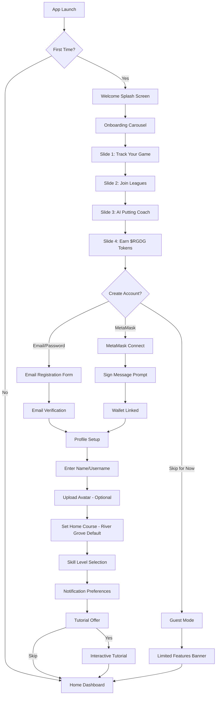
```mermaid
flowchart TD
    A[App Launch] --> B{First Time?}
    B -->|Yes| C[Welcome Splash Screen]
    B -->|No| D[Home Dashboard]
    
    C --> E[Onboarding Carousel]
    E --> E1[Slide 1: Track Your Game]
    E1 --> E2[Slide 2: Join Leagues]
    E2 --> E3[Slide 3: AI Putting Coach]
    E3 --> E4[Slide 4: Earn $RGDG Tokens]
    E4 --> F{Create Account?}
    
    F -->|Email/Password| G[Email Registration Form]
    F -->|MetaMask| H[MetaMask Connect]
    F -->|Skip for Now| I[Guest Mode]
    
    G --> J[Email Verification]
    J --> K[Profile Setup]
    
    H --> L[Sign Message Prompt]
    L --> M[Wallet Linked]
    M --> K
    
    K --> K1[Enter Name/Username]
    K1 --> K2[Upload Avatar - Optional]
    K2 --> K3[Set Home Course - River Grove Default]
    K3 --> K4[Skill Level Selection]
    K4 --> K5[Notification Preferences]
    K5 --> N[Tutorial Offer]
    
    N -->|Yes| O[Interactive Tutorial]
    N -->|Skip| D
    O --> D
    
    I --> P[Limited Features Banner]
    P --> D
```

### 1.2 Profile Completion States

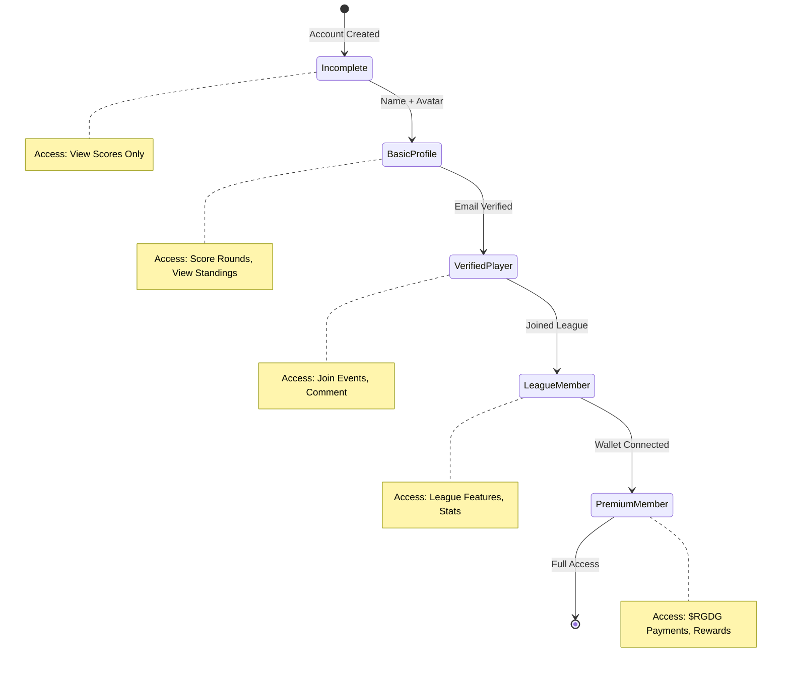
```mermaid
stateDiagram-v2
    [*] --> Incomplete: Account Created
    Incomplete --> BasicProfile: Name + Avatar
    BasicProfile --> VerifiedPlayer: Email Verified
    VerifiedPlayer --> LeagueMember: Joined League
    LeagueMember --> PremiumMember: Wallet Connected
    PremiumMember --> [*]: Full Access
    
    note right of Incomplete
        Access: View Scores Only
    end note
    
    note right of BasicProfile
        Access: Score Rounds, View Standings
    end note
    
    note right of VerifiedPlayer
        Access: Join Events, Comment
    end note
    
    note right of LeagueMember
        Access: League Features, Stats
    end note
    
    note right of PremiumMember
        Access: $RGDG Payments, Rewards
    end note
```

---

## 2. Authentication Flows

### 2.1 Login Options

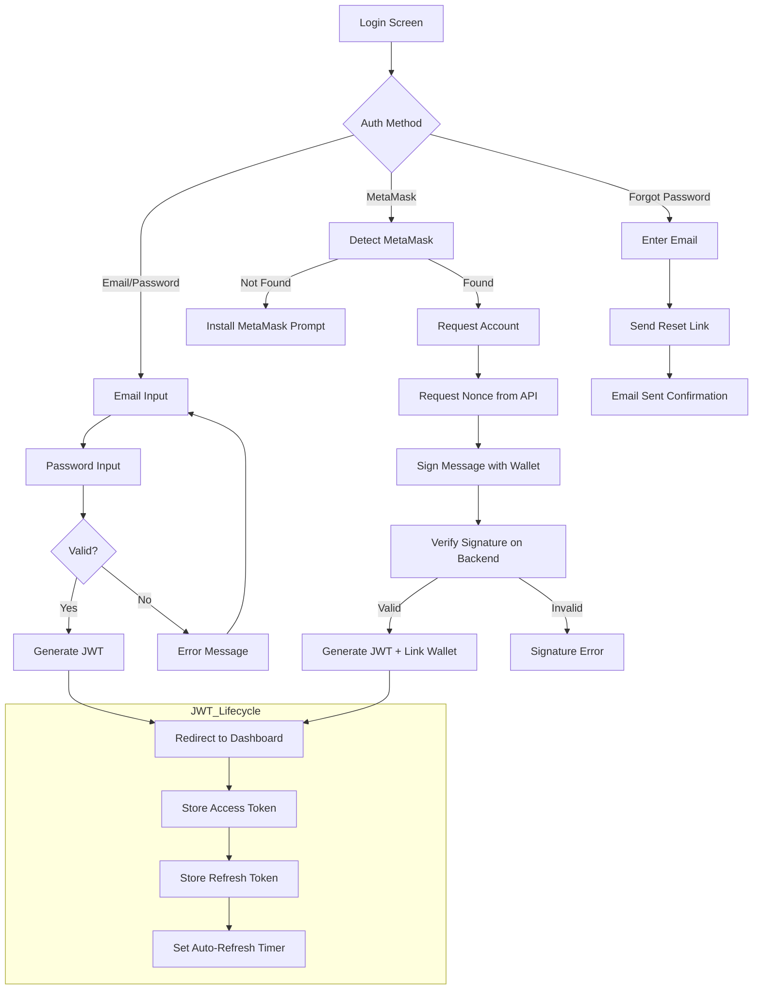
```mermaid
flowchart TD
    A[Login Screen] --> B{Auth Method}
    
    B -->|Email/Password| C[Email Input]
    C --> D[Password Input]
    D --> E{Valid?}
    E -->|Yes| F[Generate JWT]
    E -->|No| G[Error Message]
    G --> C
    
    B -->|MetaMask| H[Detect MetaMask]
    H -->|Found| I[Request Account]
    H -->|Not Found| J[Install MetaMask Prompt]
    I --> K[Request Nonce from API]
    K --> L[Sign Message with Wallet]
    L --> M[Verify Signature on Backend]
    M -->|Valid| N[Generate JWT + Link Wallet]
    M -->|Invalid| O[Signature Error]
    
    B -->|Forgot Password| P[Enter Email]
    P --> Q[Send Reset Link]
    Q --> R[Email Sent Confirmation]
    
    F --> S[Redirect to Dashboard]
    N --> S
    
    subgraph JWT_Lifecycle
        S --> T[Store Access Token]
        T --> U[Store Refresh Token]
        U --> V[Set Auto-Refresh Timer]
    end
```

### 2.2 Session Management

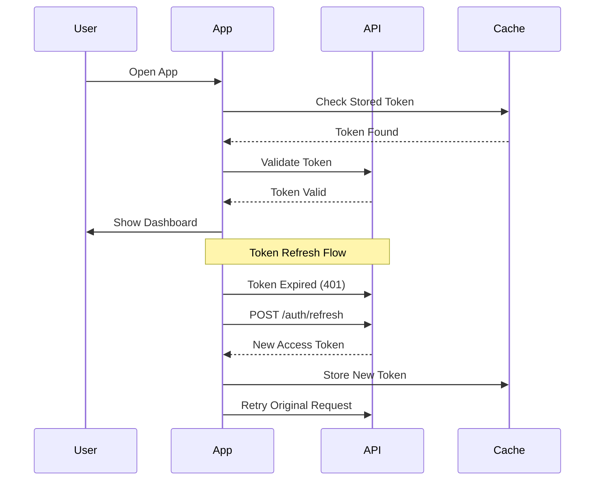
```mermaid
sequenceDiagram
    participant User
    participant App
    participant API
    participant Cache
    
    User->>App: Open App
    App->>Cache: Check Stored Token
    Cache-->>App: Token Found
    App->>API: Validate Token
    API-->>App: Token Valid
    App->>User: Show Dashboard
    
    Note over App,API: Token Refresh Flow
    App->>API: Token Expired (401)
    App->>API: POST /auth/refresh
    API-->>App: New Access Token
    App->>Cache: Store New Token
    App->>API: Retry Original Request
```

---

## 3. Round Scoring Journey

### 3.1 Start New Round

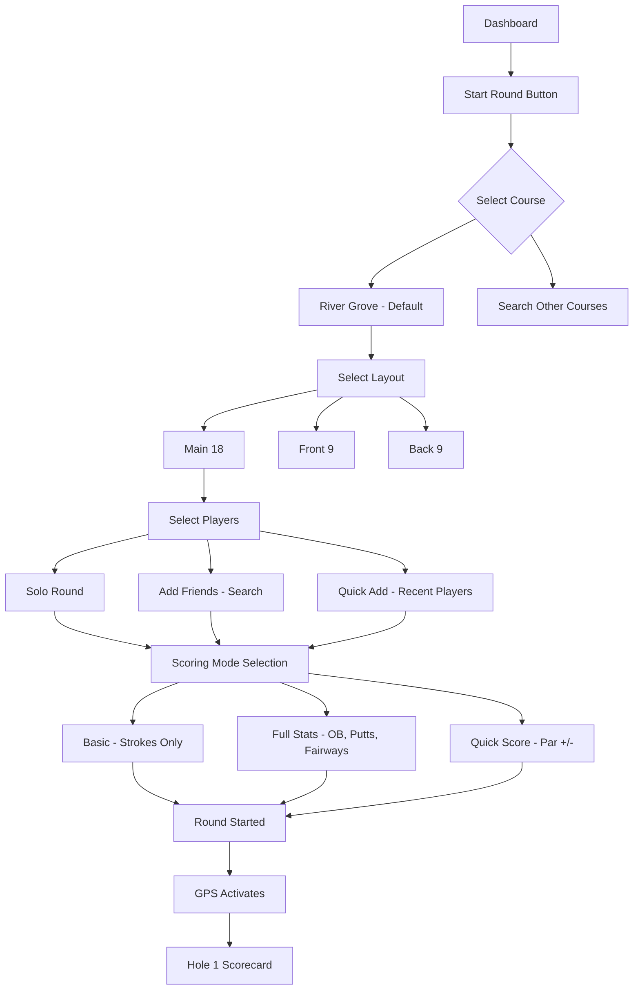
```mermaid
flowchart TD
    A[Dashboard] --> B[Start Round Button]
    B --> C{Select Course}
    C --> D[River Grove - Default]
    C --> E[Search Other Courses]
    
    D --> F[Select Layout]
    F --> F1[Main 18]
    F --> F2[Front 9]
    F --> F3[Back 9]
    
    F1 --> G[Select Players]
    G --> G1[Solo Round]
    G --> G2[Add Friends - Search]
    G --> G3[Quick Add - Recent Players]
    
    G1 --> H[Scoring Mode Selection]
    G2 --> H
    G3 --> H
    
    H --> H1[Basic - Strokes Only]
    H --> H2[Full Stats - OB, Putts, Fairways]
    H --> H3[Quick Score - Par +/-]
    
    H1 --> I[Round Started]
    H2 --> I
    H3 --> I
    
    I --> J[GPS Activates]
    J --> K[Hole 1 Scorecard]
```

### 3.2 Hole-by-Hole Scoring

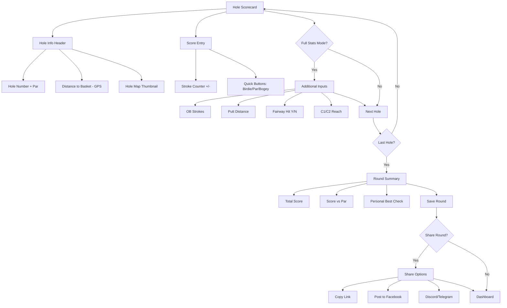
```mermaid
flowchart TD
    A[Hole Scorecard] --> B[Hole Info Header]
    B --> B1[Hole Number + Par]
    B --> B2[Distance to Basket - GPS]
    B --> B3[Hole Map Thumbnail]
    
    A --> C[Score Entry]
    C --> C1[Stroke Counter +/-]
    C --> C2[Quick Buttons: Birdie/Par/Bogey]
    
    A --> D{Full Stats Mode?}
    D -->|Yes| E[Additional Inputs]
    E --> E1[OB Strokes]
    E --> E2[Putt Distance]
    E --> E3[Fairway Hit Y/N]
    E --> E4[C1/C2 Reach]
    
    D -->|No| F[Next Hole]
    E --> F
    
    F --> G{Last Hole?}
    G -->|No| A
    G -->|Yes| H[Round Summary]
    
    H --> I[Total Score]
    H --> J[Score vs Par]
    H --> K[Personal Best Check]
    H --> L[Save Round]
    
    L --> M{Share Round?}
    M -->|Yes| N[Share Options]
    N --> N1[Copy Link]
    N --> N2[Post to Facebook]
    N --> N3[Discord/Telegram]
    M -->|No| O[Dashboard]
    N --> O
```

### 3.3 Real-Time GPS Distance

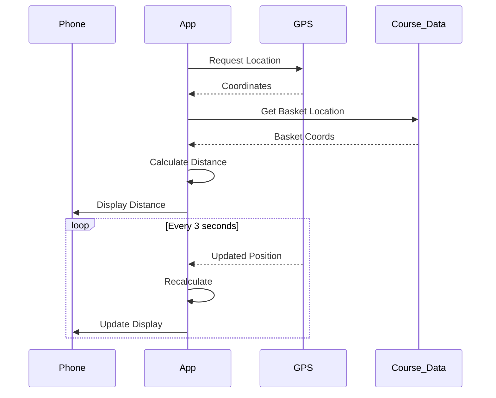
```mermaid
sequenceDiagram
    participant Phone
    participant App
    participant GPS
    participant Course_Data
    
    App->>GPS: Request Location
    GPS-->>App: Coordinates
    App->>Course_Data: Get Basket Location
    Course_Data-->>App: Basket Coords
    App->>App: Calculate Distance
    App->>Phone: Display Distance
    
    loop Every 3 seconds
        GPS-->>App: Updated Position
        App->>App: Recalculate
        App->>Phone: Update Display
    end
```

---

## 4. League Participation

### 4.1 Join League Flow

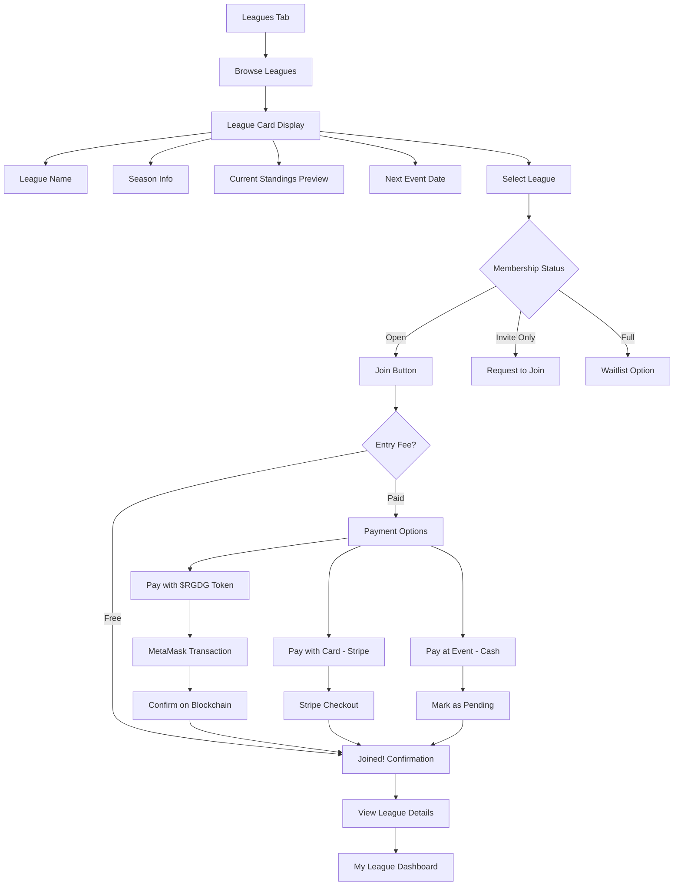
```mermaid
flowchart TD
    A[Leagues Tab] --> B[Browse Leagues]
    B --> C[League Card Display]
    C --> C1[League Name]
    C --> C2[Season Info]
    C --> C3[Current Standings Preview]
    C --> C4[Next Event Date]
    
    C --> D[Select League]
    D --> E{Membership Status}
    E -->|Open| F[Join Button]
    E -->|Invite Only| G[Request to Join]
    E -->|Full| H[Waitlist Option]
    
    F --> I{Entry Fee?}
    I -->|Free| J[Joined! Confirmation]
    I -->|Paid| K[Payment Options]
    
    K --> K1[Pay with $RGDG Token]
    K --> K2[Pay with Card - Stripe]
    K --> K3[Pay at Event - Cash]
    
    K1 --> L[MetaMask Transaction]
    L --> M[Confirm on Blockchain]
    M --> J
    
    K2 --> N[Stripe Checkout]
    N --> J
    
    K3 --> O[Mark as Pending]
    O --> J
    
    J --> P[View League Details]
    P --> Q[My League Dashboard]
```

### 4.2 Event Check-In Flow

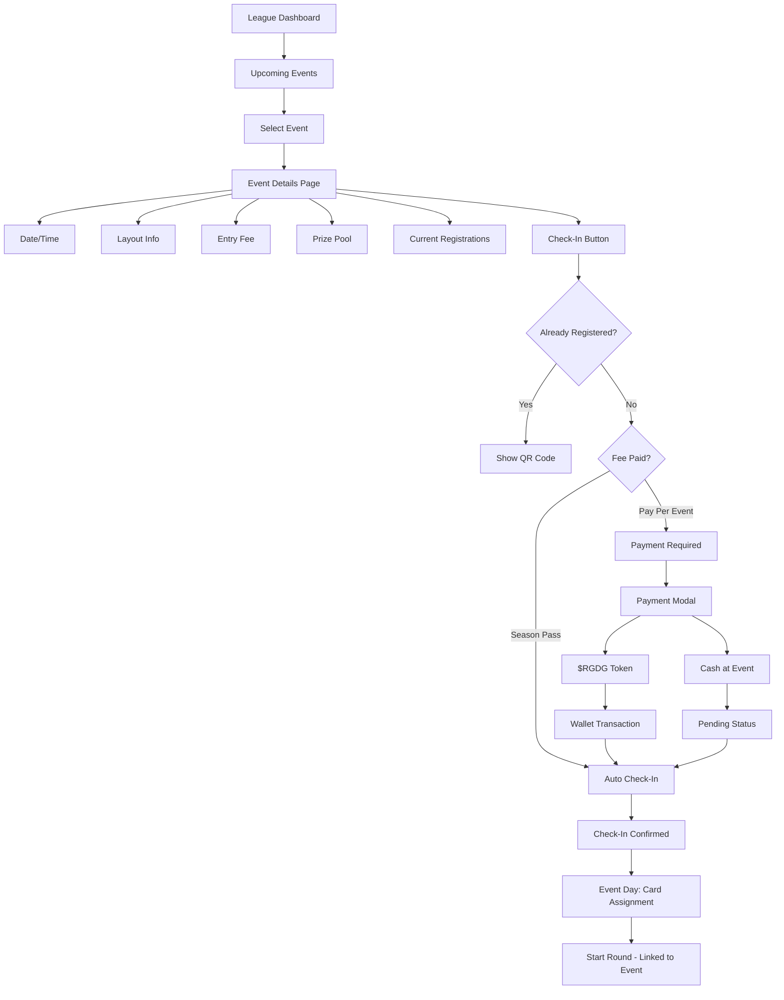
```mermaid
flowchart TD
    A[League Dashboard] --> B[Upcoming Events]
    B --> C[Select Event]
    C --> D[Event Details Page]
    
    D --> D1[Date/Time]
    D --> D2[Layout Info]
    D --> D3[Entry Fee]
    D --> D4[Prize Pool]
    D --> D5[Current Registrations]
    
    D --> E[Check-In Button]
    E --> F{Already Registered?}
    F -->|Yes| G[Show QR Code]
    F -->|No| H{Fee Paid?}
    
    H -->|Season Pass| I[Auto Check-In]
    H -->|Pay Per Event| J[Payment Required]
    
    J --> K[Payment Modal]
    K --> K1[$RGDG Token]
    K --> K2[Cash at Event]
    
    K1 --> L[Wallet Transaction]
    L --> I
    K2 --> M[Pending Status]
    M --> I
    
    I --> N[Check-In Confirmed]
    N --> O[Event Day: Card Assignment]
    O --> P[Start Round - Linked to Event]
```

### 4.3 View Standings & Stats

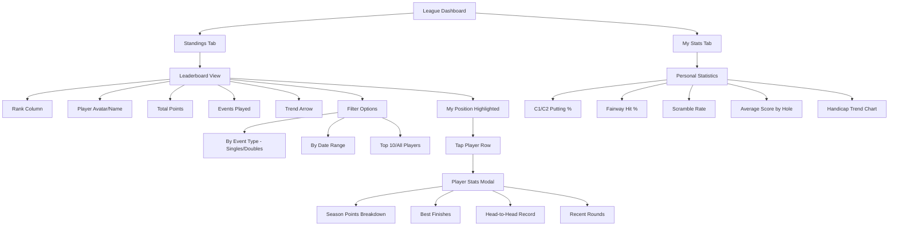
```mermaid
flowchart TD
    A[League Dashboard] --> B[Standings Tab]
    B --> C[Leaderboard View]
    
    C --> C1[Rank Column]
    C --> C2[Player Avatar/Name]
    C --> C3[Total Points]
    C --> C4[Events Played]
    C --> C5[Trend Arrow]
    
    C --> D[Filter Options]
    D --> D1[By Event Type - Singles/Doubles]
    D --> D2[By Date Range]
    D --> D3[Top 10/All Players]
    
    C --> E[My Position Highlighted]
    E --> F[Tap Player Row]
    F --> G[Player Stats Modal]
    
    G --> G1[Season Points Breakdown]
    G --> G2[Best Finishes]
    G --> G3[Head-to-Head Record]
    G --> G4[Recent Rounds]
    
    A --> H[My Stats Tab]
    H --> I[Personal Statistics]
    I --> I1[C1/C2 Putting %]
    I --> I2[Fairway Hit %]
    I --> I3[Scramble Rate]
    I --> I4[Average Score by Hole]
    I --> I5[Handicap Trend Chart]
```

---

## 5. AI Putting Coach

### 5.1 Putting Practice Session

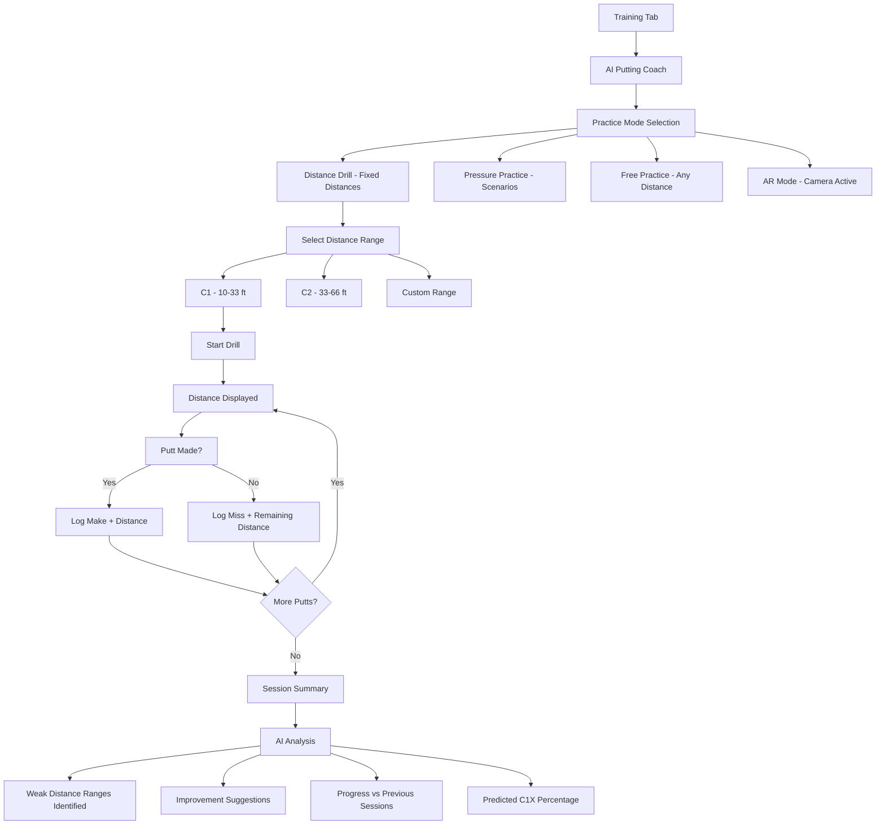
```mermaid
flowchart TD
    A[Training Tab] --> B[AI Putting Coach]
    B --> C[Practice Mode Selection]
    
    C --> C1[Distance Drill - Fixed Distances]
    C --> C2[Pressure Practice - Scenarios]
    C --> C3[Free Practice - Any Distance]
    C --> C4[AR Mode - Camera Active]
    
    C1 --> D[Select Distance Range]
    D --> D1[C1 - 10-33 ft]
    D --> D2[C2 - 33-66 ft]
    D --> D3[Custom Range]
    
    D1 --> E[Start Drill]
    E --> F[Distance Displayed]
    F --> G[Putt Made?]
    G -->|Yes| H[Log Make + Distance]
    G -->|No| I[Log Miss + Remaining Distance]
    
    H --> J{More Putts?}
    I --> J
    J -->|Yes| F
    J -->|No| K[Session Summary]
    
    K --> L[AI Analysis]
    L --> L1[Weak Distance Ranges Identified]
    L --> L2[Improvement Suggestions]
    L --> L3[Progress vs Previous Sessions]
    L --> L4[Predicted C1X Percentage]
```

### 5.2 Putting Probability Model

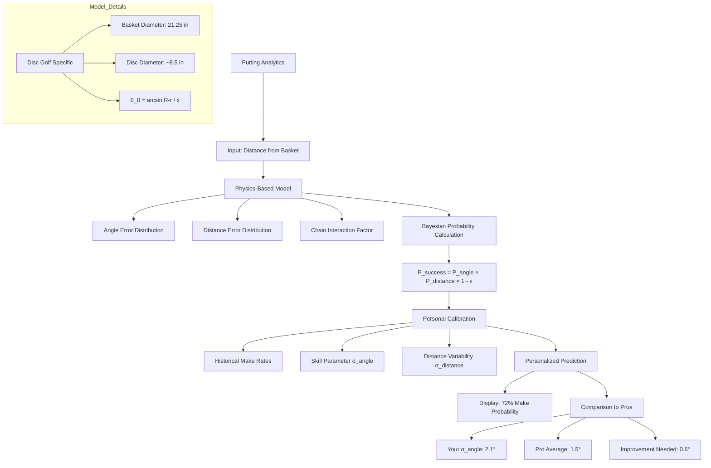
```mermaid
flowchart TD
    A[Putting Analytics] --> B[Input: Distance from Basket]
    
    B --> C[Physics-Based Model]
    C --> C1[Angle Error Distribution]
    C --> C2[Distance Error Distribution]
    C --> C3[Chain Interaction Factor]
    
    C --> D[Bayesian Probability Calculation]
    D --> D1[P_success = P_angle × P_distance × 1 - ε]
    
    D1 --> E[Personal Calibration]
    E --> E1[Historical Make Rates]
    E --> E2[Skill Parameter σ_angle]
    E --> E3[Distance Variability σ_distance]
    
    E --> F[Personalized Prediction]
    F --> G[Display: 72% Make Probability]
    
    F --> H[Comparison to Pros]
    H --> H1[Your σ_angle: 2.1°]
    H --> H2[Pro Average: 1.5°]
    H --> H3[Improvement Needed: 0.6°]
    
    subgraph Model_Details
        I[Disc Golf Specific]
        I --> I1[Basket Diameter: 21.25 in]
        I --> I2[Disc Diameter: ~8.5 in]
        I --> I3[θ_0 = arcsin R-r / x]
    end
```

---

## 6. Blockchain/Wallet Integration

### 6.1 Wallet Connection Flow

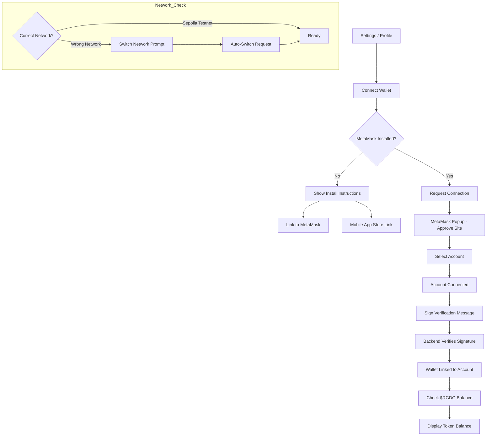
```mermaid
flowchart TD
    A[Settings / Profile] --> B[Connect Wallet]
    B --> C{MetaMask Installed?}
    
    C -->|No| D[Show Install Instructions]
    D --> D1[Link to MetaMask]
    D --> D2[Mobile App Store Link]
    
    C -->|Yes| E[Request Connection]
    E --> F[MetaMask Popup - Approve Site]
    F --> G[Select Account]
    G --> H[Account Connected]
    
    H --> I[Sign Verification Message]
    I --> J[Backend Verifies Signature]
    J --> K[Wallet Linked to Account]
    
    K --> L[Check $RGDG Balance]
    L --> M[Display Token Balance]
    
    subgraph Network_Check
        N{Correct Network?}
        N -->|Sepolia Testnet| O[Ready]
        N -->|Wrong Network| P[Switch Network Prompt]
        P --> Q[Auto-Switch Request]
        Q --> O
    end
```

### 6.2 Token Purchase Flow

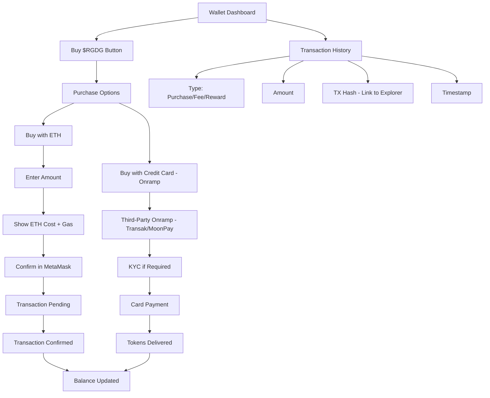
```mermaid
flowchart TD
    A[Wallet Dashboard] --> B[Buy $RGDG Button]
    B --> C[Purchase Options]
    
    C --> C1[Buy with ETH]
    C --> C2[Buy with Credit Card - Onramp]
    
    C1 --> D[Enter Amount]
    D --> E[Show ETH Cost + Gas]
    E --> F[Confirm in MetaMask]
    F --> G[Transaction Pending]
    G --> H[Transaction Confirmed]
    H --> I[Balance Updated]
    
    C2 --> J[Third-Party Onramp - Transak/MoonPay]
    J --> K[KYC if Required]
    K --> L[Card Payment]
    L --> M[Tokens Delivered]
    M --> I
    
    A --> N[Transaction History]
    N --> N1[Type: Purchase/Fee/Reward]
    N --> N2[Amount]
    N --> N3[TX Hash - Link to Explorer]
    N --> N4[Timestamp]
```

### 6.3 Pay League Fee with Token

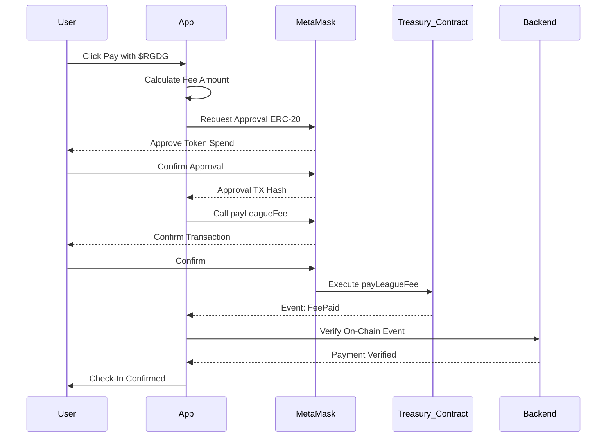
```mermaid
sequenceDiagram
    participant User
    participant App
    participant MetaMask
    participant Treasury_Contract
    participant Backend
    
    User->>App: Click Pay with $RGDG
    App->>App: Calculate Fee Amount
    App->>MetaMask: Request Approval ERC-20
    MetaMask-->>User: Approve Token Spend
    User->>MetaMask: Confirm Approval
    MetaMask-->>App: Approval TX Hash
    
    App->>MetaMask: Call payLeagueFee
    MetaMask-->>User: Confirm Transaction
    User->>MetaMask: Confirm
    MetaMask->>Treasury_Contract: Execute payLeagueFee
    Treasury_Contract-->>App: Event: FeePaid
    
    App->>Backend: Verify On-Chain Event
    Backend-->>App: Payment Verified
    App->>User: Check-In Confirmed
```

---

## 7. Social & Community Features

### 7.1 Player Profile View

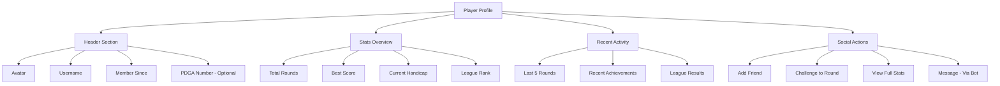
```mermaid
flowchart TD
    A[Player Profile] --> B[Header Section]
    B --> B1[Avatar]
    B --> B2[Username]
    B --> B3[Member Since]
    B --> B4[PDGA Number - Optional]
    
    A --> C[Stats Overview]
    C --> C1[Total Rounds]
    C --> C2[Best Score]
    C --> C3[Current Handicap]
    C --> C4[League Rank]
    
    A --> D[Recent Activity]
    D --> D1[Last 5 Rounds]
    D --> D2[Recent Achievements]
    D --> D3[League Results]
    
    A --> E[Social Actions]
    E --> E1[Add Friend]
    E --> E2[Challenge to Round]
    E --> E3[View Full Stats]
    E --> E4[Message - Via Bot]
```

### 7.2 Chat Bot Interaction

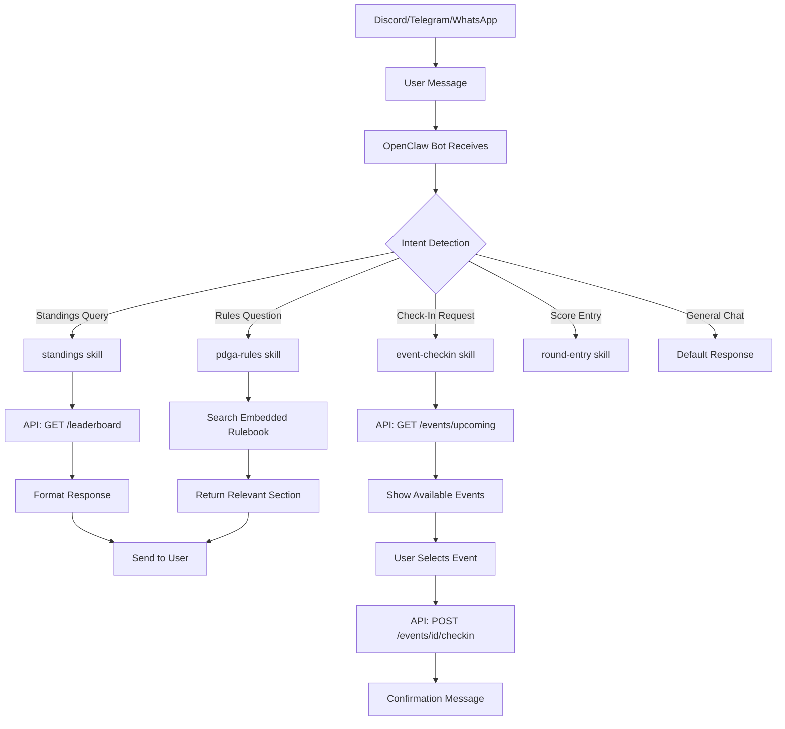
```mermaid
flowchart TD
    A[Discord/Telegram/WhatsApp] --> B[User Message]
    B --> C[OpenClaw Bot Receives]
    
    C --> D{Intent Detection}
    D -->|Standings Query| E[standings skill]
    D -->|Check-In Request| F[event-checkin skill]
    D -->|Rules Question| G[pdga-rules skill]
    D -->|Score Entry| H[round-entry skill]
    D -->|General Chat| I[Default Response]
    
    E --> J[API: GET /leaderboard]
    J --> K[Format Response]
    K --> L[Send to User]
    
    F --> M[API: GET /events/upcoming]
    M --> N[Show Available Events]
    N --> O[User Selects Event]
    O --> P[API: POST /events/id/checkin]
    P --> Q[Confirmation Message]
    
    G --> R[Search Embedded Rulebook]
    R --> S[Return Relevant Section]
    S --> L
```

---

## 8. AR Training Features

### 8.1 AR Putting Assistant

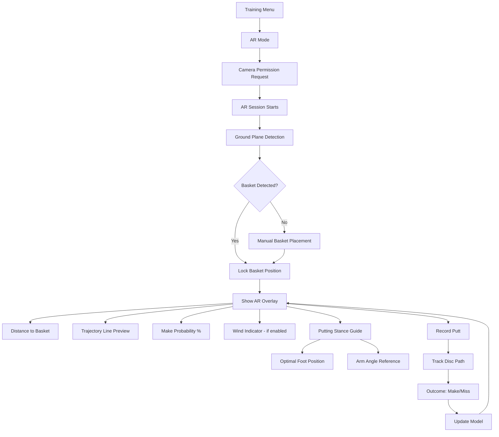
```mermaid
flowchart TD
    A[Training Menu] --> B[AR Mode]
    B --> C[Camera Permission Request]
    C --> D[AR Session Starts]
    
    D --> E[Ground Plane Detection]
    E --> F{Basket Detected?}
    F -->|Yes| G[Lock Basket Position]
    F -->|No| H[Manual Basket Placement]
    H --> G
    
    G --> I[Show AR Overlay]
    I --> I1[Distance to Basket]
    I --> I2[Trajectory Line Preview]
    I --> I3[Make Probability %]
    I --> I4[Wind Indicator - if enabled]
    
    I --> J[Putting Stance Guide]
    J --> J1[Optimal Foot Position]
    J --> J2[Arm Angle Reference]
    
    I --> K[Record Putt]
    K --> L[Track Disc Path]
    L --> M[Outcome: Make/Miss]
    M --> N[Update Model]
    N --> I
```

### 8.2 AR Distance Measurement

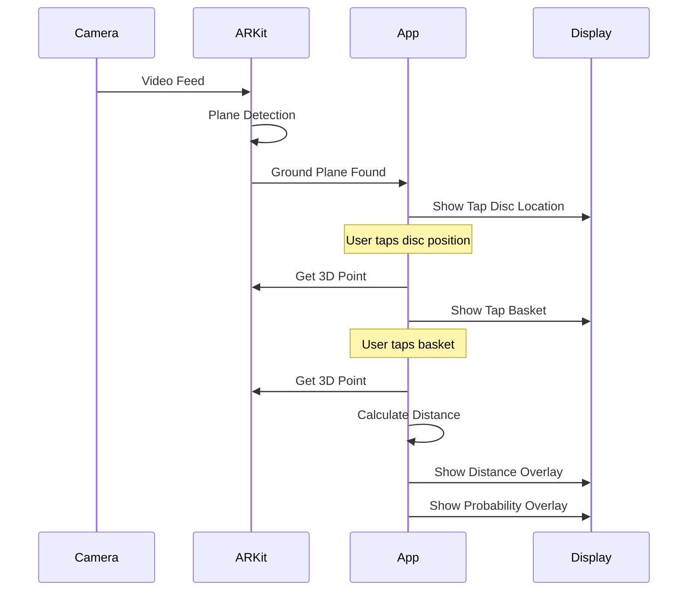
```mermaid
sequenceDiagram
    participant Camera
    participant ARKit
    participant App
    participant Display
    
    Camera->>ARKit: Video Feed
    ARKit->>ARKit: Plane Detection
    ARKit->>App: Ground Plane Found
    
    App->>Display: Show Tap Disc Location
    Note over App: User taps disc position
    App->>ARKit: Get 3D Point
    
    App->>Display: Show Tap Basket
    Note over App: User taps basket
    App->>ARKit: Get 3D Point
    
    App->>App: Calculate Distance
    App->>Display: Show Distance Overlay
    App->>Display: Show Probability Overlay
```

---

## 9. Disc Golf Game (P1)

### 9.1 Game Main Menu

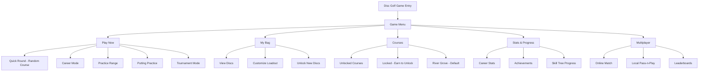
```mermaid
flowchart TD
    A[Disc Golf Game Entry] --> B[Game Menu]
    
    B --> C[Play Now]
    C --> C1[Quick Round - Random Course]
    C --> C2[Career Mode]
    C --> C3[Practice Range]
    C --> C4[Putting Practice]
    C --> C5[Tournament Mode]
    
    B --> D[My Bag]
    D --> D1[View Discs]
    D --> D2[Customize Loadout]
    D --> D3[Unlock New Discs]
    
    B --> E[Courses]
    E --> E1[Unlocked Courses]
    E --> E2[Locked - Earn to Unlock]
    E --> E3[River Grove - Default]
    
    B --> F[Stats & Progress]
    F --> F1[Career Stats]
    F --> F2[Achievements]
    F --> F3[Skill Tree Progress]
    
    B --> G[Multiplayer]
    G --> G1[Online Match]
    G --> G2[Local Pass-n-Play]
    G --> G3[Leaderboards]
```

### 9.2 Gameplay Flow - Single Hole

```mermaid
flowchart TD
    A[Hole Start] --> B[Hole Overview]
    B --> B1[3D Course Preview]
    B --> B2[Par/Distance Info]
    B --> B3[Wind Conditions]
    
    B --> C[Disc Selection]
    C --> C1[Driver/Mid/Putter]
    C --> C2[Flight Numbers Display]
    C --> C3[Recommended Disc AI]
    
    C --> D[Aiming Phase]
    D --> D1[Drag to Aim Direction]
    D --> D2[Trajectory Preview Line]
    D --> D3[Power Meter Ready]
    
    D --> E[Throw Execution]
    E --> E1[Swipe to Throw]
    E --> E2[Release Point Matters]
    E --> E3[Angle Control]
    
    E --> F[Disc Flight]
    F --> F1[Physics Simulation]
    F --> F2[Wind Effect Applied]
    F --> F3[Fade/Turn Applied]
    
    F --> G[Disc Landing]
    G --> H{In Basket?}
    H -->|Yes| I[Hole Complete - Score]
    H -->|No| J[Mark Lie Position]
    J --> K{In Bounds?}
    K -->|Yes| D
    K -->|No| L[OB Penalty + Rethrow]
    L --> D
    
    I --> M{Last Hole?}
    M -->|No| A
    M -->|Yes| N[Round Complete]
    N --> O[Scorecard Summary]
    O --> P[XP Earned]
    P --> Q[Unlock Progress Check]
```

### 9.3 Skill Progression System

```mermaid
flowchart TD
    A[Player Progression] --> B[Experience Points]
    B --> B1[Rounds Completed]
    B --> B2[Under Par Bonus]
    B --> B3[Achievements]
    B --> B4[Daily Challenges]
    
    B --> C[Level Up]
    C --> D[Skill Points Earned]
    D --> E[Skill Tree]
    
    E --> E1[Power Branch]
    E1 --> E1a[+5% Distance]
    E1 --> E1b[Faster Meter Fill]
    E1 --> E1c[Max Power Unlock]
    
    E --> E2[Accuracy Branch]
    E2 --> E2a[Tighter Release Window]
    E2 --> E2b[Trajectory Preview Extended]
    E2 --> E2c[Wind Resistance]
    
    E --> E3[Putting Branch]
    E3 --> E3a[Larger Sweet Spot]
    E3 --> E3b[Better C2 Makes]
    E3 --> E3c[Chain Magnet Perk]
    
    E --> E4[Mental Branch]
    E4 --> E4a[Mulligan Unlocks]
    E4 --> E4b[Pressure Resistance]
    E4 --> E4c[Focus Mode Duration]
```

---

## 10. Admin Workflows

### 10.1 Event Management

```mermaid
flowchart TD
    A[Admin Dashboard] --> B[Events Management]
    B --> C[Create New Event]
    
    C --> D[Event Details Form]
    D --> D1[Event Name]
    D --> D2[Date/Time]
    D --> D3[Select League]
    D --> D4[Select Layout]
    D --> D5[Entry Fee]
    D --> D6[Max Players]
    
    D --> E[Save Event]
    E --> F[Event Created]
    F --> G[Publish Event]
    G --> H[Visible to Players]
    
    B --> I[Manage Active Event]
    I --> J[View Registrations]
    J --> J1[Player List]
    J --> J2[Payment Status]
    J --> J3[Export List]
    
    I --> K[Day-of Actions]
    K --> K1[Generate Card Groups]
    K --> K2[Send Start Notifications]
    K --> K3[Open Live Scoring]
    
    I --> L[Finalize Event]
    L --> M[Import/Verify Scores]
    M --> N[Calculate Points]
    N --> O[Post Results]
    O --> P[Distribute Prizes]
    P --> Q[Update Standings]
```

### 10.2 Points & Prize Distribution

```mermaid
flowchart TD
    A[Event Finalized] --> B[Auto-Calculate Points]
    B --> C[Points Formula]
    C --> C1[points = participants - position + 1]
    C --> C2[Ties: Same Points, Skip Next]
    C --> C3[DNF/DQ = 0 Points]
    
    C --> D[Display Results Preview]
    D --> E{Admin Approves?}
    E -->|Yes| F[Commit to Database]
    E -->|Edit| G[Manual Adjustments]
    G --> D
    
    F --> H[Update Season Standings]
    H --> I[Check Season End]
    I -->|Season Active| J[Post to Channels]
    I -->|Season Complete| K[Prize Distribution Flow]
    
    K --> L[Calculate Top 5 Prizes]
    L --> M{Payment Method}
    M -->|$RGDG Token| N[Smart Contract Transfer]
    M -->|Cash| O[Mark for Manual Payout]
    M -->|Venmo/PayPal| P[Record Payment]
    
    N --> Q[Verify On-Chain]
    Q --> R[Close Season]
    O --> R
    P --> R
    
    J --> S[Discord/Telegram Notification]
    S --> T[Update App Leaderboard]
```

---

## Complete Navigation Map

```mermaid
graph TD
    subgraph Main_Navigation
        HOME[Home Dashboard]
        ROUNDS[Rounds Tab]
        LEAGUES[Leagues Tab]
        TRAINING[Training Tab]
        PROFILE[Profile Tab]
    end
    
    subgraph Home_Screens
        HOME --> H1[Quick Start Round]
        HOME --> H2[Upcoming Events]
        HOME --> H3[Recent Activity]
        HOME --> H4[League Position]
    end
    
    subgraph Rounds_Screens
        ROUNDS --> R1[New Round]
        ROUNDS --> R2[Round History]
        ROUNDS --> R3[Statistics]
        R1 --> R1a[Course Select]
        R1a --> R1b[Scoring]
        R2 --> R2a[Round Detail]
    end
    
    subgraph Leagues_Screens
        LEAGUES --> L1[My Leagues]
        LEAGUES --> L2[Browse Leagues]
        LEAGUES --> L3[Event Calendar]
        L1 --> L1a[League Detail]
        L1a --> L1b[Standings]
        L1a --> L1c[Events]
    end
    
    subgraph Training_Screens
        TRAINING --> T1[AI Putting Coach]
        TRAINING --> T2[AR Mode]
        TRAINING --> T3[Disc Golf Game]
        T1 --> T1a[Practice Session]
        T1 --> T1b[Analytics]
        T3 --> T3a[Quick Play]
        T3 --> T3b[Career Mode]
    end
    
    subgraph Profile_Screens
        PROFILE --> P1[My Stats]
        PROFILE --> P2[Wallet]
        PROFILE --> P3[Settings]
        PROFILE --> P4[Achievements]
        P2 --> P2a[Token Balance]
        P2 --> P2b[Transactions]
    end
```

---

## Summary

This document covers all major user flows in the RGDGC application:

1. **Onboarding**: 5 screens from first launch to dashboard
2. **Authentication**: Email, MetaMask, session management
3. **Round Scoring**: 8+ screens from start to share
4. **League System**: Join, check-in, standings, stats
5. **AI Putting Coach**: Practice modes, probability model
6. **Blockchain**: Wallet connection, token purchase, payments
7. **Social**: Profiles, bot interactions
8. **AR Features**: Distance measurement, trajectory preview
9. **Game (P1)**: Full casual disc golf game with progression
10. **Admin**: Event management, prize distribution

Each flow is designed for mobile-first experience with PWA capabilities.
