# RGDGC User Flow Diagrams

Comprehensive Mermaid flow diagrams for every user path in the RGDGC platform.
Generated from actual codebase analysis on 2026-03-23.

---

## 1. Player Journey (Mobile App)

### 1.1 Root Navigation & Auth Gate

The app entry point (`mobile/app/index.tsx`) checks auth state and redirects accordingly.

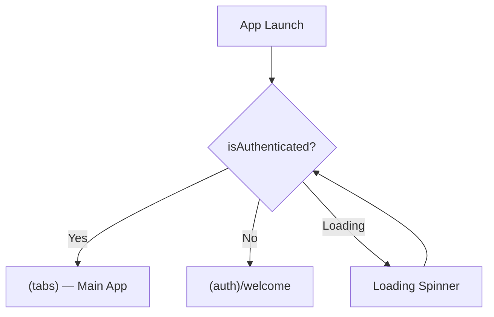
```mermaid
flowchart TD
    LAUNCH["App Launch"] --> AUTH_CHECK{"isAuthenticated?"}
    AUTH_CHECK -->|Yes| TABS["(tabs) — Main App"]
    AUTH_CHECK -->|No| WELCOME["(auth)/welcome"]
    AUTH_CHECK -->|Loading| SPINNER["Loading Spinner"]
    SPINNER --> AUTH_CHECK
```

### 1.2 Authentication Flow

All three auth screens (welcome, login, register) use Google OAuth exclusively.
On success, they redirect to `/(tabs)`. The onboarding screen is a 4-page walkthrough
that ends by redirecting to `/(auth)/welcome`.

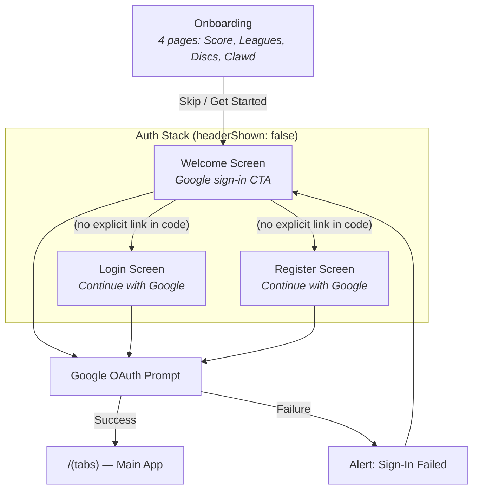
```mermaid
flowchart TD
    WELCOME["Welcome Screen<br/><i>Google sign-in CTA</i>"] --> GOOGLE_AUTH["Google OAuth Prompt"]
    WELCOME -->|"(no explicit link in code)"| LOGIN["Login Screen<br/><i>Continue with Google</i>"]
    WELCOME -->|"(no explicit link in code)"| REGISTER["Register Screen<br/><i>Continue with Google</i>"]

    LOGIN --> GOOGLE_AUTH
    REGISTER --> GOOGLE_AUTH

    GOOGLE_AUTH -->|Success| TABS["/(tabs) — Main App"]
    GOOGLE_AUTH -->|Failure| ERROR_ALERT["Alert: Sign-In Failed"]
    ERROR_ALERT --> WELCOME

    ONBOARDING["Onboarding<br/><i>4 pages: Score, Leagues, Discs, Clawd</i>"] -->|"Skip / Get Started"| WELCOME

    subgraph "Auth Stack (headerShown: false)"
        WELCOME
        LOGIN
        REGISTER
    end
```

### 1.3 Main Tab Navigation

Five tabs in the bottom bar, each with a notification bell in the header.

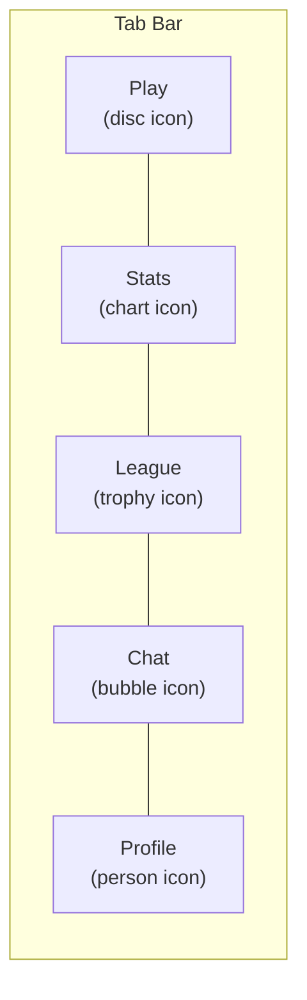
```mermaid
flowchart LR
    subgraph "Tab Bar"
        PLAY["Play<br/>(disc icon)"]
        STATS["Stats<br/>(chart icon)"]
        LEAGUE["League<br/>(trophy icon)"]
        CHAT["Chat<br/>(bubble icon)"]
        PROFILE["Profile<br/>(person icon)"]
    end

    PLAY --- STATS --- LEAGUE --- CHAT --- PROFILE
```

### 1.4 Play Tab — Full Flow

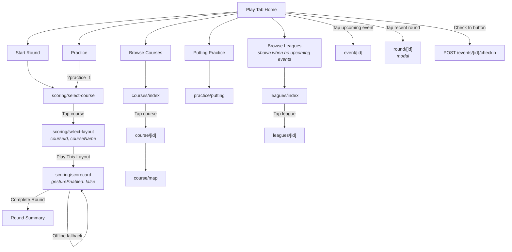
```mermaid
flowchart TD
    PLAY_HOME["Play Tab Home"] --> START_ROUND["Start Round"]
    PLAY_HOME --> PRACTICE_BTN["Practice"]
    PLAY_HOME --> BROWSE_COURSES["Browse Courses"]
    PLAY_HOME --> PUTTING_PRACTICE["Putting Practice"]
    PLAY_HOME --> BROWSE_LEAGUES["Browse Leagues<br/><i>shown when no upcoming events</i>"]
    PLAY_HOME -->|"Tap upcoming event"| EVENT_DETAIL["event/[id]"]
    PLAY_HOME -->|"Tap recent round"| ROUND_DETAIL["round/[id]<br/><i>modal</i>"]
    PLAY_HOME -->|"Check In button"| CHECKIN_API["POST /events/{id}/checkin"]

    START_ROUND --> SELECT_COURSE["scoring/select-course"]
    PRACTICE_BTN -->|"?practice=1"| SELECT_COURSE

    SELECT_COURSE -->|"Tap course"| SELECT_LAYOUT["scoring/select-layout<br/><i>courseId, courseName</i>"]
    SELECT_LAYOUT -->|"Play This Layout"| SCORECARD["scoring/scorecard<br/><i>gestureEnabled: false</i>"]

    SCORECARD -->|"Complete Round"| ROUND_COMPLETE["Round Summary"]
    SCORECARD -->|"Offline fallback"| SCORECARD

    BROWSE_COURSES --> COURSE_LIST["courses/index"]
    COURSE_LIST -->|"Tap course"| COURSE_DETAIL["course/[id]"]
    COURSE_DETAIL --> COURSE_MAP["course/map"]

    PUTTING_PRACTICE --> PUTTING_SCREEN["practice/putting"]

    BROWSE_LEAGUES --> LEAGUES_LIST["leagues/index"]
    LEAGUES_LIST -->|"Tap league"| LEAGUE_DETAIL["leagues/[id]"]
```

### 1.5 Scoring Flow (Detailed)

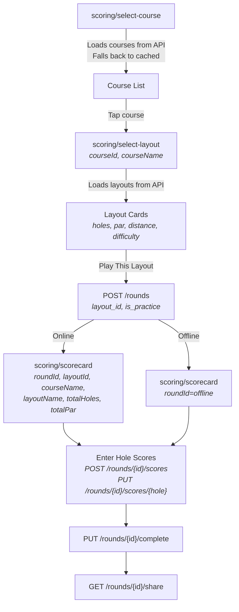
```mermaid
flowchart TD
    SC["scoring/select-course"] -->|"Loads courses from API<br/>Falls back to cached"| COURSE_LIST["Course List"]
    COURSE_LIST -->|"Tap course"| SL["scoring/select-layout<br/><i>courseId, courseName</i>"]
    SL -->|"Loads layouts from API"| LAYOUT_LIST["Layout Cards<br/><i>holes, par, distance, difficulty</i>"]
    LAYOUT_LIST -->|"Play This Layout"| START_API["POST /rounds<br/><i>layout_id, is_practice</i>"]
    START_API -->|"Online"| SCORECARD["scoring/scorecard<br/><i>roundId, layoutId, courseName,<br/>layoutName, totalHoles, totalPar</i>"]
    START_API -->|"Offline"| SCORECARD_OFFLINE["scoring/scorecard<br/><i>roundId=offline</i>"]
    SCORECARD --> ENTER_SCORES["Enter Hole Scores<br/><i>POST /rounds/{id}/scores<br/>PUT /rounds/{id}/scores/{hole}</i>"]
    ENTER_SCORES --> COMPLETE["PUT /rounds/{id}/complete"]
    COMPLETE --> SHARE["GET /rounds/{id}/share"]
    SCORECARD_OFFLINE --> ENTER_SCORES
```

### 1.6 League Tab — Full Flow

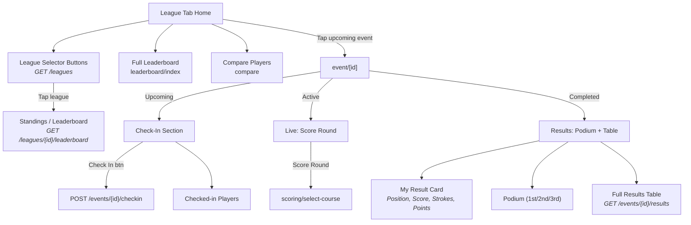
```mermaid
flowchart TD
    LEAGUE_TAB["League Tab Home"] --> LEAGUE_SELECTOR["League Selector Buttons<br/><i>GET /leagues</i>"]
    LEAGUE_SELECTOR -->|"Tap league"| LEADERBOARD["Standings / Leaderboard<br/><i>GET /leagues/{id}/leaderboard</i>"]
    LEAGUE_TAB --> FULL_LB["Full Leaderboard<br/>leaderboard/index"]
    LEAGUE_TAB --> COMPARE["Compare Players<br/>compare"]
    LEAGUE_TAB -->|"Tap upcoming event"| EVENT_DETAIL["event/[id]"]

    EVENT_DETAIL -->|"Upcoming"| CHECKIN_SECTION["Check-In Section"]
    EVENT_DETAIL -->|"Active"| LIVE_SECTION["Live: Score Round"]
    EVENT_DETAIL -->|"Completed"| RESULTS_SECTION["Results: Podium + Table"]

    CHECKIN_SECTION -->|"Check In btn"| CHECKIN_API["POST /events/{id}/checkin"]
    CHECKIN_SECTION --> PLAYER_LIST["Checked-in Players"]

    LIVE_SECTION -->|"Score Round"| START_SCORING["scoring/select-course"]

    RESULTS_SECTION --> MY_RESULT["My Result Card<br/><i>Position, Score, Strokes, Points</i>"]
    RESULTS_SECTION --> PODIUM["Podium (1st/2nd/3rd)"]
    RESULTS_SECTION --> FULL_TABLE["Full Results Table<br/><i>GET /events/{id}/results</i>"]
```

### 1.7 Stats Tab — Full Flow

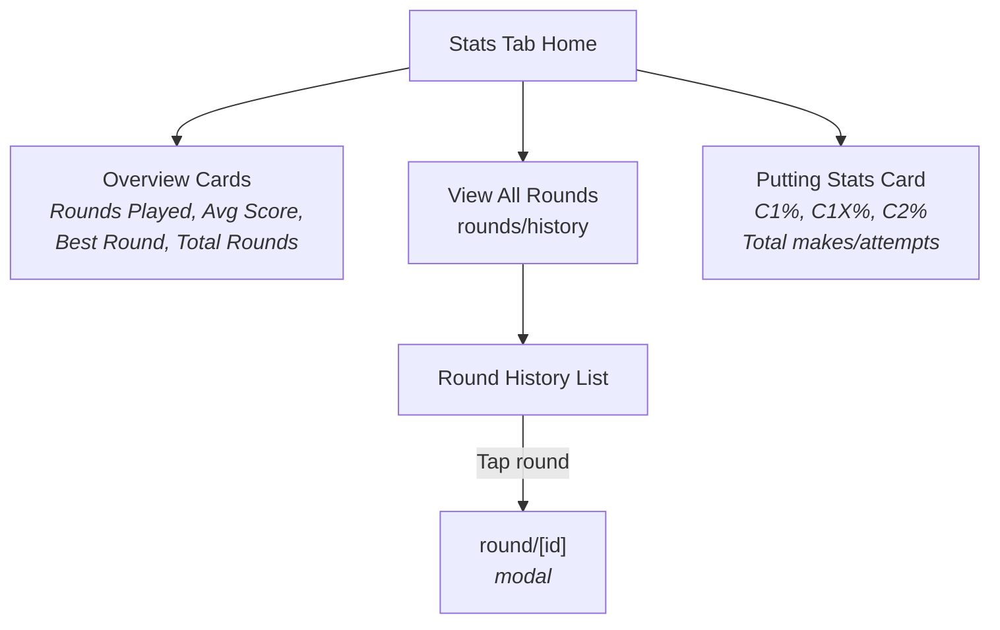
```mermaid
flowchart TD
    STATS_TAB["Stats Tab Home"] --> OVERVIEW["Overview Cards<br/><i>Rounds Played, Avg Score,<br/>Best Round, Total Rounds</i>"]
    STATS_TAB --> VIEW_ALL["View All Rounds<br/>rounds/history"]
    STATS_TAB --> PUTTING_STATS["Putting Stats Card<br/><i>C1%, C1X%, C2%<br/>Total makes/attempts</i>"]

    VIEW_ALL --> ROUND_HISTORY["Round History List"]
    ROUND_HISTORY -->|"Tap round"| ROUND_DETAIL["round/[id]<br/><i>modal</i>"]
```

### 1.8 Chat Tab — Ace Bot

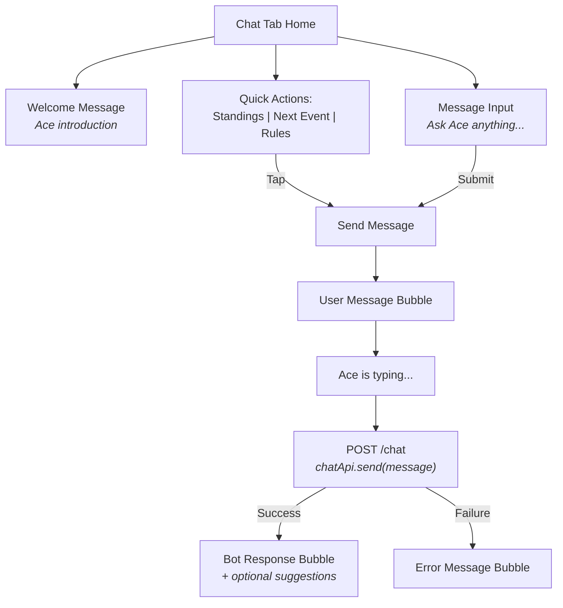
```mermaid
flowchart TD
    CHAT_TAB["Chat Tab Home"] --> WELCOME_MSG["Welcome Message<br/><i>Ace introduction</i>"]
    CHAT_TAB --> QUICK_ACTIONS["Quick Actions:<br/>Standings | Next Event | Rules"]
    CHAT_TAB --> TEXT_INPUT["Message Input<br/><i>Ask Ace anything...</i>"]

    QUICK_ACTIONS -->|"Tap"| SEND_MSG["Send Message"]
    TEXT_INPUT -->|"Submit"| SEND_MSG

    SEND_MSG --> USER_BUBBLE["User Message Bubble"]
    USER_BUBBLE --> TYPING["Ace is typing..."]
    TYPING --> BOT_API["POST /chat<br/><i>chatApi.send(message)</i>"]
    BOT_API -->|"Success"| BOT_BUBBLE["Bot Response Bubble<br/><i>+ optional suggestions</i>"]
    BOT_API -->|"Failure"| ERROR_BUBBLE["Error Message Bubble"]
```

### 1.9 Profile Tab — Full Flow

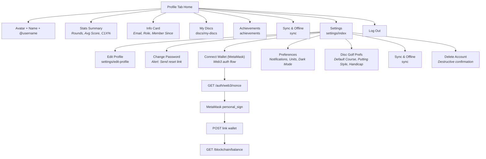
```mermaid
flowchart TD
    PROFILE_TAB["Profile Tab Home"] --> AVATAR["Avatar + Name + @username"]
    PROFILE_TAB --> STATS_SUMMARY["Stats Summary<br/><i>Rounds, Avg Score, C1X%</i>"]
    PROFILE_TAB --> INFO_CARD["Info Card<br/><i>Email, Role, Member Since</i>"]
    PROFILE_TAB --> MY_DISCS["My Discs<br/>discs/my-discs"]
    PROFILE_TAB --> ACHIEVEMENTS["Achievements<br/>achievements"]
    PROFILE_TAB --> SYNC_OFFLINE["Sync & Offline<br/>sync"]
    PROFILE_TAB --> SETTINGS["Settings<br/>settings/index"]
    PROFILE_TAB --> LOGOUT["Log Out"]

    SETTINGS --> EDIT_PROFILE["Edit Profile<br/>settings/edit-profile"]
    SETTINGS --> CHANGE_PASSWORD["Change Password<br/><i>Alert: Send reset link</i>"]
    SETTINGS --> CONNECT_WALLET["Connect Wallet (MetaMask)<br/><i>Web3 auth flow</i>"]
    SETTINGS --> PREFS["Preferences<br/><i>Notifications, Units, Dark Mode</i>"]
    SETTINGS --> DG_PREFS["Disc Golf Prefs<br/><i>Default Course, Putting Style, Handicap</i>"]
    SETTINGS --> SYNC_DATA["Sync & Offline<br/>sync"]
    SETTINGS --> DELETE_ACCOUNT["Delete Account<br/><i>Destructive confirmation</i>"]

    CONNECT_WALLET --> NONCE["GET /auth/web3/nonce"]
    NONCE --> SIGN["MetaMask personal_sign"]
    SIGN --> LINK["POST link wallet"]
    LINK --> BALANCE["GET /blockchain/balance"]
```

### 1.10 Disc Management Flow

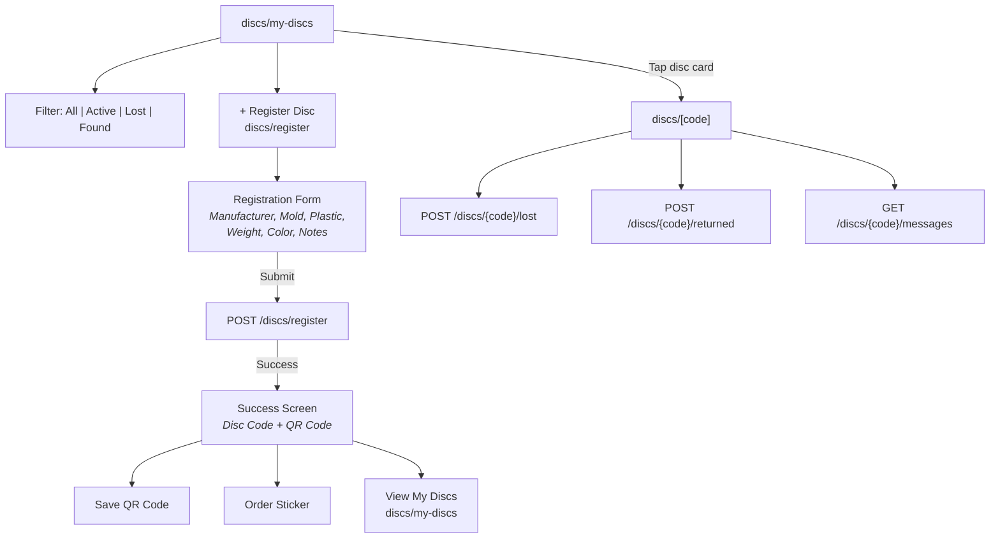
```mermaid
flowchart TD
    MY_DISCS["discs/my-discs"] --> FILTER_TABS["Filter: All | Active | Lost | Found"]
    MY_DISCS --> REGISTER_BTN["+ Register Disc<br/>discs/register"]
    MY_DISCS -->|"Tap disc card"| DISC_DETAIL["discs/[code]"]

    REGISTER_BTN --> REG_FORM["Registration Form<br/><i>Manufacturer, Mold, Plastic,<br/>Weight, Color, Notes</i>"]
    REG_FORM -->|"Submit"| REG_API["POST /discs/register"]
    REG_API -->|"Success"| REG_SUCCESS["Success Screen<br/><i>Disc Code + QR Code</i>"]
    REG_SUCCESS --> SAVE_QR["Save QR Code"]
    REG_SUCCESS --> ORDER_STICKER["Order Sticker"]
    REG_SUCCESS --> VIEW_DISCS["View My Discs<br/>discs/my-discs"]

    DISC_DETAIL --> REPORT_LOST["POST /discs/{code}/lost"]
    DISC_DETAIL --> REPORT_RETURNED["POST /discs/{code}/returned"]
    DISC_DETAIL --> DISC_MESSAGES["GET /discs/{code}/messages"]
```

### 1.11 Sticker Claim Flow

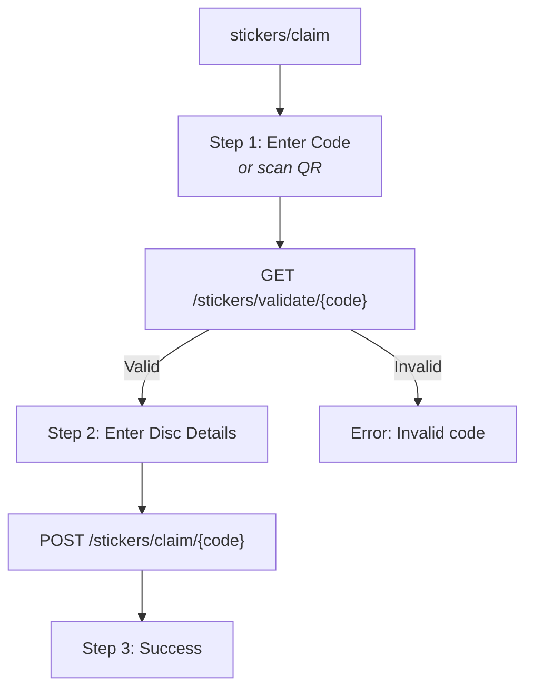
```mermaid
flowchart TD
    CLAIM["stickers/claim"] --> ENTER_CODE["Step 1: Enter Code<br/><i>or scan QR</i>"]
    ENTER_CODE --> VALIDATE["GET /stickers/validate/{code}"]
    VALIDATE -->|"Valid"| DISC_DETAILS["Step 2: Enter Disc Details"]
    VALIDATE -->|"Invalid"| ERROR["Error: Invalid code"]
    DISC_DETAILS --> CLAIM_API["POST /stickers/claim/{code}"]
    CLAIM_API --> SUCCESS["Step 3: Success"]
```

### 1.12 AR Features

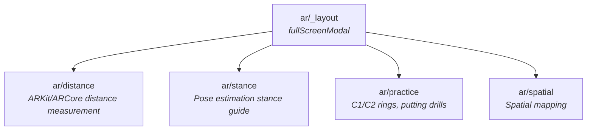
```mermaid
flowchart TD
    AR_LAYOUT["ar/_layout<br/><i>fullScreenModal</i>"] --> DISTANCE["ar/distance<br/><i>ARKit/ARCore distance measurement</i>"]
    AR_LAYOUT --> STANCE["ar/stance<br/><i>Pose estimation stance guide</i>"]
    AR_LAYOUT --> PRACTICE_AR["ar/practice<br/><i>C1/C2 rings, putting drills</i>"]
    AR_LAYOUT --> SPATIAL["ar/spatial<br/><i>Spatial mapping</i>"]
```

### 1.13 KSA Knowledge Base (Mobile)

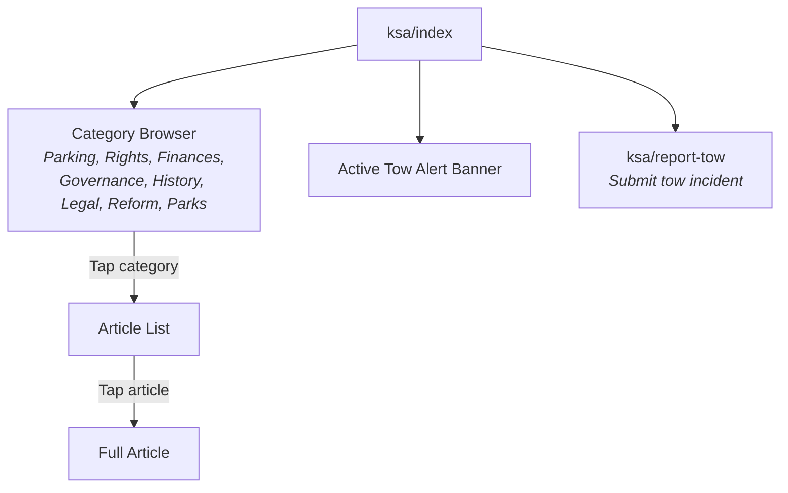
```mermaid
flowchart TD
    KSA_HOME["ksa/index"] --> CATEGORIES["Category Browser<br/><i>Parking, Rights, Finances,<br/>Governance, History, Legal, Reform, Parks</i>"]
    KSA_HOME --> TOW_BANNER["Active Tow Alert Banner"]
    CATEGORIES -->|"Tap category"| ARTICLE_LIST["Article List"]
    ARTICLE_LIST -->|"Tap article"| ARTICLE_READER["Full Article"]

    KSA_HOME --> REPORT_TOW["ksa/report-tow<br/><i>Submit tow incident</i>"]
```

### 1.14 Notification Routing

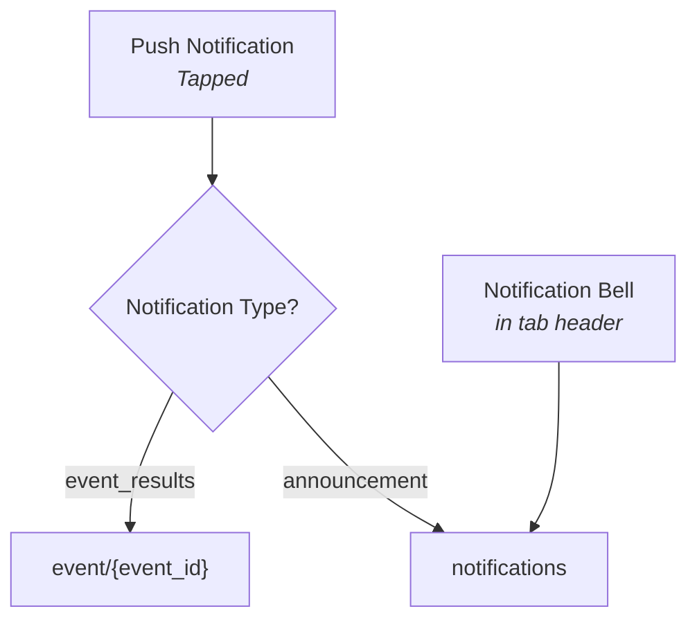
```mermaid
flowchart TD
    PUSH_NOTIFICATION["Push Notification<br/><i>Tapped</i>"] --> CHECK_TYPE{"Notification Type?"}
    CHECK_TYPE -->|"event_results"| EVENT_PAGE["event/{event_id}"]
    CHECK_TYPE -->|"announcement"| NOTIFICATIONS["notifications"]
    BELL_ICON["Notification Bell<br/><i>in tab header</i>"] --> NOTIFICATIONS
```

### 1.15 Complete Screen Map

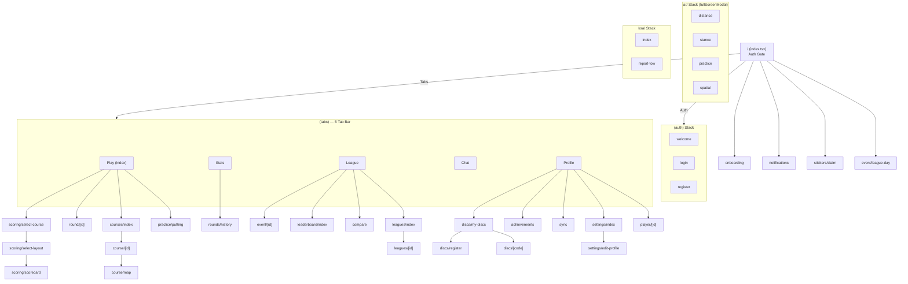
```mermaid
flowchart TD
    ROOT["/ (index.tsx)<br/>Auth Gate"] -->|Auth| AUTH_STACK
    ROOT -->|Tabs| TAB_STACK

    subgraph AUTH_STACK["(auth) Stack"]
        A_WELCOME["welcome"]
        A_LOGIN["login"]
        A_REGISTER["register"]
    end

    subgraph TAB_STACK["(tabs) — 5 Tab Bar"]
        T_PLAY["Play (index)"]
        T_STATS["Stats"]
        T_LEAGUE["League"]
        T_CHAT["Chat"]
        T_PROFILE["Profile"]
    end

    T_PLAY --> SC_COURSE["scoring/select-course"]
    SC_COURSE --> SC_LAYOUT["scoring/select-layout"]
    SC_LAYOUT --> SC_CARD["scoring/scorecard"]

    T_PLAY --> ROUND_DET["round/[id]"]
    T_PLAY --> COURSES_IDX["courses/index"]
    COURSES_IDX --> COURSE_DET["course/[id]"]
    COURSE_DET --> COURSE_MAP["course/map"]
    T_PLAY --> PRACTICE_PUT["practice/putting"]

    T_STATS --> ROUNDS_HIST["rounds/history"]

    T_LEAGUE --> EVENT_DET["event/[id]"]
    T_LEAGUE --> LB_IDX["leaderboard/index"]
    T_LEAGUE --> COMPARE["compare"]
    T_LEAGUE --> LEAGUES_IDX["leagues/index"]
    LEAGUES_IDX --> LEAGUE_DET["leagues/[id]"]

    T_PROFILE --> DISCS_MY["discs/my-discs"]
    DISCS_MY --> DISCS_REG["discs/register"]
    DISCS_MY --> DISCS_DET["discs/[code]"]
    T_PROFILE --> ACHIEVEMENTS["achievements"]
    T_PROFILE --> SYNC["sync"]
    T_PROFILE --> SETTINGS_IDX["settings/index"]
    SETTINGS_IDX --> SETTINGS_EDIT["settings/edit-profile"]
    T_PROFILE --> PLAYER_DET["player/[id]"]

    ROOT --> ONBOARDING["onboarding"]
    ROOT --> NOTIFICATIONS["notifications"]
    ROOT --> STICKER_CLAIM["stickers/claim"]
    ROOT --> EVENT_LD["event/league-day"]

    subgraph AR_STACK["ar/ Stack (fullScreenModal)"]
        AR_DIST["distance"]
        AR_STANCE["stance"]
        AR_PRACTICE["practice"]
        AR_SPATIAL["spatial"]
    end

    subgraph KSA_STACK["ksa/ Stack"]
        KSA_IDX["index"]
        KSA_TOW["report-tow"]
    end
```

---

## 2. Admin Journey (Admin Dashboard)

### 2.1 Admin Auth & Layout

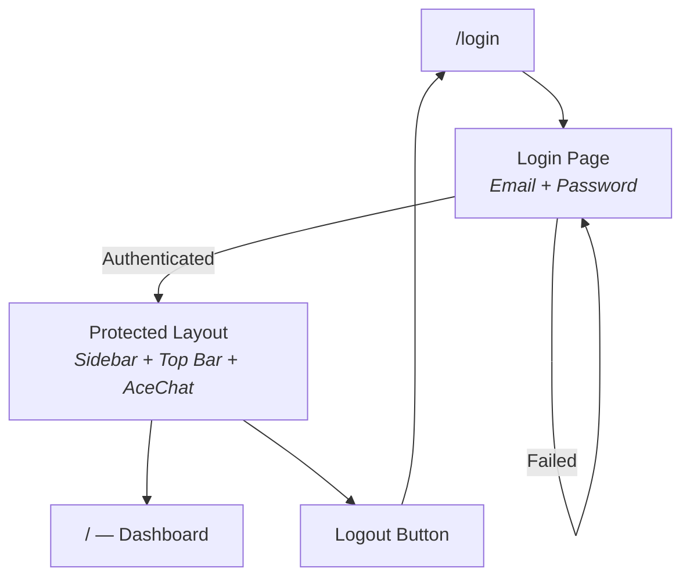
```mermaid
flowchart TD
    VISIT["/login"] --> LOGIN_FORM["Login Page<br/><i>Email + Password</i>"]
    LOGIN_FORM -->|"Authenticated"| LAYOUT["Protected Layout<br/><i>Sidebar + Top Bar + AceChat</i>"]
    LOGIN_FORM -->|"Failed"| LOGIN_FORM

    LAYOUT --> DASHBOARD["/ — Dashboard"]
    LAYOUT --> LOGOUT["Logout Button"]
    LOGOUT --> VISIT
```

### 2.2 Sidebar Navigation

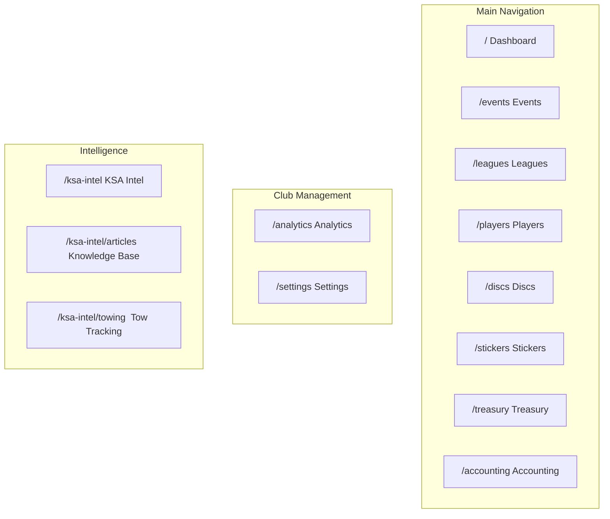
```mermaid
flowchart TD
    subgraph "Main Navigation"
        DASH["/  Dashboard"]
        EVENTS["/events  Events"]
        LEAGUES["/leagues  Leagues"]
        PLAYERS["/players  Players"]
        DISCS["/discs  Discs"]
        STICKERS["/stickers  Stickers"]
        TREASURY["/treasury  Treasury"]
        ACCOUNTING["/accounting  Accounting"]
    end

    subgraph "Club Management"
        ANALYTICS["/analytics  Analytics"]
        SETTINGS["/settings  Settings"]
    end

    subgraph "Intelligence"
        KSA["/ksa-intel  KSA Intel"]
        KB["/ksa-intel/articles  Knowledge Base"]
        TOW["/ksa-intel/towing  Tow Tracking"]
    end
```

### 2.3 Dashboard Page

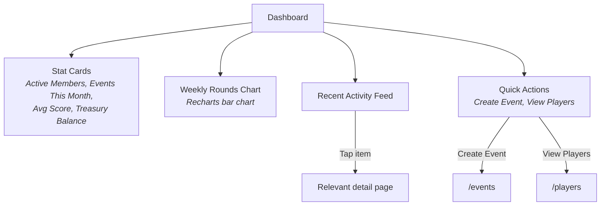
```mermaid
flowchart TD
    DASHBOARD["Dashboard"] --> STAT_CARDS["Stat Cards<br/><i>Active Members, Events This Month,<br/>Avg Score, Treasury Balance</i>"]
    DASHBOARD --> WEEKLY_CHART["Weekly Rounds Chart<br/><i>Recharts bar chart</i>"]
    DASHBOARD --> RECENT_ACTIVITY["Recent Activity Feed"]
    DASHBOARD --> QUICK_ACTIONS["Quick Actions<br/><i>Create Event, View Players</i>"]

    QUICK_ACTIONS -->|"Create Event"| EVENTS_PAGE["/events"]
    QUICK_ACTIONS -->|"View Players"| PLAYERS_PAGE["/players"]
    RECENT_ACTIVITY -->|"Tap item"| DETAIL_PAGE["Relevant detail page"]
```

### 2.4 Event Management Flow

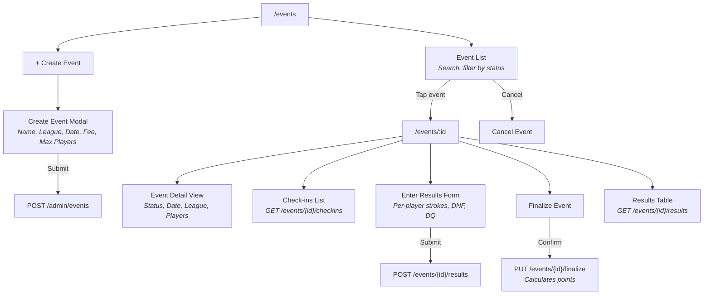
```mermaid
flowchart TD
    EVENTS["/events"] --> EVENT_LIST["Event List<br/><i>Search, filter by status</i>"]
    EVENTS --> CREATE_BTN["+ Create Event"]
    CREATE_BTN --> CREATE_MODAL["Create Event Modal<br/><i>Name, League, Date, Fee, Max Players</i>"]
    CREATE_MODAL -->|"Submit"| CREATE_API["POST /admin/events"]

    EVENT_LIST -->|"Tap event"| EVENT_DETAIL["/events/:id"]
    EVENT_LIST -->|"Cancel"| CANCEL_API["Cancel Event"]

    EVENT_DETAIL --> DETAIL_VIEW["Event Detail View<br/><i>Status, Date, League, Players</i>"]
    EVENT_DETAIL --> CHECKINS_VIEW["Check-ins List<br/><i>GET /events/{id}/checkins</i>"]
    EVENT_DETAIL --> ENTER_RESULTS["Enter Results Form<br/><i>Per-player strokes, DNF, DQ</i>"]
    ENTER_RESULTS -->|"Submit"| SUBMIT_API["POST /events/{id}/results"]
    EVENT_DETAIL --> FINALIZE["Finalize Event"]
    FINALIZE -->|"Confirm"| FINALIZE_API["PUT /events/{id}/finalize<br/><i>Calculates points</i>"]
    EVENT_DETAIL --> RESULTS_TABLE["Results Table<br/><i>GET /events/{id}/results</i>"]
```

### 2.5 League Management Flow

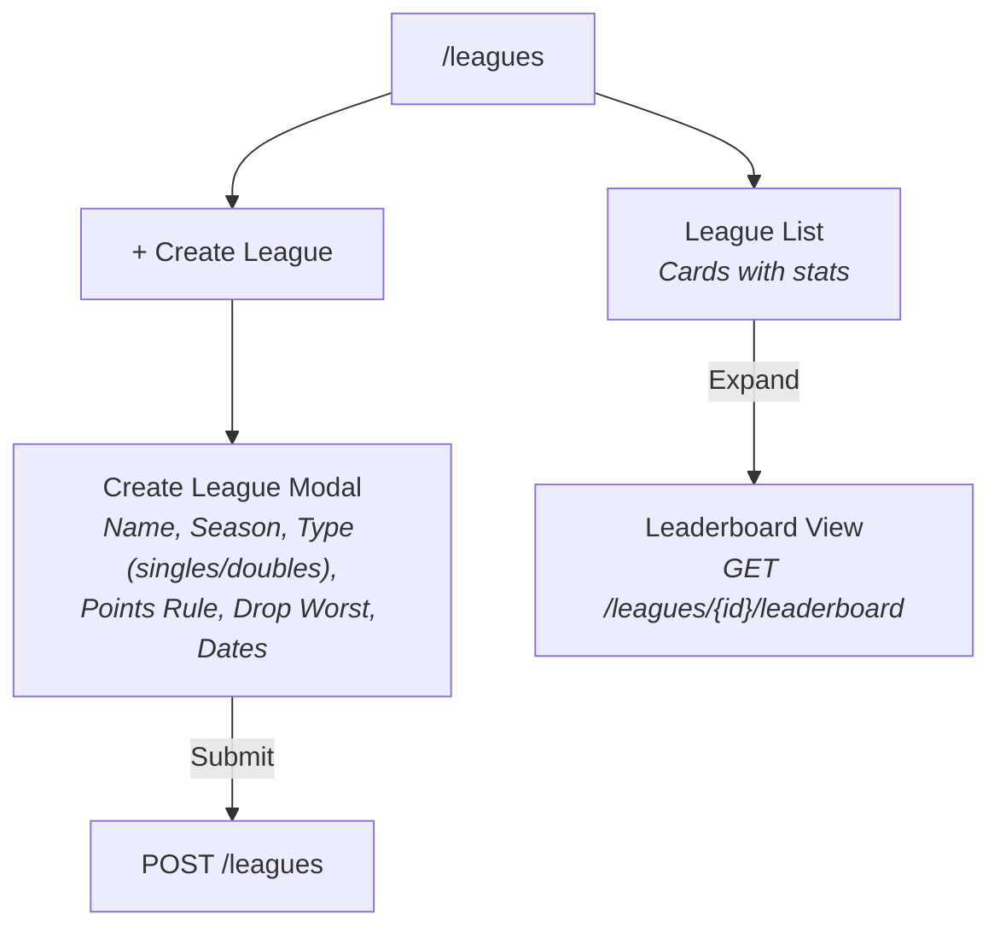
```mermaid
flowchart TD
    LEAGUES["/leagues"] --> LEAGUE_LIST["League List<br/><i>Cards with stats</i>"]
    LEAGUES --> CREATE_LG["+ Create League"]
    CREATE_LG --> CREATE_MODAL["Create League Modal<br/><i>Name, Season, Type (singles/doubles),<br/>Points Rule, Drop Worst, Dates</i>"]
    CREATE_MODAL -->|"Submit"| CREATE_API["POST /leagues"]

    LEAGUE_LIST -->|"Expand"| LB_VIEW["Leaderboard View<br/><i>GET /leagues/{id}/leaderboard</i>"]
```

### 2.6 Player Management Flow

```mermaid
flowchart TD
    PLAYERS["/players"] --> PLAYER_TABLE["Player Table<br/><i>Search, role filter, pagination</i>"]
    PLAYER_TABLE -->|"Tap player"| PLAYER_DETAIL["/players/:id"]
    PLAYER_TABLE -->|"Context menu"| ACTIONS["Actions Menu"]

    ACTIONS --> CHANGE_ROLE["Change Role<br/><i>POST /admin/users/{id}/role</i>"]
    ACTIONS --> TOGGLE_ACTIVE["Activate/Deactivate<br/><i>Toggle player active status</i>"]

    CHANGE_ROLE --> ROLE_MODAL["Role Selection Modal<br/><i>player, moderator, admin, super_admin</i>"]
    ROLE_MODAL -->|"Confirm"| ROLE_API["PUT /admin/users/{id}/role"]

    PLAYER_DETAIL --> PLAYER_INFO["Player Detail<br/><i>Profile, stats, rounds, league history</i>"]
```

### 2.7 Treasury Dashboard Flow (Blockchain)

```mermaid
flowchart TD
    TREASURY["/treasury"] --> BALANCE_CARD["Treasury Balance<br/><i>GET /blockchain/treasury</i>"]
    TREASURY --> BALANCE_CHART["Balance History Chart"]
    TREASURY --> TX_TABLE["Transaction History<br/><i>GET /blockchain/transactions<br/>Filter by type, paginated</i>"]

    TREASURY --> MINT_BTN["Mint Tokens"]
    MINT_BTN --> MINT_MODAL["Mint Modal<br/><i>Amount, Reason</i>"]
    MINT_MODAL -->|"Submit"| MINT_API["POST /blockchain/mint"]

    TREASURY --> DISTRIBUTE_BTN["Distribute Prizes"]
    DISTRIBUTE_BTN --> DISTRIBUTE_MODAL["Distribute Modal<br/><i>Select League</i>"]
    DISTRIBUTE_MODAL -->|"Submit"| DISTRIBUTE_API["POST /blockchain/distribute/{league_id}"]
```

### 2.8 Accounting Flow (Cash Treasury)

```mermaid
flowchart TD
    ACCOUNTING["/accounting"] --> TABS["Tab Navigation"]

    TABS --> OVERVIEW["Overview<br/><i>Balance, Income YTD,<br/>Expenses YTD, Outstanding</i>"]
    TABS --> LEDGER["Ledger<br/><i>All transactions, scrollable</i>"]
    TABS --> COLLECT["Collect Fees<br/><i>POST /treasury/collect-fee<br/>POST /treasury/collect-bulk<br/>POST /treasury/collect-ctp</i>"]
    TABS --> EXPENSES["Expenses<br/><i>POST /treasury/record-expense<br/>GET /treasury/expenses/by-category</i>"]
    TABS --> PLAYER_BAL["Player Balances<br/><i>GET /treasury/player-balances</i>"]
    TABS --> BUDGET["Budget<br/><i>POST /treasury/budget<br/>GET /treasury/budget/vs-actual</i>"]

    ACCOUNTING --> EXPORT_CSV["Export CSV<br/><i>GET /treasury/export</i>"]
```

### 2.9 Sticker Management Flow

```mermaid
flowchart TD
    STICKERS["/stickers"] --> STATS_CARDS["Stats Cards<br/><i>Total, Available, Claimed, Distributed</i>"]
    STICKERS --> GENERATE["Generate Batch<br/><i>POST /stickers/generate-batch</i>"]
    GENERATE --> BATCH_RESULT["Batch Result<br/><i>Codes, CSV download URL</i>"]
    BATCH_RESULT --> DOWNLOAD_CSV["Download CSV<br/><i>GET /stickers/batch/{id}/csv</i>"]

    STICKERS --> VALIDATE["Validate Code<br/><i>GET /stickers/validate/{code}</i>"]
    STICKERS --> INVENTORY["Batch Inventory<br/><i>GET /stickers/batch/{id}/inventory</i>"]
    STICKERS --> RECENT_CLAIMS["Recent Claims List"]
```

### 2.10 Club Analytics Flow

```mermaid
flowchart TD
    ANALYTICS["/analytics"] --> HEALTH_SCORE["Community Health Score<br/><i>Always visible</i>"]
    ANALYTICS --> TAB_NAV["Tab Navigation"]

    TAB_NAV --> FINANCIAL["Financial Tab"]
    TAB_NAV --> MEMBERSHIP["Membership Tab"]
    TAB_NAV --> PERFORMANCE["Performance Tab"]
    TAB_NAV --> OPERATIONS["Operations Tab"]
    TAB_NAV --> STRATEGIC["Strategy Tab"]

    FINANCIAL --> FIN_SUMMARY["P&L Summary<br/><i>GET /admin/financial/summary</i>"]
    FINANCIAL --> FIN_CASHFLOW["Cash Flow Chart<br/><i>GET /admin/financial/cashflow</i>"]
    FINANCIAL --> FIN_EVENTS["Event Breakdown<br/><i>GET /admin/financial/event-breakdown</i>"]
    FINANCIAL --> FIN_UNPAID["Unpaid Fees<br/><i>GET /admin/financial/unpaid</i>"]

    MEMBERSHIP --> MEM_SEGMENTS["Member Segments<br/><i>GET /admin/membership/segments</i>"]
    MEMBERSHIP --> MEM_RETENTION["Retention Metrics<br/><i>GET /admin/membership/retention</i>"]
    MEMBERSHIP --> MEM_CHURN["Churn Risk<br/><i>GET /admin/membership/churn-risk</i>"]

    PERFORMANCE --> PERF_COURSE["Course Difficulty<br/><i>GET /admin/performance/course-difficulty</i>"]
    PERFORMANCE --> PERF_PUTTING["Putting Summary<br/><i>GET /admin/performance/putting-summary</i>"]
    PERFORMANCE --> PERF_SCORING["Scoring Trends<br/><i>GET /admin/performance/scoring-trends</i>"]

    OPERATIONS --> OPS_CALENDAR["Event Calendar<br/><i>GET /admin/operations/event-calendar</i>"]
    OPERATIONS --> OPS_HEATMAP["Usage Heatmap<br/><i>GET /admin/operations/usage-heatmap</i>"]

    STRATEGIC --> STRAT_GROWTH["Growth Drivers<br/><i>GET /admin/strategic/growth-drivers</i>"]
    STRATEGIC --> STRAT_REVENUE["Revenue Forecast<br/><i>GET /admin/strategic/revenue-forecast</i>"]
    STRATEGIC --> STRAT_HEALTH["Community Health<br/><i>GET /admin/strategic/community-health</i>"]
```

### 2.11 Club Settings Flow

```mermaid
flowchart TD
    SETTINGS["/settings"] --> ANNOUNCE["Create Announcement<br/><i>POST /admin/announcements</i>"]
    SETTINGS --> CLEAR_CACHE["Clear Cache<br/><i>POST /admin/cache/clear</i>"]
    SETTINGS -->|"super_admin only"| DANGER_ZONE["Danger Zone<br/><i>System admin tools</i>"]
```

### 2.12 KSA Intel Flow

```mermaid
flowchart TD
    KSA["/ksa-intel"] --> KSA_TABS["Three Sections"]

    KSA_TABS --> OVERVIEW["Overview<br/><i>KSA Financial Snapshot,<br/>Key Metrics, Risk Indicators</i>"]
    KSA_TABS --> KB_MGMT["/ksa-intel/articles<br/><i>Knowledge Base Management</i>"]
    KSA_TABS --> TOW_TRACK["/ksa-intel/towing<br/><i>Tow Tracking</i>"]

    KB_MGMT --> ARTICLE_LIST["Article List<br/><i>GET /ksa/articles</i>"]
    KB_MGMT --> CREATE_ARTICLE["Create Article<br/><i>POST /ksa/articles</i>"]
    KB_MGMT --> TIMELINE["Timeline<br/><i>GET /ksa/timeline</i>"]

    TOW_TRACK --> TOW_INCIDENTS["Incident Database<br/><i>GET /tow-incidents/stats</i>"]
    TOW_TRACK --> TOW_ALERTS["Tow Alerts<br/><i>GET /tow-alerts</i>"]
    TOW_TRACK --> RESPOND_ALERT["Respond to Alert<br/><i>POST /tow-alerts/{id}/respond</i>"]
```

### 2.13 Disc Registry (Admin)

```mermaid
flowchart TD
    DISCS["/discs"] --> DISC_TABLE["Disc Registry Table<br/><i>All registered discs across members</i>"]
    DISCS --> SEARCH["Search by code, mold, owner"]
    DISC_TABLE -->|"Tap disc"| DISC_DETAIL["Disc Detail<br/><i>Owner info, status, history</i>"]
```

### 2.14 Ace Chat (Admin Floating Widget)

```mermaid
flowchart TD
    ANY_PAGE["Any Admin Page"] --> ACE_WIDGET["AceChat Floating Button"]
    ACE_WIDGET -->|"Click"| CHAT_PANEL["Chat Panel<br/><i>Same Ace bot as mobile</i>"]
    CHAT_PANEL -->|"Send message"| CHAT_API["POST /chat"]
    CHAT_API --> RESPONSE["Bot Response"]
```

### 2.15 Complete Admin Screen Map

```mermaid
flowchart TD
    LOGIN["/login"] -->|"Auth"| PROTECTED["Protected Layout"]

    PROTECTED --> DASH["/ Dashboard"]
    PROTECTED --> EVENTS["/events"]
    EVENTS --> EVENT_DET["/events/:id"]
    PROTECTED --> LEAGUES["/leagues"]
    PROTECTED --> PLAYERS["/players"]
    PLAYERS --> PLAYER_DET["/players/:id"]
    PROTECTED --> DISCS_REG["/discs"]
    PROTECTED --> STICKERS["/stickers"]
    PROTECTED --> TREASURY["/treasury"]
    PROTECTED --> ACCOUNTING["/accounting"]
    PROTECTED --> ANALYTICS["/analytics"]
    PROTECTED --> SETTINGS["/settings"]
    PROTECTED --> KSA["/ksa-intel"]
    PROTECTED --> KSA_ART["/ksa-intel/articles"]
    PROTECTED --> KSA_TOW["/ksa-intel/towing"]
```

---

## 3. API Endpoint Map

### 3.1 All Route Groups

```mermaid
flowchart LR
    API["/api/v1"] --> AUTH["/auth"]
    API --> USERS["/users"]
    API --> COURSES["/courses"]
    API --> ROUNDS["/rounds"]
    API --> LEAGUES["/leagues"]
    API --> EVENTS["/events"]
    API --> PUTTING["/putting"]
    API --> ADMIN["/admin"]
    API --> STICKERS["/stickers"]
    API --> GEO["/geo"]
    API --> DISCS["/discs"]
    API --> CHAT["/chat"]
    API --> WEATHER["/weather"]
    API --> BLOCKCHAIN["/blockchain"]
    API --> PAYMENTS["/payments"]
    API --> TREASURY["/treasury"]
    API --> TOKENS["/tokens"]
    API --> INTEL["/intel"]
    API --> MARKETPLACE["/marketplace"]
    API --> KSA_ROUTES["(ksa routes)"]
    API --> LEAGUE_OPS["(league-ops routes)"]
    API --> OWNER["/owner<br/><i>hidden from docs</i>"]
```

### 3.2 Auth Endpoints

```mermaid
flowchart TD
    AUTH["/api/v1/auth"] --> REG["POST /register"]
    AUTH --> LOGIN["POST /login"]
    AUTH --> REFRESH["POST /refresh"]
    AUTH --> GOOGLE["POST /google"]
    AUTH --> APPLE["POST /apple"]
    AUTH --> LOGOUT["POST /logout"]
    AUTH --> ME["GET /me"]
    AUTH --> W3_NONCE["POST /web3/nonce"]
    AUTH --> W3_VERIFY["POST /web3/verify"]
```

### 3.3 Scoring & Rounds Endpoints

```mermaid
flowchart TD
    ROUNDS["/api/v1/rounds"] --> CREATE["POST / — Start round"]
    ROUNDS --> LIST["GET / — Round history"]
    ROUNDS --> GET["GET /{id} — Round detail"]
    ROUNDS --> SCORES["POST /{id}/scores — Submit hole score"]
    ROUNDS --> UPDATE_SCORE["PUT /{id}/scores/{hole} — Update score"]
    ROUNDS --> COMPLETE["PUT /{id}/complete — Finalize round"]
    ROUNDS --> SHARE["GET /{id}/share — Share link"]
    ROUNDS --> GROUP_CREATE["POST /group — Create group scorecard"]
    ROUNDS --> GROUP_GET["GET /group/{id} — Get group scorecard"]
```

### 3.4 League, Event & League Ops Endpoints

```mermaid
flowchart TD
    LEAGUES["/api/v1/leagues"] --> L_LIST["GET / — List leagues"]
    LEAGUES --> L_GET["GET /{id} — League detail"]
    LEAGUES --> L_LB["GET /{id}/leaderboard"]
    LEAGUES --> L_JOIN["POST /{id}/join"]
    LEAGUES --> L_LEAVE["DELETE /{id}/leave"]
    LEAGUES --> L_MEMBERS["GET /{id}/members"]

    EVENTS["/api/v1/events"] --> E_LIST["GET / — List events"]
    EVENTS --> E_GET["GET /{id} — Event detail"]
    EVENTS --> E_RESULTS["GET /{id}/results"]
    EVENTS --> E_CHECKIN["POST /{id}/checkin"]
    EVENTS --> E_SUBMIT["POST /{id}/results (admin)"]
    EVENTS --> E_FINAL["PUT /{id}/finalize (admin)"]

    LEAGUE_OPS["League Ops"] --> CARDS["POST /cards/assign"]
    LEAGUE_OPS --> CARDS_NOTIFY["POST /cards/notify"]
    LEAGUE_OPS --> CTP_RECORD["POST /ctp/record"]
    LEAGUE_OPS --> CTP_RESULTS["GET /ctp/results/{event_id}"]
    LEAGUE_OPS --> RECURRING["POST /recurring/setup"]
    LEAGUE_OPS --> PICKUP["POST /scoring/pickup"]
    LEAGUE_OPS --> ACE_BAL["GET /ace-fund/balance"]
    LEAGUE_OPS --> ACE_COLLECT["POST /ace-fund/collect"]
    LEAGUE_OPS --> ACE_PAYOUT["POST /ace-fund/payout"]
    LEAGUE_OPS --> SHARE_RESULTS["GET /share/event-results/{event_id}"]
    LEAGUE_OPS --> SHARE_STANDINGS["GET /share/standings/{league_id}"]
```

### 3.5 Disc & Sticker Endpoints

```mermaid
flowchart TD
    DISCS["/api/v1/discs"] --> D_REG["POST /register"]
    DISCS --> D_MY["GET /my-discs"]
    DISCS --> D_GET["GET /{code}"]
    DISCS --> D_QR["GET /{code}/qr"]
    DISCS --> D_LOST["POST /{code}/lost"]
    DISCS --> D_RETURNED["POST /{code}/returned"]
    DISCS --> D_PHOTO["POST /{code}/photo"]
    DISCS --> D_LOOKUP["GET /{code}/lookup (public)"]
    DISCS --> D_FOUND["POST /{code}/found"]
    DISCS --> D_MSG_POST["POST /{code}/messages"]
    DISCS --> D_MSG_GET["GET /{code}/messages"]

    STICKERS["/api/v1/stickers"] --> S_GEN["POST /generate-batch (admin)"]
    STICKERS --> S_CSV["GET /batch/{id}/csv"]
    STICKERS --> S_INV["GET /batch/{id}/inventory"]
    STICKERS --> S_STATS["GET /stats"]
    STICKERS --> S_CLAIM["POST /claim/{code}"]
    STICKERS --> S_VALIDATE["GET /validate/{code}"]
```

### 3.6 Putting Analytics Endpoints

```mermaid
flowchart TD
    PUTTING["/api/v1/putting"] --> P_ATTEMPT["POST /attempt — Log single putt"]
    PUTTING --> P_BATCH["POST /batch — Sync offline putts"]
    PUTTING --> P_STATS["GET /stats — Putting stats by zone"]
    PUTTING --> P_PROB["GET /probability — Make probability"]
    PUTTING --> P_SG["GET /strokes-gained — Strokes gained"]
```

### 3.7 Treasury & Finance Endpoints

```mermaid
flowchart TD
    TREASURY["/api/v1/treasury"] --> T_COLLECT["POST /collect-fee"]
    TREASURY --> T_BULK["POST /collect-bulk"]
    TREASURY --> T_CTP["POST /collect-ctp"]
    TREASURY --> T_PRIZE["POST /payout-prize"]
    TREASURY --> T_CTP_PAY["POST /payout-ctp"]
    TREASURY --> T_EXPENSE["POST /record-expense"]
    TREASURY --> T_BALANCE["GET /balance"]
    TREASURY --> T_EVENT["GET /event/{id}/summary"]
    TREASURY --> T_SEASON["GET /season/{season}"]
    TREASURY --> T_LEDGER["GET /ledger"]
    TREASURY --> T_UNPAID["GET /unpaid/{event_id}"]
    TREASURY --> T_EXPCAT["GET /expenses/by-category"]
    TREASURY --> T_BUDGET["POST /budget"]
    TREASURY --> T_BVA["GET /budget/vs-actual"]
    TREASURY --> T_PBAL["GET /player-balances"]
    TREASURY --> T_EXPORT["GET /export"]
    TREASURY --> T_VPRIZE["GET /validate-prizes/{event_id}"]
    TREASURY --> T_VOID["POST /{entry_id}/void"]
```

### 3.8 Blockchain & Token Endpoints

```mermaid
flowchart TD
    BLOCKCHAIN["/api/v1/blockchain"] --> B_BAL["GET /balance"]
    BLOCKCHAIN --> B_PAY["POST /pay-fee"]
    BLOCKCHAIN --> B_TX["GET /transactions"]
    BLOCKCHAIN --> B_TREAS["GET /treasury"]
    BLOCKCHAIN --> B_MINT["POST /mint (admin)"]
    BLOCKCHAIN --> B_DIST["POST /distribute/{league_id} (admin)"]
    BLOCKCHAIN --> B_MINT_NFT["POST /discs/{code}/mint-nft"]
    BLOCKCHAIN --> B_NFT_STATUS["GET /discs/{code}/nft"]
    BLOCKCHAIN --> B_TRANSFER_NFT["POST /discs/{code}/transfer-nft"]

    TOKENS["/api/v1/tokens"] --> TK_BAL["GET /balance"]
    TOKENS --> TK_HIST["GET /history"]
    TOKENS --> TK_PAY["POST /pay-event-fee"]
    TOKENS --> TK_GIFT["POST /gift"]
    TOKENS --> TK_LB["GET /leaderboard"]
    TOKENS --> TK_GRANT["POST /grant (admin)"]
    TOKENS --> TK_DEDUCT["POST /deduct (admin)"]
    TOKENS --> TK_CONFIG["GET /config"]
    TOKENS --> TK_UPD_CONFIG["PUT /config/{reward_type}"]
    TOKENS --> TK_STATS["GET /stats"]
```

### 3.9 Admin & Analytics Endpoints

```mermaid
flowchart TD
    ADMIN["/api/v1/admin"] --> A_EVENTS["POST /events"]
    ADMIN --> A_DASH["GET /analytics/dashboard"]
    ADMIN --> A_ACTIVITY["GET /activity"]
    ADMIN --> A_WEEKLY["GET /analytics/weekly-rounds"]
    ADMIN --> A_ROLE["POST /users/{id}/role"]
    ADMIN --> A_AUDIT["GET /audit-log"]
    ADMIN --> A_ANN_CREATE["POST /announcements"]
    ADMIN --> A_ANN_LIST["GET /announcements"]
    ADMIN --> A_ANN_UPDATE["PUT /announcements/{id}"]
    ADMIN --> A_ANN_DELETE["DELETE /announcements/{id}"]
    ADMIN --> A_CACHE["POST /cache/clear"]
    ADMIN --> A_PLAYERS["GET /analytics/players"]
    ADMIN --> A_ROUNDS_A["GET /analytics/rounds"]
    ADMIN --> A_PUSH["POST /test-push"]

    ADMIN --> BOT_LEARN["GET/POST/PUT/DELETE /bot/learnings"]
    ADMIN --> BOT_SKILLS["GET/POST /bot/skills"]
    ADMIN --> BOT_TOGGLE["PUT /bot/skills/{id}/toggle"]
    ADMIN --> LLM_USAGE["GET /llm/usage"]
    ADMIN --> LLM_CONFIG["GET /llm/config"]

    ANALYTICS["Analytics Routes"] --> AN_FIN_SUM["GET /financial/summary"]
    ANALYTICS --> AN_FIN_CF["GET /financial/cashflow"]
    ANALYTICS --> AN_FIN_EB["GET /financial/event-breakdown"]
    ANALYTICS --> AN_FIN_UP["GET /financial/unpaid"]
    ANALYTICS --> AN_MEM_SEG["GET /membership/segments"]
    ANALYTICS --> AN_MEM_RET["GET /membership/retention"]
    ANALYTICS --> AN_MEM_CHR["GET /membership/churn-risk"]
    ANALYTICS --> AN_PER_CD["GET /performance/course-difficulty"]
    ANALYTICS --> AN_PER_PS["GET /performance/putting-summary"]
    ANALYTICS --> AN_PER_ST["GET /performance/scoring-trends"]
    ANALYTICS --> AN_OPS_EC["GET /operations/event-calendar"]
    ANALYTICS --> AN_OPS_UH["GET /operations/usage-heatmap"]
    ANALYTICS --> AN_STR_GD["GET /strategic/growth-drivers"]
    ANALYTICS --> AN_STR_RF["GET /strategic/revenue-forecast"]
    ANALYTICS --> AN_STR_CH["GET /strategic/community-health"]
```

### 3.10 Other Endpoints

```mermaid
flowchart TD
    USERS["/api/v1/users"] --> U_STATS["GET /{id}/stats"]
    USERS --> U_HOLE_AVG["GET /{id}/hole-averages"]
    USERS --> U_LIST["GET / — List users"]
    USERS --> U_WALLET["POST /me/wallet"]
    USERS --> U_UPDATE["PUT /me — Update profile"]
    USERS --> U_DELETE["DELETE /me — Delete account"]
    USERS --> U_PUSH["POST /me/push-token"]
    USERS --> U_AVATAR["POST /me/avatar"]

    COURSES["/api/v1/courses"] --> C_LIST["GET / — List courses"]
    COURSES --> C_GET["GET /{id} — Course detail"]
    COURSES --> C_LAYOUT["GET /layouts/{id}"]
    COURSES --> C_COURSE_LAYOUT["GET /{course_id}/layouts/{layout_id}"]

    GEO["/api/v1/geo"] --> G_GEOJSON["GET /courses/{id}/geojson"]
    GEO --> G_ELEV["GET /courses/{id}/holes/{n}/elevation"]
    GEO --> G_NEAREST["GET /nearest-hole"]

    CHAT["/api/v1/chat"] --> CH_SEND["POST / — Send message"]
    CHAT --> CH_FEEDBACK["POST /feedback"]

    WEATHER["/api/v1/weather"] --> W_CURRENT["GET /current"]
    WEATHER --> W_WIND["GET /wind"]

    PAYMENTS["/api/v1/payments"] --> PAY_CONFIG["GET /config"]
    PAYMENTS --> PAY_CHECKOUT["POST /checkout"]
    PAYMENTS --> PAY_WEBHOOK["POST /webhook"]
    PAYMENTS --> PAY_HISTORY["GET /history"]

    MARKETPLACE["/api/v1/marketplace"] --> MK_LIST["GET / — Browse listings"]
    MARKETPLACE --> MK_MY_LIST["GET /my-listings"]
    MARKETPLACE --> MK_MY_PURCH["GET /my-purchases"]
    MARKETPLACE --> MK_GET["GET /{id}"]
    MARKETPLACE --> MK_CREATE["POST / — Create listing"]
    MARKETPLACE --> MK_UPDATE["PUT /{id}"]
    MARKETPLACE --> MK_DELETE["DELETE /{id}"]
    MARKETPLACE --> MK_BUY["POST /{id}/buy"]

    INTEL["/api/v1/intel"] --> IN_GEN["POST /reports/generate"]
    INTEL --> IN_MANUAL["POST /reports/manual"]
    INTEL --> IN_LIST["GET /reports"]
    INTEL --> IN_LATEST["GET /reports/latest"]
    INTEL --> IN_DIGEST["GET /reports/digest"]
    INTEL --> IN_SEARCH["GET /reports/search"]
    INTEL --> IN_GET["GET /reports/{id}"]
    INTEL --> IN_CATS["GET /categories"]

    KSA["KSA Routes"] --> KSA_ART["GET /ksa/articles"]
    KSA --> KSA_ART_SLUG["GET /ksa/articles/{slug}"]
    KSA --> KSA_CATS["GET /ksa/categories"]
    KSA --> KSA_TIMELINE["GET /ksa/timeline"]
    KSA --> KSA_CREATE["POST /ksa/articles"]
    KSA --> KSA_TOW_POST["POST /tow-alerts"]
    KSA --> KSA_TOW_GET["GET /tow-alerts"]
    KSA --> KSA_TOW_RESP["POST /tow-alerts/{id}/respond"]
    KSA --> KSA_INC["POST /tow-incidents"]
    KSA --> KSA_INC_STATS["GET /tow-incidents/stats"]
    KSA --> KSA_PARKING["GET /parking/{park_name}"]

    OWNER["/api/v1/owner<br/>(hidden)"] --> OW_IMP["POST /impersonate"]
    OWNER --> OW_ROLE["POST /override-role"]
    OWNER --> OW_LOCK["POST /lock-user"]
    OWNER --> OW_UNLOCK["POST /unlock-user"]
    OWNER --> OW_REVOKE["POST /revoke-all"]
    OWNER --> OW_RESET["POST /reset-password"]
    OWNER --> OW_ADMINS["GET /admins"]
    OWNER --> OW_AUDIT["GET /audit"]
    OWNER --> OW_ANNOUNCE["POST /announce"]
    OWNER --> OW_STATUS["GET /system-status"]
```

---

## 4. Data Flow

### 4.1 Request/Response Lifecycle

```mermaid
flowchart TD
    subgraph "Client Layer"
        MOBILE["Mobile App<br/>(React Native/Expo)"]
        ADMIN_DASH["Admin Dashboard<br/>(React/Vite)"]
        ACE_BOT["Ace Bot<br/>(In-App Chat)"]
        MCP["Claude MCP Server"]
    end

    subgraph "API Layer"
        FASTAPI["FastAPI Backend<br/>api.rgdgc.com/api/v1/*"]
        AUTH_MW["Auth Middleware<br/><i>JWT validation</i>"]
        ROLE_MW["Role Guard<br/><i>admin/super_admin check</i>"]
    end

    subgraph "Data Layer"
        PG["PostgreSQL<br/><i>Source of truth</i>"]
        REDIS["Redis<br/><i>Cache + sessions</i>"]
    end

    subgraph "External Services"
        GOOGLE_AUTH["Google OAuth"]
        STRIPE["Stripe<br/><i>Payments</i>"]
        ETHEREUM["Ethereum<br/><i>$RGDG Token</i>"]
        OPENAI_ANTHROPIC["LLM Provider<br/><i>Anthropic/Vertex/Ollama</i>"]
        WEATHER_API["Weather API"]
    end

    MOBILE -->|"HTTPS + JWT"| FASTAPI
    ADMIN_DASH -->|"HTTPS + JWT"| FASTAPI
    ACE_BOT -->|"POST /chat"| FASTAPI
    MCP -->|"HTTPS + JWT"| FASTAPI

    FASTAPI --> AUTH_MW --> ROLE_MW
    ROLE_MW --> PG
    ROLE_MW --> REDIS

    FASTAPI -->|"OAuth verify"| GOOGLE_AUTH
    FASTAPI -->|"Payment processing"| STRIPE
    FASTAPI -->|"Token operations"| ETHEREUM
    FASTAPI -->|"Chat completions"| OPENAI_ANTHROPIC
    FASTAPI -->|"Weather data"| WEATHER_API
```

### 4.2 Scoring Data Flow

```mermaid
flowchart TD
    PLAYER["Player on Mobile"] -->|"1. Select course/layout"| SELECT["GET /courses/{id}"]
    SELECT -->|"Response: layouts"| PLAYER
    PLAYER -->|"2. Start round"| START["POST /rounds<br/><i>layout_id, is_practice</i>"]
    START -->|"Insert into rounds table"| PG["PostgreSQL"]
    START -->|"Response: round_id"| PLAYER
    PLAYER -->|"3. Submit hole score"| SCORE["POST /rounds/{id}/scores<br/><i>hole_id, strokes, putts, ob</i>"]
    SCORE -->|"Insert into hole_scores"| PG
    SCORE -->|"Optional: putt_attempts"| PG
    PLAYER -->|"4. Complete round"| COMPLETE["PUT /rounds/{id}/complete"]
    COMPLETE -->|"Calculate total_score<br/>relative to par"| PG
    COMPLETE -->|"Invalidate cache"| REDIS["Redis Cache"]
    COMPLETE -->|"Round summary"| PLAYER
```

### 4.3 League Event Lifecycle

```mermaid
flowchart TD
    ADMIN_CREATE["Admin: Create Event<br/>POST /admin/events"] -->|"Insert"| PG["PostgreSQL<br/><i>events table: status=upcoming</i>"]

    PG -->|"Players see event"| PLAYER_CHECKIN["Player: Check In<br/>POST /events/{id}/checkin"]
    PLAYER_CHECKIN -->|"Insert into checkins"| PG

    ADMIN_ACTIVATE["Admin: Day of Event<br/><i>status → active</i>"] --> PG

    PLAYER_SCORE["Players: Score Rounds<br/>POST /rounds, /scores, /complete"] --> PG

    ADMIN_RESULTS["Admin: Enter Results<br/>POST /events/{id}/results"] -->|"Insert into results table<br/><i>total_strokes, total_score</i>"| PG

    ADMIN_FINALIZE["Admin: Finalize<br/>PUT /events/{id}/finalize"] -->|"Calculate positions<br/>Calculate points<br/>(field_size - position + 1)<br/>status → completed"| PG

    PG -->|"Leaderboard query<br/>SUM(points_earned)<br/>minus drop_worst"| LEADERBOARD["GET /leagues/{id}/leaderboard"]
    LEADERBOARD -->|"Cache result"| REDIS["Redis"]
    REDIS -->|"Serve cached"| MOBILE["Mobile App"]
```

### 4.4 Chat (Ace Bot) Data Flow

```mermaid
flowchart TD
    USER_MSG["User sends message<br/><i>Mobile Chat tab or<br/>Admin AceChat widget</i>"] -->|"POST /chat<br/>{message: string}"| CHAT_API["Chat Service"]

    CHAT_API -->|"1. Load conversation history"| PG["PostgreSQL<br/><i>conversations table</i>"]
    CHAT_API -->|"2. Load bot learnings"| PG
    CHAT_API -->|"3. Build prompt with<br/>skill registry + context"| LLM["LLM Provider<br/><i>Anthropic → Vertex → Ollama</i>"]
    LLM -->|"4. AI response"| CHAT_API
    CHAT_API -->|"5. Store conversation"| PG
    CHAT_API -->|"6. Return response<br/>+ suggestions"| USER_MSG
```

### 4.5 Offline Sync Flow

```mermaid
flowchart TD
    OFFLINE_PLAY["Player plays round offline"] -->|"Scores cached in<br/>AsyncStorage"| LOCAL["Local Storage<br/>(AsyncStorage)"]
    LOCAL -->|"App comes online"| SYNC["Sync Service"]
    SYNC -->|"POST /rounds (create)"| API["FastAPI Backend"]
    SYNC -->|"POST /rounds/{id}/scores (each hole)"| API
    SYNC -->|"PUT /rounds/{id}/complete"| API
    API -->|"Persist"| PG["PostgreSQL"]
    API -->|"Confirm sync"| SYNC
    SYNC -->|"Clear local cache"| LOCAL

    COURSE_CACHE["Course data cached<br/>on first load"] -->|"cacheCourseData()"| LOCAL
    LOCAL -->|"getCachedCourses()"| OFFLINE_COURSE["Offline course selection"]
```

---

## Appendix: Screen & Route Inventory

### Mobile App — 45 Screens

| Route | Screen | Type |
|-------|--------|------|
| `/` | Auth gate (redirect) | Root |
| `(auth)/welcome` | Welcome + Google sign-in | Auth |
| `(auth)/login` | Login + Google sign-in | Auth |
| `(auth)/register` | Register + Google sign-in | Auth |
| `onboarding` | 4-page feature walkthrough | Onboarding |
| `(tabs)/index` | Play tab home | Tab |
| `(tabs)/stats` | Stats tab home | Tab |
| `(tabs)/league` | League tab home | Tab |
| `(tabs)/chat` | Ace bot chat | Tab |
| `(tabs)/profile` | Profile tab home | Tab |
| `scoring/select-course` | Course picker | Scoring |
| `scoring/select-layout` | Layout picker | Scoring |
| `scoring/scorecard` | Live scorecard | Scoring |
| `round/[id]` | Round detail (modal) | Detail |
| `rounds/history` | All rounds list | History |
| `event/[id]` | Event detail | Detail |
| `event/league-day` | League day view | Detail |
| `course/[id]` | Course detail | Detail |
| `course/map` | Course map (Mapbox) | Map |
| `courses/index` | Browse courses | List |
| `leagues/index` | Browse leagues | List |
| `leagues/[id]` | League detail | Detail |
| `leaderboard/index` | Full leaderboard | List |
| `compare` | Compare players | Tool |
| `player/[id]` | Player profile | Detail |
| `discs/my-discs` | My disc collection | List |
| `discs/register` | Register new disc | Form |
| `discs/[code]` | Disc detail | Detail |
| `stickers/claim` | Claim sticker code | Form |
| `settings/index` | Settings | Settings |
| `settings/edit-profile` | Edit profile | Form |
| `notifications` | Notification center | List |
| `achievements` | Achievement badges | List |
| `sync` | Sync & offline management | Tool |
| `practice/putting` | Putting practice | Practice |
| `ar/distance` | AR distance measurement | AR |
| `ar/stance` | AR stance guide | AR |
| `ar/practice` | AR putting practice | AR |
| `ar/spatial` | AR spatial mapping | AR |
| `ksa/index` | KSA knowledge base | KSA |
| `ksa/report-tow` | Report tow incident | KSA |

### Admin Dashboard — 14 Pages

| Route | Page | Purpose |
|-------|------|---------|
| `/login` | LoginPage | Authentication |
| `/` | Dashboard | Overview stats & activity |
| `/events` | EventManagement | List/create/cancel events |
| `/events/:id` | EventDetail | Checkins, results, finalize |
| `/leagues` | LeagueManagement | List/create leagues, leaderboards |
| `/players` | PlayerManagement | List/search/role-change players |
| `/players/:id` | PlayerDetail | Individual player detail |
| `/discs` | DiscRegistry | All registered discs |
| `/stickers` | StickerManagement | Generate/validate/inventory |
| `/treasury` | TreasuryDashboard | Blockchain token management |
| `/accounting` | Accounting | Cash treasury & fees |
| `/analytics` | ClubAnalytics | 5-tab analytics dashboard |
| `/settings` | ClubSettings | Announcements, cache, config |
| `/ksa-intel` | KSAIntel | Intelligence dashboard |

### API Routes — 28 Route Groups, 160+ Endpoints

| Prefix | Module | Endpoints |
|--------|--------|-----------|
| `/auth` | auth + web3auth | 9 |
| `/users` | users | 8 |
| `/courses` | courses | 4 |
| `/rounds` | rounds | 9 |
| `/leagues` | leagues | 6 |
| `/events` | events | 6 |
| `/putting` | putting | 5 |
| `/admin` | admin + bot_admin + llm_analytics + analytics | 35+ |
| `/stickers` | stickers | 6 |
| `/geo` | geo | 3 |
| `/discs` | discs | 11 |
| `/chat` | chat | 2 |
| `/weather` | weather | 2 |
| `/blockchain` | blockchain | 9 |
| `/payments` | payments | 4 |
| `/treasury` | treasury | 17 |
| `/tokens` | tokens | 10 |
| `/intel` | intel | 8 |
| `/marketplace` | marketplace | 7 |
| (ksa) | ksa | 11 |
| (league-ops) | league_ops | 11 |
| `/owner` | owner (hidden) | 10 |
